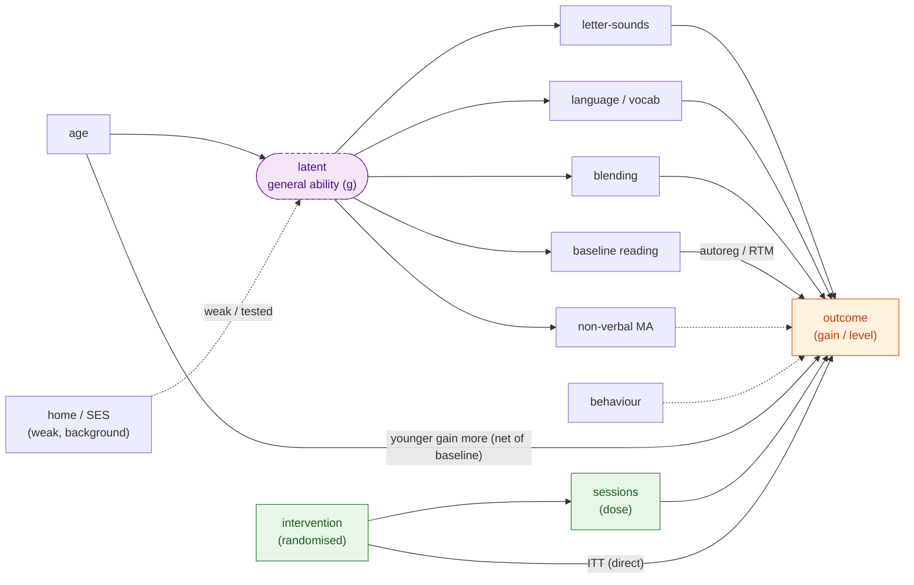

# Shared causal DAG (v5) — the canonical structure for the RLI re-analysis

> [!WARNING]
> These notes were generated by an AI tool.

Date: 2026-06-22

This is the **canonical shared DAG (v5)** that sits behind every model in the
suite — ITT, gain, achievement-level, mechanism/mediation, and the
longitudinal/cross-lagged work. Each model's own diagram should be a **subset**
(an adjustment-set projection) or a **specialisation** of this one structure, so
the results stay comparable and there is a single source of truth. It matches
the DAG section of the predictor-selection review and the existing v5
justification.

*Solid = assumed/confirmed structural edges; dashed = tested-not-assumed (SES→g;
behaviour→outcome; non-verbal MA→outcome); green = the randomised intervention
path; the latent factor is dashed to mark it unobserved.*

## Edges (the canonical set, so the diagram is unambiguous)

- **`age → g`** — age acts on the skills *through* general ability (developmental
  level), **not** directly. (The apparent direct `age → letter-sounds` link was
  an over-adjustment artefact: raw age↔skills are all positive, and the "ability"
  control was itself age-dependent.)
- **`SES → g`** — dashed, weak, *tested* (background only in this sample).
- **`g → {letter-sounds, language/vocab, blending, non-verbal MA, baseline
  reading}`** — one general-ability factor drives the correlated baselines (this
  is why the skills correlate and why non-verbal ability drops out once language
  + letter-sounds are in).
- **`intervention → sessions (dose) → outcome`** plus a direct **`intervention →
  outcome`** (ITT). The intervention cannot touch pre-measured baselines.
- **each baseline skill `→ outcome`**; **`baseline reading → outcome`**
  (autoregression / regression-to-mean).
- **`age → outcome`** — younger children gain more, net of baseline.
- **`non-verbal MA → outcome`** and **`behaviour → outcome`** — dashed, *tested*
  (not assumed).

**Deliberately absent:** no `age → skill` edges; no `SES → outcome`; no
`SES → dose`.

## Per-model subsets

Each model adjusts for a subset of this structure:

- **LRP65** (between-child predictors): the `g → baselines`, `age → g`,
  `age → outcome`, and `skill/baseline-reading → outcome` portion — the
  intervention/dose arm is omitted because it is a predictor model, not ITT.
- **LRP66** (latent ability): the **reflective-`g` measurement specialisation**
  — `g` is fitted as a reflective factor of the baseline skills.
- **ITT (LRP52–55)**: the `intervention → sessions → outcome` + direct-ITT arm,
  with baseline-of-outcome for precision; no predictor-cluster adjustment
  (randomisation handles confounding).
- **Mechanism/mediation (LRP56–62)**: per-effect back-door adjustment sets that
  are subsets of this DAG (see each `docs/models/<id>/index.qmd`).
