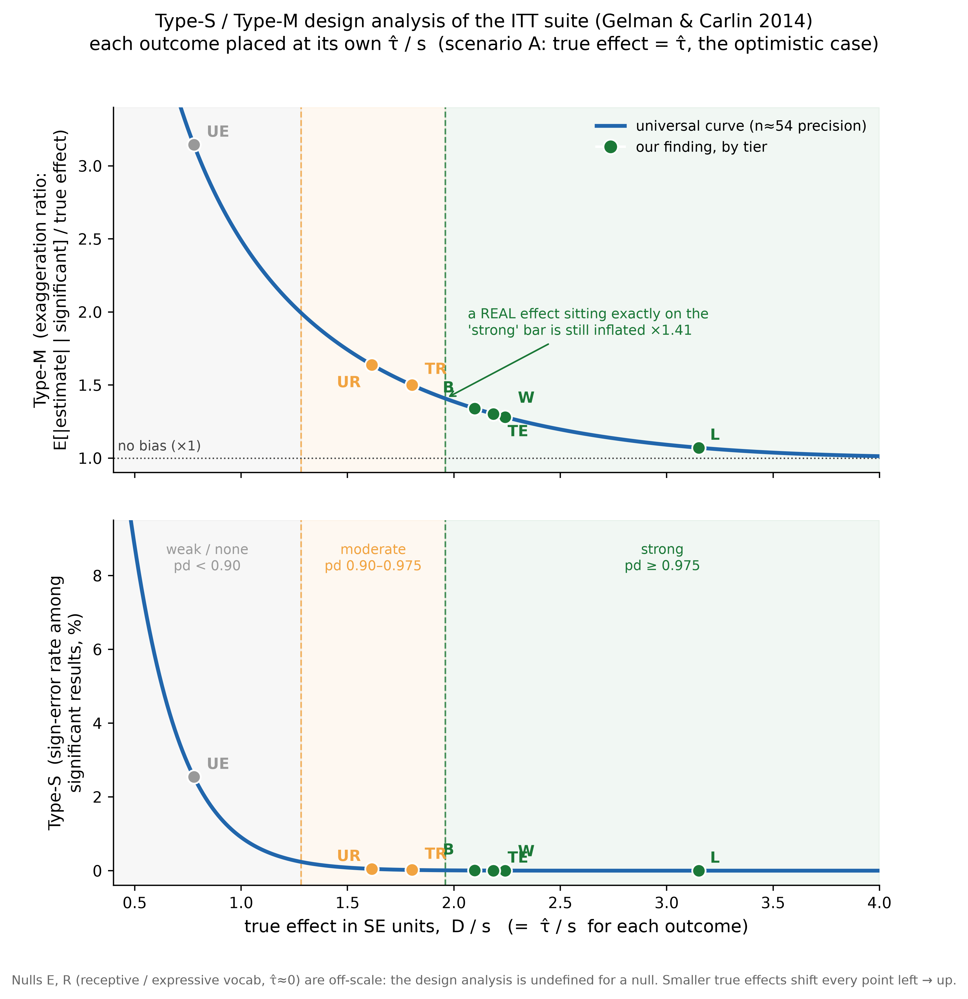
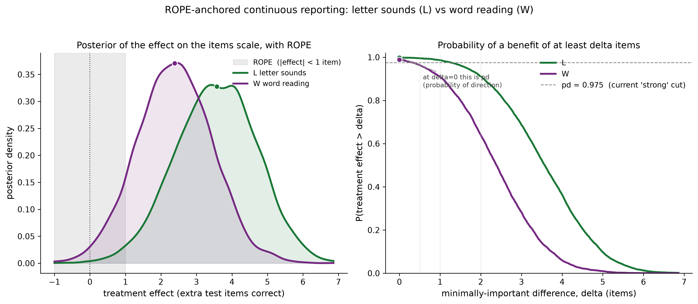

# Evidence-strength terminology, the small-sample winner's curse, and ROPE-anchored reporting

> [!NOTE]
> Drafted by a LLM-based AI tool (Claude Code/Opus 4.8).

> [!IMPORTANT]
> **Current policy (issue #179).** The evidence ladder in force is claim-oriented:
> **inconclusive / suggestive / moderate / strong / very strong** at the round-odds
> boundaries (3:1 / 10:1 / 30:1 / 100:1, i.e. P ≥ 0.75 / 0.91 / 0.97 / 0.99). "Weak"
> is **retired** as a current label — where it appears below it describes the earlier
> scheme, kept for history; read it as "suggestive". Labels qualify the evidence for a
> **named claim**, oriented to the favoured direction (a clearly negative effect is
> evidence of harm, not "inconclusive"), never the effect size, and are reported after
> the probability and odds. Interval bands follow the 50 / 90 / 95 convention (issue #177).

Date: 2026-06-26

## Scope and purpose

This note records a methodological decision about **how we describe the strength
of evidence** in the Bayesian statistical models (the `LRPITT`/`LRP` suite), and
**how we report effects**, so that the choice is a citable decision rather than an
inherited convention. It covers three linked things:

1. why the project's verbal evidence tiers ("strong" / "moderate" / "weak") and
   the default 95 % interval quietly re-import the `p < 0.05` convention we
   otherwise avoid;
2. a **design analysis** (Type-S / Type-M errors) that quantifies, for our actual
   sample size (n ≈ 54), how trustworthy a "strong" finding's **sign** and
   **magnitude** really are; and
3. the reporting standard we are adopting in response: **ROPE-anchored continuous
   reporting**, with a per-outcome minimally-important difference (δ) and the
   first set of provisional δ values.

It is written for a reader who is comfortable with p-values, confidence intervals
and effect sizes but **not** necessarily with Bayesian statistics. Each Bayesian
idea is introduced in those terms first.

A one-paragraph orientation for Bayesian readers: nothing here is novel
statistics; it is the standard effect-existence-vs-significance argument
(Makowski et al. 2019), Gelman & Carlin's (2014) retrospective design analysis,
and Kruschke's (2018) ROPE, applied to this study and turned into a house rule.

---

## 1. A short bridge for the frequentist reader

Our models are Bayesian. Three translations make the rest of this note readable
without a Bayesian background.

- **Posterior distribution = "all plausible values of the effect, weighted by
  credibility."** A frequentist analysis returns a point estimate and a standard
  error. A Bayesian model returns a whole distribution for the unknown effect —
  the _posterior_ — given the data and the model. Everything else is a summary of
  it. The **posterior mean** (or median) is the central estimate, analogous to a
  point estimate; the **posterior standard deviation (SD)** plays the role of the
  standard error.
- **95 % credible interval ≈ the confidence interval, read the way people wish
  they could read it.** The central range holding 95 % of the posterior mass is
  the **credible interval (CrI)**. Unlike a confidence interval, it genuinely
  licenses the sentence "given the data and model, there is a 95 % probability the
  true effect lies in this range." (We report equal-tailed intervals — the 2.5th
  to 97.5th percentile — not highest-density intervals; see §9.)
- **There is no p-value; we quote the probability of direction (`pd`).** Because
  there is no null-hypothesis test, there is no p-value. The closest analogue is
  `pd = P(effect > 0)`, the share of the posterior above zero — informally, "the
  probability the intervention helped." **Crucially, `pd` is almost a
  re-expression of the one-sided p-value:** for approximately symmetric posteriors
  with weak priors (our case), `p ≈ 2 × (1 − pd)` (Makowski et al. 2019). So
  `pd = 0.975` ≈ `p = 0.05`, and `pd = 0.90` ≈ `p = 0.20`.

Sign convention throughout: **positive τ ("tau") = the intervention raised the
outcome** (`G = 2 − group`). Only τ is causal (it is identified by randomisation);
every other coefficient is an adjusted association.

---

## 2. The problem: our verbal tiers are `p < 0.05` in disguise

The project had been labelling effects with verbal tiers defined on `pd`:
"strong" at `pd ≥ 0.975`, "moderate" at `0.90–0.975`, "weak" at `0.75–0.90`. Using
`p ≈ 2 × (1 − pd)`, those tiers translate exactly into p-value bands:

| Our label | `pd`       | "the X % CrI excludes 0" | two-sided p |
| --------- | ---------- | ------------------------ | ----------- |
| strong    | ≥ 0.975    | 95 % excludes 0          | **< 0.05**  |
| moderate  | 0.90–0.975 | 80–95 %                  | 0.05–0.20   |
| weak      | 0.75–0.90  | 50–80 %                  | 0.20–0.50   |
| none      | < 0.75     | —                        | > 0.50      |

So "strong = the 95 % CrI excludes zero" is literally `p < 0.05` wearing Bayesian
clothes, and the other tiers are p-value bands relabelled. This silently
contradicts the house style in `METHODS.md` ("report where the mass sits, never
collapse to significant/not; no p-values"). It is exactly the convention we did
not mean to adopt. Two distinct problems follow.

### 2a. Sign versus size

`pd` answers only _"is the effect non-zero, in this direction?"_ — a question
about **existence and sign**. It says nothing about whether the effect is **big
enough to matter**. On a small sample you can have `pd = 0.99` for an effect that
is practically negligible, or `pd = 0.85` for a clinically important one. A label
built on `pd` therefore certifies direction, not magnitude. (This is the
existence-vs-significance distinction of Makowski et al. 2019.)

### 2b. Small-sample inflation (the "winner's curse")

When we only _highlight_ estimates that clear a bar (the 95 % CrI excludes zero),
we are **selecting on a noisy quantity**. Selection on noise has a systematic
consequence: among the estimates that survive the filter, the magnitude is on
average **larger** than the truth, and — if power is low — the **sign** can be
wrong. This is the statistical-significance filter, or "winner's curse." It is the
same regression-to-the-mean selection effect we have already seen acting on
children's scores, but here it acts on the **effect estimate** itself. The next
section measures how bad it is for us.

---

## 3. Type-S / Type-M design analysis

### What it is

A **retrospective design analysis** (Gelman & Carlin 2014) takes a study of a
given precision and asks, of the findings it would _declare significant_:

- **Type-S (sign) error rate** — the probability a declared effect points the
  **wrong way**.
- **Type-M (magnitude) error**, a.k.a. the **exaggeration ratio** — the factor by
  which a declared effect **overstates** the true magnitude, on average.

It reframes "low power": the worry is no longer only "we might miss a real effect"
(the classical Type-II error) but the sharper "even our _hits_ are unreliable in
sign and inflated in size." These are frequentist (repeated-sampling) ideas and
apply identically to a p-value workflow.

### What you feed it

Two inputs: a **plausible true effect `D`** (chosen from _outside_ this study —
prior knowledge, or a minimally-important size; see the warning below) and the
**standard error `s`** (here the posterior SD, the precision the design actually
achieved). Model the estimate as `estimate ~ Normal(D, s)` and the significance
filter as `|estimate| > 1.96 s` (the 95 % interval excludes zero). Then:

```
power  = P(|estimate| > 1.96 s)                          # at the assumed D
Type-S = P(estimate has the wrong sign AND is significant) / power
Type-M = E[ |estimate|  |  significant ] / |D|
```

All three depend only on the ratio **`D / s`** (because the cutoff `1.96 s` scales
with `s`). That is why a single universal curve, below, summarises everything, and
why fast model refits that pin down `s` are sufficient.

### The intuition (why selection inflates size and flips signs)

Picture the bell curve of possible estimates centred on the true `D`, with cutoffs
at `± 1.96 s`. To be "declared," an estimate must land in a tail beyond a cutoff.

- **Magnitude.** When `D` is small relative to `s` (low power), most of the bell
  sits inside the cutoffs and is discarded; the survivors are precisely the draws
  that noise pushed _far_ from zero, so they are systematically **larger** than
  `D`. The weaker the design, the more extreme a survivor must be, and the bigger
  the exaggeration. When the design is strong (`D/s` large), almost everything
  clears the bar, selection is mild, and the exaggeration vanishes (Type-M → 1).
- **Sign.** When `D` is small and `s` large, the bell centred at `D > 0` still has
  real mass below the lower cutoff; those "significant" draws point the wrong way.
  As power falls toward its floor, the wrong-sign tail and right-sign tail become
  comparable and Type-S → ~50 % (a coin flip on direction).

Both failures share one driver: a true signal that is small relative to the noise.

> **The single most important caveat.** You must **not** plug the observed estimate
> in as `D` and call it done — that is "observed (post-hoc) power," which is
> circular (it is just a re-expression of the p-value). `D` must be chosen from
> outside the data, and because it is uncertain the honest form is a _sensitivity
> analysis over a range of `D`_. Below we report the optimistic anchor (`D = τ̂`)
> **and** a less flattering one (`D = τ̂ / 2`) **and** the universal curve.

### Results for our suite

Each graded single-outcome ITT model was refit; we took the posterior mean `τ̂`
and posterior SD `s` (logit scale) and ran the analysis. The implementation was
checked against the textbook landmark — a true effect estimated with 50 % power is
exaggerated ≈ 1.4× when significant — which it reproduces.

**Precision actually achieved**, sorted by `|τ̂| / s` (which equals the "z-like"
ratio and maps to `pd`):

| Outcome                |   n | `τ̂` (logit) |   `s` |  `pd` | `τ̂/s` |
| ---------------------- | --: | ----------: | ----: | ----: | ----: |
| L letter sounds        |  54 |       0.583 | 0.185 | 0.999 |  3.14 |
| W word reading         |  53 |       0.354 | 0.158 | 0.987 |  2.25 |
| TE taught expressive   |  54 |       0.319 | 0.146 | 0.985 |  2.18 |
| B blending             |  54 |       0.453 | 0.216 | 0.984 |  2.10 |
| TR taught receptive    |  54 |       0.247 | 0.137 | 0.966 |  1.80 |
| UR untaught receptive  |  54 |       0.289 | 0.179 | 0.946 |  1.61 |
| UE untaught expressive |  54 |       0.133 | 0.171 | 0.775 |  0.78 |
| E expressive vocab     |  54 |       0.008 | 0.082 | 0.546 |  0.10 |
| R receptive vocab      |  54 |       0.005 | 0.089 | 0.531 |  0.05 |

**Type-S and Type-M.** Scenario A assumes the true effect equals the estimate
(optimistic); scenario B assumes it is half that (the case the analysis exists to
warn about):

| Outcome                | power A | Type-S A | **Type-M A** | power B | Type-S B | **Type-M B** |
| ---------------------- | ------: | -------: | -----------: | ------: | -------: | -----------: |
| L letter sounds        |    0.88 |    0.0 % |     **1.07** |    0.35 |    0.1 % |         1.67 |
| W word reading         |    0.61 |    0.0 % |     **1.28** |    0.20 |    0.5 % |         2.24 |
| TE taught expressive   |    0.59 |    0.0 % |     **1.31** |    0.19 |    0.6 % |         2.30 |
| B blending             |    0.55 |    0.0 % |     **1.34** |    0.18 |    0.7 % |         2.38 |
| TR taught receptive    |    0.44 |    0.0 % |     **1.50** |    0.15 |    1.4 % |         2.74 |
| UR untaught receptive  |    0.36 |    0.1 % |     **1.64** |    0.13 |    2.3 % |         3.05 |
| UE untaught expressive |    0.12 |    2.5 % |         3.14 |    0.07 |   13.9 % |         6.10 |
| E, R (vocab nulls)     |    0.05 |    ~40 % |            — |    0.05 |    ~45 % |            — |

**The universal relationship** (any outcome; depends only on `D/s`):

|             true effect `D/s` |    power |     Type-S |   Type-M |
| ----------------------------: | -------: | ---------: | -------: |
|                           0.5 |     0.08 |      8.8 % |     4.79 |
|                           1.0 |     0.17 |      0.9 % |     2.49 |
| **1.96 (= our "strong" cut)** | **0.50** | **0.01 %** | **1.41** |
|                           2.5 |     0.71 |      0.0 % |     1.20 |
|                           3.0 |     0.85 |      0.0 % |     1.09 |
|                           4.0 |     0.98 |      0.0 % |     1.01 |



_Figure 1. The universal Type-M (top) and Type-S (bottom) curves for our n ≈ 54
precision, with each outcome placed at its own `τ̂/s` (scenario A) and the
project's evidence-tier bands overlaid (`pd` via `pd = Φ(τ̂/s)`). Nulls E, R are
off-scale because the analysis is undefined for a null (`τ̂ ≈ 0`)._

### How to read it

- **The "strong" boundary is not a magnitude-safety line.** A _genuinely real_
  effect sitting exactly on our strong cut (`τ̂/s = 1.96`) is still exaggerated
  **≈ 1.41×** on average. Clearing the bar certifies **direction**, not **size** —
  the empirical core of why blindly trusting the 0.975 / 95 % convention is unsafe.
- **Sign is trustworthy where we call something strong; size often is not.**
  Across the strong/moderate region Type-S is below ~1 %, so the _directions_ are
  solid. But only **letter sounds** is genuinely well-powered (Type-M 1.07). The
  other "strong" findings (W, TE, B) carry ~30 % expected inflation even
  optimistically, rising to ~2.2–2.4× if the truth is half what we saw.
- **The "moderate" findings (TR, UR)** sit higher up the curve (Type-M 1.5–1.6),
  with Type-S just lifting off zero.
- **The nulls (E, R)** correctly fall out as uninformative.

---

## 4. The remedy: ROPE-anchored continuous reporting

### What a ROPE is (in effect-size terms)

A **ROPE** (region of practical equivalence; Kruschke 2018) is the Bayesian name
for a concept frequentists already use: the **smallest effect size of interest
(SESOI)** in equivalence testing (Lakens et al. 2018), or a **minimally-important
difference (MID)** in clinical research. It is a band around zero, `[−δ, +δ]`, wide
enough that any effect inside it is "practically equivalent to no effect" for the
purpose at hand. We set `δ` on the **items scale** (number of test items), because
that is where "practically meaningful" can be judged. §5 sets the values.

With a ROPE we can ask the question `pd` cannot:

- `P(benefit ≥ δ)` — probability the effect is at least _meaningfully_ positive.
  This is the headline number; it replaces the bare "strong" label and is the
  _effect-significance_ index, distinct from the _effect-existence_ index `pd`.
- `P(|effect| < δ)` — probability the effect is practically negligible (inside the
  ROPE).
- `P(harm ≥ δ)` — the mirror image.

### The report card

For each outcome we report the full posterior, not a single number:

- the effect on **two scales** — logit (model-native) and **items** (the average
  marginal effect: for every child, toggle their randomised assignment
  counterfactually, read the change in expected items-correct, average; this
  carries the full posterior uncertainty);
- **two credible intervals** (50 % and 95 %) to show the shape and stop any single
  boundary carrying decisional weight;
- **`pd`**, demoted to "direction" — _is there a benefit at all?_;
- **`P(benefit ≥ δ)` and the ROPE coverage** — _is it meaningfully large?_;
- a **magnitude-reliability flag** (the Type-M from §3) on the point estimate.

### Worked contrast: letter sounds vs word reading

Both are "STRONG" under the old scheme (`pd` 0.999 vs 0.989) — indistinguishable.
The continuous, ROPE-anchored view separates them.

**L — letter sounds** (n = 54, 32-item test)

```
Current style → τ = +0.581 logit, 95% CrI [+0.209, +0.939], pd = 0.999  [STRONG]
Effect, logit : median +0.585   50% [+0.454, +0.708]   95% [+0.209, +0.939]
Effect, ITEMS : median +3.57    50% [+2.78,  +4.34]    95% [+1.27,  +5.72]
Direction     : pd = 0.999
Magnitude rel.: Type-M ≈ 1.07  (well powered — size trustworthy)
Practical sig.: P(benefit ≥ 1 item) = 0.986 ;  P(benefit ≥ 2) = 0.911 ;  in-ROPE(±2) = 0.089
```

**W — word reading** (n = 53, 79-item test)

```
Current style → τ = +0.355 logit, 95% CrI [+0.047, +0.658], pd = 0.989  [STRONG]
Effect, logit : median +0.356   50% [+0.249, +0.462]   95% [+0.047, +0.658]
Effect, ITEMS : median +2.39    50% [+1.68,  +3.09]    95% [+0.33,  +4.44]
Direction     : pd = 0.989
Magnitude rel.: Type-M ≈ 1.28  (size optimistic — discount the point estimate)
Practical sig.: P(benefit ≥ 1 item) = 0.909 ;  P(benefit ≥ 2) = 0.640 ;  in-ROPE(±2) = 0.360
```

In plain words: letter sounds is a _meaningful_ effect (≈ +3.6 items; a ≥ 2-item
benefit is 91 % probable; well powered). Word reading is _near-certain in
direction but uncertain in size_ (≈ +2.4 items, but a ≥ 2-item benefit is only
64 % probable, with a 36 % chance the true effect is within ± 2 items, and the
point estimate is itself mildly inflated). That distinction — "meaningful" vs
"real but maybe small" — is exactly what a single `pd` threshold throws away.



_Figure 2. Left: the items-scale posteriors with the ±1-item ROPE shaded; both
clear it, but word reading (purple) sits left of letter sounds (green). Right:
`P(effect > δ)` as the "meaningful" bar δ rises. At δ = 0 this is `pd` (both ≈ 1,
near-identical); as δ grows, letter sounds' curve stays high while word reading's
falls away. The widening gap is the information the "strong/strong" label hides._

---

## 5. Choosing δ (the minimally-important difference)

`δ` is a domain judgement, not a statistical one, so the values below are
**provisional** and owned by the education lead. But we make the choice a reaction
to real numbers rather than a guess: for each outcome we computed the anchors a
sensible `δ` could be built from.

- **scale length** (`n_trials`) — one item means more on a 10-item test than a
  170-item one;
- **baseline mean and SD** — for a distribution-based "small effect" (`0.2 × SD`);
- **natural maturation gain** — the untreated wait-list arm's t1→t2 gain over the
  ~20-week window, for an anchor-based `δ` ("a fraction of natural progress");
- **proportion of scale** (`5 %`).

| Outcome                | scale | baseline mean (SD) | natural growth | `0.2·SD` | `5 %` scale | `½·growth` |     **adopted δ** |
| ---------------------- | ----: | -----------------: | -------------: | -------: | ----------: | ---------: | ----------------: |
| L letter sounds        |    32 |         14.3 (8.7) |            3.2 |      1.7 |         1.6 |        1.6 |             **2** |
| W word reading         |    79 |         6.3 (11.3) |            2.0 |      2.3 |         4.0 |        1.0 |             **1** |
| R receptive vocab      |   170 |        35.4 (13.5) |            3.0 |      2.7 |         8.5 |        1.5 |             **2** |
| E expressive vocab     |   170 |        28.7 (12.8) |            4.3 |      2.6 |         8.5 |        2.2 |             **2** |
| TR taught receptive    |    24 |         12.0 (4.1) |            2.1 |      0.8 |         1.2 |        1.1 |             **1** |
| TE taught expressive   |    24 |          5.0 (3.5) |            1.8 |      0.7 |         1.2 |        0.9 |             **1** |
| UR untaught receptive  |  12\* |          7.5 (2.1) |            0.3 |      0.4 |         0.6 |        0.2 |     **1** (floor) |
| UE untaught expressive |  12\* |          5.8 (2.4) |            0.5 |      0.5 |         0.6 |        0.3 |     **1** (floor) |
| B blending             |    10 |          4.9 (2.2) |           0.04 |      0.4 |         0.5 |        0.0 |     **1** (floor) |
| P phonetic spelling    |    92 |         8.5 (21.1) |              — |        — |           — |        2.1 | **prob δ ≈ 0.10** |
| N nonword              |     6 |                  — |              — |        — |           — |        0.1 | **prob δ ≈ 0.10** |

\* UR/UE scale length is unconfirmed (absent from the data dictionary), so their
items `δ` is doubly provisional.

### The adopted principle and its consequence

We adopt **`δ` = half the period's natural maturation gain, floored at 1 item**
(you cannot meaningfully resolve less than one item) and rounded to whole items.
This is clinically interpretable — "the intervention adds at least half of what a
child would gain naturally in a period."

There is a consequence worth recording, because it is a feature of the choice, not
an accident. Tying `δ` to each test's own pace of growth makes the bar **lower for
tests where children naturally progress slowly**. That re-converges the
letter-sounds-vs-word-reading comparison:

- letter sounds, δ = 2 → `P(benefit ≥ δ) = 0.91`;
- word reading, δ = 1 → `P(benefit ≥ δ) = 0.91`.

Under a _distribution-based_ (`0.2·SD`) principle both would have had δ ≈ 2–3 and
word reading would have read as clearly weaker (`P ≈ 0.64`). The `½-growth` choice
makes them comparably meaningful, because word reading's slower natural growth
(~2 items/period) sets a gentler threshold. Neither principle is "right": the
choice encodes whether "meaningful" is **absolute** (a fixed slice of between-child
spread) or **relative to each domain's pace of progress**. We have chosen the
latter, and the education lead can override it per outcome (e.g. an absolute
taught-words target on TR/TE regardless of natural growth).

### Education-lead sign-off (2026-07-01, issue #144)

The education lead reviewed and confirmed the thresholds:

- the **½-natural-maturation rule** and **W = 1** stand as the primary items-scale
  δ; word reading is **also reported at δ = 2** as a stricter secondary threshold;
- the **floored outcomes P and N** keep **δ = 0.10 (10 pp)** as the primary
  risk-difference threshold — signed off (no longer a placeholder), given this
  group's evident difficulty with these measures;
- every report carries a **δ-sensitivity table for all outcomes** (each outcome's
  `P(benefit ≥ δ)` at its adopted δ and a stricter δ — items outcomes at δ and 2·δ;
  floored outcomes at 10 / 15 / 20 pp), so the meaningful-benefit claim's
  robustness to the δ choice is explicit rather than hidden in one number.

Still open (data-owner / education-lead):

- confirming **UR/UE scale length** — their denominators are unconfirmed, so their
  items δ stays provisional pending the data dictionary;
- any **per-outcome override** where an absolute domain target beats the formula
  (e.g. a taught-words target on TR/TE regardless of natural growth).

---

## 6. The reporting standard we are adopting

The guiding principle is **avoid verbal labels wherever possible**: report the
continuous quantities and let the reader weigh them. Labels are tolerated only in
plain-language summaries where prose demands a word, and then only under §6.4.

### 6.1 Point summaries: median, not mean

Use the **posterior median** as the headline point estimate, not the mean. The
reason is **transformation invariance**: for a monotonic re-expression `g`,
`median(g(X)) = g(median(X))`, whereas `mean(g(X)) ≠ g(mean(X))`. We report effects
on two scales linked by a monotonic transform (log-odds τ and the probability /
items scale via `expit`), so the median is coherent across both and the mean is
not; the median is also robust to the right-skew the `expit` pushforward induces.
For the current near-symmetric logit posteriors this is numerically immaterial
(L: mean 0.581 vs median 0.585), but it is adopted as a rule because it matters
where it will bite — the floored outcomes and the descriptive tables.

Three riders:

- The **estimand stays mean-based.** The treatment effect is an _average_ marginal
  effect (extra items per child, which aggregates to a cohort total); only its
  _posterior summary_ becomes the median. Decision / expected-utility integrals
  still use means.
- **Raw descriptive distributions** (baseline tables) are skewed and bounded, so
  prefer **median + IQR** over mean ± SD — except for floored measures (P, N),
  where the median sits on the floor and hides the signal; there report the
  off-floor proportion plus a quantile.
- **Differences are taken in the draws, never between summaries.** Report
  `median(A − B)` from the paired posterior draws, not `median(A) − median(B)`; the
  latter discards the correlation and mis-states the interval. For a skew-robust
  companion to the mean effect on heavily skewed outcomes, prefer the
  **Hodges–Lehmann** estimate (median of pairwise differences) over a naive
  difference of medians (which is not collapsible and does not aggregate).

### 6.2 Report continuously

Lead with the estimate on the **items scale** (posterior median), a **50 % and a
95 % credible interval**, `pd` (labelled "direction"), and **`P(benefit ≥ δ)` plus
the ROPE coverage** (labelled "meaningful benefit"). Show the posterior density
where space allows. The numbers, not a word, carry the conclusion.

### 6.3 Carry a magnitude-reliability flag

Where an effect sits low on the design curve (roughly `τ̂/s < 2.5`), state that the
point estimate is optimistic (Type-M inflation, §3) and the interval is doing the
work. Direction confidence and magnitude reliability are separate properties.

### 6.4 If a label is unavoidable: the evidence ladder

Labels are a last resort for prose, never a substitute for the numbers. When one
is unavoidable, use a single odds-based ladder, and always (a) **append the word
"evidence"** — the label qualifies the _evidence_, not the size of the effect
("strong evidence that …", never "strong effect"); (b) **name the claim**;
(c) **show the odds next to the word**; and (d) apply the ladder to whichever
probability the claim is about. The round-number odds boundaries are deliberate:
they are _not_ the `p = 0.05 / 0.025 / 0.01` images, so they do not smuggle the
significance grid back in.

| Posterior probability | Odds         | Evidence label |
| --------------------- | ------------ | -------------- |
| 0.50–0.75             | up to 3:1    | inconclusive   |
| 0.75–0.91             | 3:1 – 10:1   | suggestive     |
| 0.91–0.97             | 10:1 – 30:1  | moderate       |
| 0.97–0.99             | 30:1 – 100:1 | strong         |
| > 0.99                | > 100:1      | very strong    |

Run the ladder on **both** claims — direction (`pd`) and meaningful benefit
(`P(benefit ≥ δ)`) — and report both, because they routinely differ:

| Outcome         | direction (`pd`)                                  | meaningful benefit (`P ≥ δ`)                                         |
| --------------- | ------------------------------------------------- | -------------------------------------------------------------------- |
| L letter sounds | 0.999 → 999:1 → **very strong** evidence it helps | 0.91 (δ = 2) → ≈ 10:1 → **moderate** evidence the gain is meaningful |
| W word reading  | 0.989 → 90:1 → **strong** evidence it helps       | 0.91 (δ = 1) → ≈ 10:1 → **moderate** evidence the gain is meaningful |

(Both meaningful-benefit odds land at ≈ 10:1, on the suggestive/moderate border —
itself a reminder that the odds are the real quantity and the label is a coarse
handle.) State the **orientation**: the ladder runs from 0.50 toward 1 for the
_favoured_ direction; where an outcome could plausibly be harmful, also report
`P(harm ≥ δ)`.

### 6.5 Reconciliation and implementation

This restores consistency with the existing `METHODS.md` rule ("report where the
mass sits, never collapse to significant/not; no p-values"), which the old `pd`
tiers violated. Implementation (a reusable `rope_summary()` and a report-template
block, folding into issue #125) is a separate step.

---

## 7. Limitations and assumptions

- **Normal-approximation design analysis.** Type-S/Type-M use a normal sampling
  distribution; fine for these summaries at n ≈ 54, approximate for skewed or
  near-boundary posteriors (the floored outcomes especially).
- **Posterior SD used as the standard error.** With our weak `Normal(0, ·)` priors
  the posterior ≈ the likelihood, so the mapping is clean; the prior mildly shrinks
  `τ̂` and narrows `s`, making the reported Type-M, if anything, slightly
  conservative.
- **Fast refits.** The `τ̂`, `s` and ROPE figures here come from quick dev-config
  fits — stable to the quoted precision; reporting-config sampling would only
  reduce Monte-Carlo error.
- **Equal-tailed intervals.** We report ETI (percentile) intervals, which are
  transformation-invariant but can include low-density values for skewed
  posteriors; highest-density intervals (HDI) are the alternative. This is the
  same naming point as the `hdi_prob → ci_prob` rename (#101): the code computes
  ETI and should say so.
- **`δ` is provisional** and, for raw-items ROPEs, scale-dependent across tests of
  different length — see §5.

---

## 8. Reproduction

The numbers come from refitting the graded single-outcome ITT models
(`build_itt_model`, dev config) and computing, per draw: the design-analysis
quantities from `τ̂` and `s` (closed form, §3), and the items-scale average
marginal effect via the existing `reporting.tau_summary_itt` machinery
(`expit(η0 + τ) − expit(η0)` averaged over children, × `n_trials`) with the ROPE
tail probabilities layered on top. The δ anchors come from `rli_data_long.csv`
(baseline mean/SD at t1; untreated wait-list t1→t2 gain). The figures are in
`notes/assets/202606261304-*.png`. The exploratory scripts were not retained; a
committed, reproducible script is a sensible follow-up if these analyses are to be
rerun.

---

## 9. References

- Amrhein, V., Greenland, S., & McShane, B. (2019). Scientists rise up against
  statistical significance. _Nature_, 567(7748), 305–307.
  doi:10.1038/d41586-019-00857-9
- Burgoyne, K., Duff, F. J., Clarke, P. J., Buckley, S., Snowling, M. J., & Hulme,
  C. (2012). Efficacy of a reading and language intervention for children with Down
  syndrome: a randomized controlled trial. _Journal of Child Psychology and
  Psychiatry_, 53(10), 1044–1053. doi:10.1111/j.1469-7610.2012.02557.x
- Gelman, A., & Carlin, J. (2014). Beyond power calculations: assessing Type S
  (sign) and Type M (magnitude) errors. _Perspectives on Psychological Science_,
  9(6), 641–651. doi:10.1177/1745691614551642
- Kass, R. E., & Raftery, A. E. (1995). Bayes factors. _Journal of the American
  Statistical Association_, 90(430), 773–795. doi:10.1080/01621459.1995.10476572
- Kruschke, J. K. (2018). Rejecting or accepting parameter values in Bayesian
  estimation. _Advances in Methods and Practices in Psychological Science_, 1(2),
  270–280. doi:10.1177/2515245918771304
- Lakens, D., Scheel, A. M., & Isager, P. M. (2018). Equivalence testing for
  psychological research: a tutorial. _Advances in Methods and Practices in
  Psychological Science_, 1(2), 259–269. doi:10.1177/2515245918770963
- Makowski, D., Ben-Shachar, M. S., Chen, S. H. A., & Lüdecke, D. (2019). Indices
  of effect existence and significance in the Bayesian framework. _Frontiers in
  Psychology_, 10, 2767. doi:10.3389/fpsyg.2019.02767
