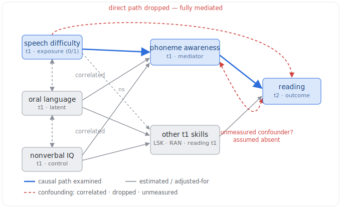
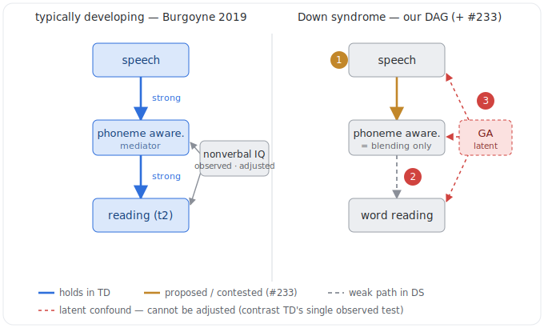

<!-- SPDX-License-Identifier: CC-BY-4.0 -->

> [!NOTE]
> Drafted by a LLM-based AI tool (Claude Code/Opus 4.8).

> [!WARNING]
> This is a **deliberation note, not a decision**. It critically reviews the LOCKED base DAG (`notes/202606231600-dag-revision-consolidated.md`, locked 2026-06-23) against the typically-developing (TD) and Down-syndrome (DS) reading-science literature. Nothing here changes code, and it does **not** edit `notes/dag-language-reading.dagitty` — every structural change proposed is gated on team sign-off per the locked DAG's own reopen protocol. Reading-science citations carry DOIs verified against PubMed/publisher pages during drafting; three older references (Stanovich 1986; Metsala & Walley 1998; Share 1995) are flagged for final verification before they enter the report, per `METHODS.md`.

# Critical review of the language & reading DAG against the TD and atypical literature

Date: 2026-07-09. Prompted by two speech-production papers supplied for consideration (Burgoyne, Lervåg, Malone & Hulme 2019; Burgoyne, Buckley & Baxter 2021) and a request to then review the whole DAG as it currently stands. This note has two parts: **Part A** records the two-paper trigger (the `SP`/speech and hearing question) in full; **Part B** is a whole-graph critical review contrasting each structural commitment with the TD and DS evidence. It closes with an ordered, gated change list, the impact on the existing model suite, and a decision log. The base DAG remains locked until the team acts on this; the ITT/joint models are unaffected by everything below (randomisation identifies τ regardless of the internal edges).

## How to read this review — the standard applied

A causal DAG for this project is an **identification instrument**, not a complete developmental theory: its job is to say which associations are confounded, what may be adjusted, and which effects the design identifies. Two asymmetries follow. First, a **missing** edge is a strong claim (an asserted-absent causal path), whereas an **extra** edge is cheap (it usually only enlarges an adjustment set) — so the review weights omissions more heavily than inclusions. Second, because `GA` is latent and points into almost everything, nearly every internal conditional independence is **untestable in these data** (every separating set contains `GA`); the internal edges are therefore imported from theory, and "contrast with the literature" is the only available audit. The locked note is unusually candid about its contestable commitments (its cautions register lists eight), so several points below are less "this is wrong" than "the caution is load-bearing and may now warrant a structural change rather than a footnote."

Throughout, the crucial population distinction: the causal architecture of early word reading is largely **shared** between TD and DS children, but the **weights differ**, and DS carries population-specific inputs (hearing, speech, verbal short-term memory) that a TD-derived graph never needed to represent.

---

## Part A — The two-paper trigger: speech production (`SP`) and hearing

### What the two papers establish

**Burgoyne, Lervåg, Malone & Hulme (2019)**, _Early Childhood Research Quarterly_ 49:40–48 (DOI: 10.1016/j.ecresq.2019.06.003). A large (N = 569) unselected TD school-entry sample. A latent-variable path model (Mplus) found that the relationship between t1 speech difficulty and t2 word reading was **fully mediated by phoneme awareness** — not by letter-sound knowledge and not by RAN — and the indirect path (t1 speech → t1 phoneme awareness → t2 reading, standardised indirect effect −0.037) survived control for oral language and non-verbal IQ. Dropping the direct paths from speech, language and IQ to t2 reading did not worsen fit. The model's direction is explicit and theory-driven: **speech → phonological skill → reading**, i.e. speech/articulation sits _upstream_ of the phonological foundations of reading.

**Burgoyne, Buckley & Baxter (2021)**, _Journal of Intellectual Disability Research_ (DOI: 10.1111/jir.12862). Crucially, **this is our own cohort** — the same children recruited to Burgoyne et al. (2012), the RLI trial (50 children with DEAP data at first and final assessment, aged 5;02–10;00 at t1). All findings are concurrent/associational (no randomised contrast on speech). The load-bearing results:

- Speech production accuracy (percentage consonants correct, PCC) was low and highly variable (mean 43.45% at t1) and, after partialling age, correlated with **receptive vocabulary (r = 0.43), phoneme blending (0.30) and single-word reading (0.50)**; it correlated only weakly and non-significantly with **letter-sound knowledge (0.27, p = .058) and non-verbal IQ**.
- In a simultaneous regression, **only reading was a unique predictor** of concurrent PCC (8.8% unique variance) — but the authors explicitly warn that reading is _not_ therefore causally related to speech improvement.
- Speech was **remarkably trait-stable**: t1↔t2 PCC r = 0.84 over 21 months, with **no significant group change**, and t1 reading did _not_ predict t2 PCC after age. Only prior speech (t1 PCC) uniquely predicted later speech (49.7% unique variance).
- Hearing impairment and a history of recurrent ear infections were associated with lower PCC at **moderate effect sizes (d ≈ 0.45–0.60)**, non-significant at n = 43/40 but consistent with the larger DS hearing literature (Laws & Hall 2014, DOI: 10.1111/1460-6984.12077, where the difference _was_ significant, d = 0.87).

### Implications for `SP` in the DAG

The locked DAG places `SP` as a **downstream sink** driven by vocabulary (`EV → SP`, `TE → SP`, plus `A`, `GA`), justified by lexical-restructuring theory (Metsala & Walley 1998). Its §7 caution already flags the direction as "genuinely contestable" and sets an explicit reopen condition: _"re-open only if speech is to be treated as a constraint on measured vocabulary rather than a downstream outcome."_ The two papers now meet that condition from both sides:

1. **Theory / TD evidence (paper 2019):** in a population model, speech sits _upstream_ of the phonological skills that cause reading — the opposite orientation to `EV → SP`.
2. **Same-sample DS evidence (paper 2021):** in _our own children_, speech is an early-emerging, trait-stable characteristic (r = 0.84, no change over the trial) that is only weakly tied to vocabulary and is reading-correlated. That is the empirical profile of a **source**, not a vocabulary-driven sink.

The structural consequence is the one the locked note itself spelled out: if `SP` flips to a source (`SP → EV`, and — following paper 2019 — plausibly `SP → PA`), it stops being an inert sink and moves **onto the path to `WR`** (via `EV`, and via `PA`). It would then enter the adjustment sets for the vocabulary→`WR` and `PA`→`WR` mechanism/mediation models. Because `SP` is measured only as `deapp_c`, that is an **unmeasured/one-indicator-confounding** concern for exactly the mechanism and mediation slopes the suite currently reports — not a cosmetic relabelling.

There is also a **measurement channel** the current graph cannot express and that these papers make salient: the expressive-vocabulary tasks (EOWPVT, the taught-expressive set) and, most sharply, **nonword reading (`NW`)** are _spoken-response_ tasks. Poor articulation depresses the _measured_ score independently of the underlying construct — a `SP → measured-Y` path that exists even if `SP → construct-Y` does not. Our own reporting-fit floor-sitter cut is the empirical face of this: four children with near-complete letter sounds (≥ 26/32) and some word reading scored **zero** on nonword reading, one of them spelling 53 items phonetically. A child who can _spell_ phonetically but scores zero _reading nonwords aloud_ is pointing straight at the production demand of the task.

### The 2019 path model as a DAG — adjustment sets, confounds, and how far it transfers

The 2019 paper reports a latent-variable path model but draws no DAG, which makes its adjustment sets and confounds hard to see. They are not hidden, though: a linear SEM path model **is** a DAG with a parametric skin. Every single-headed regression arrow is a directed edge; every double-headed "covariance" arrow is a bidirected edge — confounding the authors _admit and estimate_ rather than resolve. And there is no single global adjustment set: in an SEM the adjustment happens **per structural equation** — a path coefficient is that predictor's effect conditional on the _other predictors entered in the same equation_. Reconstructed as a graph:

_Schematic reconstruction (not a reproduction of the paper's Fig. 2). Blue = the causal path examined; grey = other estimated paths / adjustment; red dashed = confounding (correlated, dropped, or unmeasured)._

The fitted structure has three layers. **Layer 0** — three exogenous t1 variables, freely intercorrelated: speech difficulty (a 0/1 dummy, percentage-consonants-correct ≤ 85 %, only 6.88 % = 38 of 569 children), oral language (latent: expressive vocabulary + receptive grammar + listening comprehension) and nonverbal IQ (Ravens, entered as a "control"). The double-headed arrows say the model imposes _no causal order_ on this trio. **Layer 1** — the t1 skills (phoneme awareness, letter-sound knowledge, RAN, t1 reading), each regressed on all three Layer-0 variables, with freely-correlated residuals. **Layer 2** — t2 reading (6 months later), regressed on the four t1 skills; the direct paths from speech/language/IQ into t2 reading were included, then dropped with no loss of fit. This yields two implicit adjustment sets: `speech → phoneme awareness` is adjusted for `{oral language, nonverbal IQ}` (the co-predictors in the PA equation, the backdoor-blockers), and `phoneme awareness → t2 reading` is adjusted for `{letter-sound knowledge, RAN, t1 reading}` plus upstream language and IQ — the **t1-reading autoregressor** being the important one, since it turns the outcome into essentially _reading growth_.

The numbers: the **total** effect of speech on t2 reading (speech alone) is a y-standardised β = **−0.7**, i.e. ≈ Cohen's _d_; the direct arrow is fully mediated (dropping the speech/language/IQ → t2-reading paths did not worsen fit, χ²-difference(3) = 4.31, _p_ = .23); and the surviving route `speech → phoneme awareness → t2 reading` has a **standardised indirect effect of −0.037** (the paper prints the 95 % CI as [−.87, −.002], almost certainly a typographic slip for **[−.087, −.002]** — small, negative, excluding zero). The model explains 70 % of the variance in t2 reading. Note the gap between the −0.7 total and the −0.037 mediated slice: most of the raw speech–reading association is _shared_ with language and IQ; the _unique_ speech → PA → reading contribution is small.

The **confounds** are exactly the bidirected arrows the authors did _not_ draw — the identifying assumptions. (a) **Mediator–outcome confounding** (the red arc, the load-bearing one): any unmeasured common cause of phoneme awareness _and_ t2 reading — a broader general ability than one Ravens test captures, home-literacy / print exposure, SES, or a latent phonological-processing factor. So "independent of nonverbal IQ" is **not** "unconfounded by _g_"; a single observed covariate is a weak proxy for general ability. (b) **No temporal precedence**: speech, PA, language, IQ and t1 reading are all measured at the _same_ wave, so `speech → PA` is a concurrent association whose direction is assigned by theory, not by time (only t1 → t2 reading is genuinely longitudinal). (c) **Uncorrected exposure measurement error**: every other construct is latent (multiple indicators), but speech is a single **dichotomised dummy**, so its path is attenuated/biased and dichotomising a continuous score discards information. (d) **Reverse causation** (`reading → PA`) is only _partly_ handled by conditioning on t1 reading. (e) **Fit does not validate direction**: RMSEA .042 / CFI .98 is a good fit, but a Markov-equivalent model with some arrows reversed can fit _identically_.

**How far this transfers to Down syndrome.** The same three-node spine — `speech → phoneme awareness → reading` — is why the TD result _looks_ like it should carry over; the side-by-side shows the three places it does not.

_Schematic. Left: the TD spine (holds, adjusted for one observed test). Right: the same spine in our DS graph, with the three breaks numbered below._

- **① Orientation (transfers).** TD puts speech _upstream_ (`speech → PA`). Our locked DS graph has `EV → SP` — speech a downstream **sink**, the opposite arrow. Issue #233's proposal is exactly to flip `SP` upstream to match TD, and the two papers are the warrant (2019 for the theory, 2021 for the same-cohort trait-stability). This part of the transfer is sound.
- **② Mediator (does _not_ transfer — the key break).** In TD the effect is routed _entirely_ through **phoneme awareness** — and PA is precisely the pathway that is weak or absent in DS (Cossu et al. 1993; Hulme et al. 2012 _Dev Sci_), while our `PA` node is **blending only**. So even granting the orientation flip, the _engine_ of the TD result — a strong `PA → reading` slope — is the thing that may not fire in DS. The transfer can be right about the arrow and wrong about the mechanism.
- **③ Confounder (a sharper standard on our side).** TD conditions on a **single observed nonverbal-IQ measure** and calls the result "independent of IQ." Our DS graph makes general ability a **latent node `GA`** pointing into speech, PA and word reading — drawn, and by construction _not_ adjustable (ID-2). So the mediator–outcome confound the TD model assumes away with one Ravens score, we represent and refuse to claim we have removed. This is a concrete example of why we draw `GA` rather than adjust it.

The position this yields for the `SP` reopen is **adopt the orientation, quarantine the mechanism**: use the two papers to support flipping `SP` upstream (①), but do _not_ import the TD mediating pathway (②) — in the DS graph the speech→reading route should stay agnostic about _which_ mediator carries it, with letter sounds the better DS candidate (per med-059/064) — and flag (③) that the TD "fully mediated, independent of IQ" conclusion rests on a confounder control our own framework treats as unavailable.

### A candidate new node: hearing

Neither the DAG nor its node list includes **hearing**, yet `hearing`, `hearing_c` and `earinf` are all present in `rli_data_long.csv` (flagged as unused in issue #230). This is a genuine TD-vs-DS gap: hearing is rarely a needed node in a TD reading graph, but otitis media and fluctuating conductive loss affect a large fraction of children with DS, and the DS evidence links hearing to speech and language (paper 2021 moderate effects; Laws & Hall 2014 significant). If `SP` becomes a source with a path to `WR`, **hearing becomes a plausible upstream common cause** of speech (and thence of the phonological/reading route) that is measured but unmodelled — i.e. a candidate confounder we could actually adjust for. Adding `Hearing → SP` (and possibly `Hearing → RW`/`PA`) turns an unused variable into an identification asset. This ties the DAG question directly to the "unused measured domains" item on issue #230.

### What the stability finding _confirms_ (a point in the DAG's favour)

Paper 2021's r = 0.84 stability and null group-change mean `SP` behaves as a fixed baseline trait over the trial window — the intervention does not move it. That **supports** the DAG's existing choice to give `SP` **no** incoming `IG`/`IS` edge, and predicts τ_SP ≈ 0 (consistent with the reporting fit). So on the _treatment_ side the graph is right; the issue is confined to the `EV`/`SP` orientation and `SP`'s sink-vs-source status, plus the missing hearing node and the measurement channel.

---

## Part B — Whole-DAG critical review

### Where the DAG matches the literature well (keep as-is)

- **The code-route skeleton** `LS`, `PA` → decoding → `WR` is the canonical alphabetic-reading architecture with RCT-grade support in TD samples: letter-sound knowledge and phoneme awareness are the two best-established _causal_ foundations of word reading (Hulme, Bowyer-Crane, Carroll, Duff & Snowling 2012, DOI: 10.1177/0956797611435921; Bradley & Bryant 1983, DOI: 10.1038/301419a0; Melby-Lervåg, Lyster & Hulme 2012, DOI: 10.1037/a0026744). The simple-view framing (Gough & Tunmer 1986, DOI: 10.1177/074193258600700104) motivates the decoding-plus-language structure.
- **Taught vs standardised vocabulary as separate nodes** (`TE`/`TR` distinct from `EV`/`RV`, with transfer edges `TE → EV`, `TR → RV`) is an excellent, unusual move: it converts the trial's "no transfer to standardised vocabulary" from a design-forced zero into an _estimable transfer effect_, matching Burgoyne et al. (2012).
- **`RV → WR` (a language route directly into word reading)** is _better_ supported in DS than in TD. In TD, vocabulary's direct effect on word-level reading is modest and concentrated on exception words (Ricketts, Nation & Bishop 2007, DOI: 10.1080/10888430701344306). But the key DS longitudinal study — Hulme, Goetz, Brigstocke, Nash, Lervåg & Snowling (2012), _Developmental Science_ 15(3):320–329, DOI: 10.1111/j.1467-7687.2011.01129.x — found reading in DS **more** language-constrained than in TD, with vocabulary the stronger predictor of both level and growth. Our own results agree (mechanism `E→W` the strongest slope; hs-002 selecting expressive vocabulary alongside letter sounds).
- **The `IS` collider treatment** (never condition on dose; dose-response flagged observational) is more careful than most published mediation work in this area.

### Critique 1 — The weight on `PA → WR` is the DAG's most DS-contested commitment

The graph imports the TD phonological canon wholesale, and this is precisely where the DS literature diverges most sharply:

- **Cossu, Rossini & Marshall (1993)**, _Cognition_ 46(2):129–138 (DOI: 10.1016/0010-0277(93)90016-O): DS children reading at a 7-year level while _failing_ phonemic-awareness tasks that their reading-age-matched TD controls passed — the classic demonstration that in DS, word reading can run ahead of phonemic awareness.
- **Hulme et al. (2012, _Developmental Science_):** phoneme awareness predicted the _growth_ of reading in TD children **but not** in DS; letter-sound knowledge was also not a significant growth predictor in that DS sample. Initial reading was constrained more by general language (vocabulary).
- **Næss (2016)**, _Developmental Psychology_ 52(2):177–190 (DOI: 10.1037/a0039840): a meta-analysis plus empirical study finding PA in DS weak relative to controls and — importantly — _uneven_ across components (rhyme most delayed). This matters because our `PA` node is operationalised by **blending alone**, the most reading-proximal and relatively preserved PA component. The node's label ("phonological awareness") claims more construct than the single-task measure delivers.

I would **not delete** the code-route edges: PA–reading correlations do exist in DS, PA is trainable in DS, and our own RCT moves blending (τ_B = +0.099, P = 0.98). The point is subtler and belongs in the record: the DAG encodes a **TD-weighted theory of a structure whose weights are known to differ in DS**. There is a genuinely satisfying reconciliation for our own data — the _intervention's_ reading effect runs through letter sounds (med-059/064) because that is what was explicitly taught, whereas _naturalistic_ reading variance is language-constrained (Hulme 2012; our `E→W` slope). Both routes are real and the DAG rightly contains both; what is missing is the explicit statement that in this population the **orthographic/whole-word and language routes are expected to carry relatively more, and the phonemic route relatively less (or later)**, than the TD canon implies. Recommended action: a documented **DS-weighting caution** on the code route, an added **measurement caution** that `PA` = blending only, and — as a first-class analysis rather than a graph edit — a cross-lagged test (via the LCSM machinery) of whether `PA→WR` or `WR→PA` dominates in these panel data.

### Critique 2 — The missing reading → language reverse edges contradict the programme's own theory

Caution 8 concedes that reading↔PA/decoding reciprocity is collapsed one-way for acyclicity. But the larger omission is **reading → language**: there is no `WR → EV`, `WR → RV`, or `WR → RW` anywhere in the graph. Three reasons this is the most consequential missing structure:

1. **TD:** print exposure driving vocabulary and broader language growth is a textbook developmental effect (Stanovich 1986, "Matthew effects", _Reading Research Quarterly_ 21(4):360–407 — DOI to verify).
2. **DS:** this is not incidental — it is the **founding hypothesis of the intervention tradition this project sits in**. Reading instruction has long been proposed as a _route into_ language and verbal memory for children with DS (Laws & Gunn 2002, _Reading and Writing_, DOI: 10.1023/A:1016364126817; and the review of reading-as-intervention for vocabulary/memory/speech in DS, PMID 21189807). RLI is literally a "reading **and language** intervention."
3. **It cannot be represented as a patch to the current graph:** adding `WR → EV` closes a cycle (`EV → PA → WR → EV`). This is a symptom of the deeper problem in Critique 5, not a stray missing arrow.

Consequence as drawn: any mechanism or mediation model with vocabulary as exposure and reading as outcome treats the reverse channel as a structural zero, when the project's own theory of change asserts it is real. At minimum this belongs in the cautions register; properly, it needs the time-indexed graph (Critique 5) so the edge can exist without a cycle.

### Critique 3 — `RW` (phonological memory) is under-connected and internally inconsistent

`RW`'s only child is `EV`; its only parents are `A`/`GA`; it is the graph's sole node with no path from the intervention (a structural zero). Against the DS literature this is hard to defend on either side:

- **Outgoing side is too sparse.** Laws & Gunn (2004), _JCPP_ 45(2):326–337 (DOI: 10.1111/j.1469-7610.2004.00224.x) found phonological memory predicted _language comprehension_ growth over five years in DS — supporting `RW → RV` (and plausibly `RW → RG`), not just `RW → EV`. Verbal short-term memory is a **signature DS deficit** (Næss, Lyster, Hulme & Melby-Lervåg 2011, _Research in Developmental Disabilities_ 32(6):2225–2234, DOI: 10.1016/j.ridd.2011.05.014), which makes it an odd node to leave nearly disconnected in a DS-specific graph.
- **Incoming side is inconsistent with the graph's own logic.** §7 justifies `TE → SP` by lexical restructuring (vocabulary growth refines phonological representations). The _same_ theory predicts `EV`/`TE → RW` (vocabulary growth supports phonological memory), an edge the graph omits. And the DS reading-as-intervention literature includes claims that reading instruction improves verbal memory — directly contradicting `RW`'s "intervention-free" status. If the isolation is deliberate (e.g. to keep `RW` as a clean exogenous capacity proxy), that should be a _recorded_ decision with a reason; as it stands it reads as an artefact of draft history.

### Critique 4 — Speech and hearing (structural summary of Part A)

Carried up from Part A into the change list: **reopen `EV → SP`** (flip toward `SP → EV`/`SP → PA`, moving `SP` from sink to early source), **add a hearing node** as an exogenous common cause, and **record the spoken-response measurement channel** (`SP → measured `NW`/`EV`/`TE``) that no construct-level edge can capture. All three are DS-population features a TD-derived graph would not include, and all three bear on the mechanism/mediation adjustment sets rather than on the ITT.

### Critique 5 — The deepest issue: a static acyclic graph for a four-wave panel (the master fix)

Cautions 5, 6 and 8 (the `PS` direction, the `SP` direction, the collapsed reciprocity) are three faces of **one** underlying problem: a developmental system with feedback has been forced into a single cross-sectional acyclic graph. But the models the DAG actually serves are **longitudinal** — period-stacked gain factors, level trajectories, the latent change-score model, the proposed lagged-change mediation (issue #229) — and the literature's contested directions are mostly _resolvable in time_ (does `WR` at wave t predict `PA`/`EV` _change_ to t+1, or the reverse?).

A **wave-unrolled (time-indexed) companion DAG** — nodes `WR_t`, `PA_t`, `EV_t`, … with edges only permitted forward in time — would, in one move:

- make the reciprocal edges **representable** (`PA_t → WR_{t+1}` _and_ `WR_t → PA_{t+1}`) instead of confessed-away;
- let `WR → EV` (Critique 2) coexist with `EV → PA → WR` **without a cycle**;
- give `SP` (Critique 4) a natural home as an **early, stable source** whose influence propagates forward;
- make each gain-factor / LCSM model's adjustment set **literally readable off the graph** (parents at the prior wave);
- convert several currently **untestable** internal edges into **cross-lagged hypotheses** the LCSM machinery can actually probe.

This is the single highest-value structural upgrade available, and it **supersedes rather than competes with** the SP/PS direction disputes — most of those dissolve once time is explicit. It is also more work than the other items and should be scoped as its own piece.

### Smaller points (mostly keep, with recorded cautions)

- **Grammar severed from `WR`** (`RG`/`EG`/`EI`/`LF` have no path to reading) — **defensible, keep.** TD grammar predicts comprehension, not word recognition; the outcome scope here is word-level; DS grammar is disproportionately impaired (Næss et al. 2011) and so is better cast as an outcome than a decoding cause. The existing caution (any `RG→WR` estimate is structurally forced to null) is the right disclosure.
- **Single latent `GA` → (almost) everything** — **conservative and identification-safe** (its job is to _forbid_ causal readings of skill-to-skill couplings, which it does). TD evidence agrees non-verbal IQ is a weak _unique_ predictor of early word reading (paper 2019's weak IQ paths). The open "correlated domain factors / bifactor" upgrade is supported by our own mm-001 (domain correlations 0.65–0.80 — high, but distinguishable) and is identification-neutral; worth doing when the measurement model is next revisited, but not urgent.
- **No `IG → NW` edge** — a real, _testable_ exclusion restriction: as drawn, the intervention reaches nonword reading only via `LS`/`PA`. The proposed mediation-into-`NW` model (issue #228 item 12) is therefore also a **test of the DAG's own structure** — worth stating when that model is built.
- **RAN is absent from the battery entirely.** Rapid automatized naming is the second pillar of TD word-reading prediction (Lervåg & Hulme 2009, _Psychological Science_ 20(8):1040–1048, DOI: 10.1111/j.1467-9280.2009.02405.x). Nothing to fix in the graph, but it belongs in the cautions register as a named **unmeasured input** to the code route (a potential common cause of `LS`/`PA` and `WR` that we cannot adjust for).
- **`PS → WR`** — the invented-spelling-promotes-reading evidence is TD only (Ouellette & Sénéchal 2008, _Child Development_ 79(4):899–913, DOI: 10.1111/j.1467-8624.2008.01166.x); I can find no DS support, and `PS` is 78%/64% floored at t1/t2 here. The literature strengthens the DAG's _already-open_ case to **demote `PS`** to a weak indicator of a latent code factor (the floor-robust option) rather than a standalone causal node.
- **SES** is excluded from the DAG as "not a node" yet used as a robustness covariate (itt-013/113). TD SES→language gradients are robust, so the split (structure says no node; practice runs it as a sensitivity adjustment) is fine — but it is currently _unstated_ in the DAG note and should be recorded as a deliberate choice.

### Verdict table

| Structural commitment                | TD literature                           | DS literature                                                       | Verdict                                             |
| ------------------------------------ | --------------------------------------- | ------------------------------------------------------------------- | --------------------------------------------------- |
| `LS`/`PA` → decoding → `WR`          | Strong, RCT-grade                       | Contested _weights_ (Cossu 1993; Hulme 2012 Dev Sci; Næss 2016)     | Keep; document DS-weighting + blending-only caution |
| `PA` = blending only (measurement)   | PA multi-component                      | Profile uneven; blending relatively preserved                       | Add measurement caution                             |
| `RV → WR` direct                     | Modest (exception words)                | Strong (language-constrained reading)                               | Keep — well justified in DS                         |
| No `WR → EV/RV/RW` (reverse)         | Print-exposure effects (Stanovich)      | Programme's founding hypothesis (Laws & Gunn 2002)                  | **Gap** — needs time-indexed home                   |
| `RW → EV` only; intervention-free    | Loop → word learning                    | Also predicts comprehension growth (Laws & Gunn 2004); core deficit | Under-connected + inconsistent with §7              |
| `EV → SP`, `SP` a sink               | Speech _upstream_ of PA (Burgoyne 2019) | Trait-stable, reading-linked (Burgoyne 2021)                        | **Reopen** — condition met                          |
| No hearing node                      | Rarely needed                           | Prevalent; speech/language-linked (Laws & Hall 2014)                | **Add** (measured but unused)                       |
| `SP → measured score` (spoken tasks) | —                                       | Salient in DS; our floor-sitters                                    | Record measurement channel                          |
| `PS → WR`                            | TD invented-spelling only               | None; floored here                                                  | Demote to indicator (already open)                  |
| Grammar ∤ `WR`                       | Grammar → comprehension                 | Grammar an outcome                                                  | Keep, with caution                                  |
| Single latent `GA` → all             | NVIQ weak for word reading              | mm-001 domain r = 0.65–0.80                                         | Keep; domain factors when convenient                |
| RAN in the code route                | Second pillar of prediction             | Not measured here                                                   | Add "unmeasured input" caution                      |
| Static one-wave graph                | Reciprocity ubiquitous                  | Same                                                                | **Unroll over waves** — master fix                  |

## Recommended changes, in order (all gated on team sign-off)

1. **Build the wave-unrolled companion DAG** (Critique 5). Highest value; resolves cautions 5/6/8 structurally and unlocks 2–3 without cycles. Scope as its own piece; keep the static base graph as the identification reference until the unrolled version is validated (acyclicity + adjustment-set checks, as the original was in `output/replication/scratch/dag_v3_check.py`).
2. **Reopen `SP`** (flip to early source; Critique 4/Part A) **and add a hearing node** as an exogenous common cause. This is the direct two-paper trigger and the smallest self-contained change with real identification consequences (it moves `SP` into vocabulary/`PA`→`WR` adjustment sets).
3. **Add reading → language cross-lagged edges** in the unrolled form (Critique 2) — the programme's own theory of change.
4. **Resolve `RW`'s connectivity** (Critique 3): either add `RW → RV`/`RG` and reconsider `EV/TE → RW`, or record the reason for keeping it isolated.
5. **Record the measurement cautions** (blending-only `PA`; spoken-response tasks gated by `SP`; RAN as an unmeasured code-route input; SES as a deliberate non-node used only for sensitivity).

## Impact on the existing model suite

- **ITT / joint (LRP-RLI-ITT/…):** **unaffected.** τ is identified by randomisation; `IG` is a parentless root and none of these edges touches it. This holds for every proposed change.
- **Mechanism (mech-056–058, 071–073):** the `SP`/hearing reopen (item 2) would _enlarge_ the adjustment sets for any vocabulary-or-`PA` → `WR` slope (new potential confounders `SP`, hearing). Slopes remain adjusted associations either way; the change is which confounders we can name and adjust for.
- **Mediation (med-059/062/064):** most exposed. Flipping `SP` to a source and acknowledging the spoken-response measurement channel bears on the `L→W` / `E→W` decompositions (`SP` becomes a candidate mediator-outcome confounder; `NW` as an outcome inherits a production-gated measurement path). This reinforces the already-recommended mediation **sensitivity analysis** (issue #230, §1).
- **LCSM / lagged mediation (lcsm-067; issue #229):** the **beneficiary** of the unrolled DAG — the cross-lagged edges become the model's testable content rather than assumptions.
- **`.dagitty` file and code:** **no change** pending sign-off. This note edits nothing executable.

## Decision log / reopen conditions

- **`EV → SP` reopen condition (locked note §7 / open-decisions):** _met_ — both a TD upstream-of-PA theory (Burgoyne 2019) and same-sample DS trait-stability evidence (Burgoyne 2021) now support treating speech as a constraint/source rather than a vocabulary-driven sink. **Proposed:** reopen at the next DAG review.
- **`PS → WR` vs demotion (locked note open-decisions):** literature + floor evidence both favour demotion to a latent-code indicator. **Proposed:** demote when the measurement model is next revised.
- **New — hearing node:** propose adding `Hearing` (measured: `hearing`, `hearing_c`, `earinf`) as an exogenous cause of `SP` (and possibly `RW`/`PA`). Ties to issue #230's unused-domains item.
- **New — time-indexed DAG:** propose a wave-unrolled companion graph as the master structural upgrade; base graph stays locked as the identification reference meanwhile.

## References

DOIs verified against PubMed/publisher pages during drafting, except the three marked _to verify_, which must be confirmed before use in the report (per `METHODS.md`).

- Bradley, L., & Bryant, P. E. (1983). Categorising sounds and learning to read — a causal connection. _Nature, 301_, 419–421. https://doi.org/10.1038/301419a0
- Burgoyne, K., Duff, F. J., Clarke, P. J., Buckley, S., Snowling, M. J., & Hulme, C. (2012). Efficacy of a reading and language intervention for children with Down syndrome: a randomised controlled trial. _Journal of Child Psychology and Psychiatry, 53_(10), 1044–1053. https://doi.org/10.1111/j.1469-7610.2012.02557.x
- Burgoyne, K., Lervåg, A., Malone, S., & Hulme, C. (2019). Speech difficulties at school entry are a significant risk factor for later reading difficulties. _Early Childhood Research Quarterly, 49_, 40–48. https://doi.org/10.1016/j.ecresq.2019.06.003
- Burgoyne, K., Buckley, S., & Baxter, R. (2021). Speech production accuracy in children with Down syndrome: relationships with hearing, language, and reading ability and change in speech production accuracy over time. _Journal of Intellectual Disability Research_. https://doi.org/10.1111/jir.12862
- Cossu, G., Rossini, F., & Marshall, J. C. (1993). When reading is acquired but phonemic awareness is not: a study of literacy in Down's syndrome. _Cognition, 46_(2), 129–138. https://doi.org/10.1016/0010-0277(93)90016-O
- Gough, P. B., & Tunmer, W. E. (1986). Decoding, reading, and reading disability. _Remedial and Special Education, 7_(1), 6–10. https://doi.org/10.1177/074193258600700104
- Hulme, C., Goetz, K., Brigstocke, S., Nash, H. M., Lervåg, A., & Snowling, M. J. (2012). The growth of reading skills in children with Down Syndrome. _Developmental Science, 15_(3), 320–329. https://doi.org/10.1111/j.1467-7687.2011.01129.x
- Hulme, C., Bowyer-Crane, C., Carroll, J. M., Duff, F. J., & Snowling, M. J. (2012). The causal role of phoneme awareness and letter-sound knowledge in learning to read: combining intervention studies with mediation analyses. _Psychological Science, 23_(6), 572–577. https://doi.org/10.1177/0956797611435921
- Laws, G., & Gunn, D. (2002). Relationships between reading, phonological skills and language development in individuals with Down syndrome: a five year follow-up study. _Reading and Writing, 15_, 527–548. https://doi.org/10.1023/A:1016364126817
- Laws, G., & Gunn, D. (2004). Phonological memory as a predictor of language comprehension in Down syndrome: a five-year follow-up study. _Journal of Child Psychology and Psychiatry, 45_(2), 326–337. https://doi.org/10.1111/j.1469-7610.2004.00224.x
- Laws, G., & Hall, A. (2014). Early hearing loss and language abilities in children with Down syndrome. _International Journal of Language & Communication Disorders, 49_(3), 333–342. https://doi.org/10.1111/1460-6984.12077
- Lervåg, A., & Hulme, C. (2009). Rapid automatized naming (RAN) taps a mechanism that places constraints on the development of early reading fluency. _Psychological Science, 20_(8), 1040–1048. https://doi.org/10.1111/j.1467-9280.2009.02405.x
- Melby-Lervåg, M., Lyster, S.-A. H., & Hulme, C. (2012). Phonological skills and their role in learning to read: a meta-analytic review. _Psychological Bulletin, 138_(2), 322–352. https://doi.org/10.1037/a0026744
- Metsala, J. L., & Walley, A. C. (1998). Spoken vocabulary growth and the segmental restructuring of lexical representations. In _Word Recognition in Beginning Literacy_ (pp. 89–120). _(citation/DOI to verify.)_
- Næss, K.-A. B., Lyster, S.-A. H., Hulme, C., & Melby-Lervåg, M. (2011). Language and verbal short-term memory skills in children with Down syndrome: a meta-analytic review. _Research in Developmental Disabilities, 32_(6), 2225–2234. https://doi.org/10.1016/j.ridd.2011.05.014
- Næss, K.-A. B. (2016). Development of phonological awareness in Down syndrome: a meta-analysis and empirical study. _Developmental Psychology, 52_(2), 177–190. https://doi.org/10.1037/a0039840
- Ouellette, G., & Sénéchal, M. (2008). Pathways to literacy: a study of invented spelling and its role in learning to read. _Child Development, 79_(4), 899–913. https://doi.org/10.1111/j.1467-8624.2008.01166.x
- Ricketts, J., Nation, K., & Bishop, D. V. M. (2007). Vocabulary is important for some, but not all reading skills. _Scientific Studies of Reading, 11_(3), 235–257. https://doi.org/10.1080/10888430701344306
- Share, D. L. (1995). Phonological recoding and self-teaching: sine qua non of reading acquisition. _Cognition, 55_(2), 151–218. _(citation/DOI to verify.)_
- Stanovich, K. E. (1986). Matthew effects in reading: some consequences of individual differences in the acquisition of literacy. _Reading Research Quarterly, 21_(4), 360–407. _(citation/DOI to verify.)_

## Related notes and issues

- Issue #233 — the tracking issue for this review (scheduled DAG re-review; assigned for consideration).
- `notes/202606231600-dag-revision-consolidated.md` — the LOCKED base DAG and its full deliberation (this note reviews it).
- `notes/dag-language-reading.dagitty` — the machine-readable base graph (unchanged).
- Issue #230 — future predictor-exploration directions (unused hearing/speech domains; mediation sensitivity analysis).
- Issue #229 — skill-to-skill mediation across all periods (beneficiary of the unrolled DAG).
