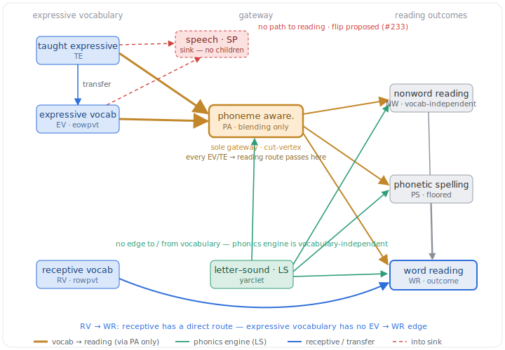

<!-- SPDX-License-Identifier: CC-BY-4.0 -->

> [!NOTE]
> Drafted by a LLM-based AI tool (Claude Code/Opus 4.8).

> [!WARNING]
> This is a **deliberation note, not a decision**. It critically reviews one sub-region of the LOCKED base DAG (`notes/dag-language-reading.dagitty`, locked 2026-06-23) — how expressive vocabulary reaches word reading — against the TD and Down-syndrome (DS) reading literature. Nothing here changes code or edits the `.dagitty` file; every structural change proposed is gated on team sign-off per the locked DAG's reopen protocol. It is a companion to `notes/202607091430-dag-critical-review-td-atypical-literature.md` and issue #233.

# The expressive-vocabulary → word-reading subgraph: the phoneme-awareness bottleneck, the speech sink, and the vocabulary-independent phonics engine

Date: 2026-07-09. Prompted by a request to critically review how expressive vocabulary (taught `TE` or standardised `EV`) links to speech clarity (`SP`), letter–sound knowledge (`LS`), phoneme awareness/blending (`PA`), phonetic spelling (`PS`) and nonword reading (`NW`), how predictors then flow to word reading (`WR`), and what the revision options are. Everything below is grounded in the edges exactly as they stand in the locked graph.

## 1. What the graph asserts (and the one fact that drives everything)

The edges touching expressive vocabulary, verbatim from the locked DAG:

- `TE → { EV, EG, EI, PA, SP }`
- `EV → { EG, EI, PA, SP }`
- `LS → { NW, PA, PS, WR }`, `PA → { NW, WR, PS }`, `NW → WR`, `PS → WR`
- `RV → { …, WR }`, `TR → { …, WR }` (the receptive routes to reading)

The **non-edges are the strong claims** (an omitted edge asserts an absent causal path): there is **no** `EV → WR`, **no** `EV → LS` (explicitly dropped in the locked note §5), **no** `EV → NW`, **no** `EV → PS`, and **no** `LS ↔ vocabulary` edge in either direction. `SP` has **no children at all**.

Trace every child of `EV`. `EG` and `EI` are expressive-language sinks (locked note §8 hard-codes that no grammar/expressive node reaches `WR`); `SP` is a childless sink; only `PA` has any onward path to reading. The same holds for `TE` (its extra child `EV` only re-enters reading via `PA`). Therefore:

> **`PA` (blending) is the unique gateway — a cut-vertex — from expressive vocabulary to _every_ reading outcome.** Delete `EV → PA` and expressive vocabulary is causally severed from `WR`, `NW` and `PS` entirely. Everything expressive vocabulary contributes to reading is funnelled through one edge into the single phonological node the DS literature identifies as weakest.

## 2. Critical observations

**A. The vocabulary → reading effect is bottlenecked through the DS-weak link — by construction.** Because `PA` is the sole gateway, the only way the model can express a vocabulary → reading contribution is `EV → PA → {WR, NW→WR, PS→WR}`. But `PA → WR` (and `PA`'s reading potency generally) is precisely the slope the DS evidence says is weak or absent: Cossu et al. (1993, reading acquired without phonemic awareness), Hulme et al. (2012, _Dev Sci_, PA a poor predictor of DS reading _growth_), Næss (2016). In our own cohort blending is mid-range and variable (mean ≈ 5.06/10; Burgoyne 2021), so this is not a variance problem — it is a **weak-slope** problem: even a large true `EV → PA` transmits little to `WR` when `PA → WR` is near-zero in DS. The graph therefore **structurally suppresses** any vocabulary → reading pathway that does not pass through blending — including precisely the sight-word / semantic-support route on which DS early reading is usually theorised to run. This is the vocabulary analogue of the "import the TD mediator" problem in `notes/202607091430`: the graph encodes the TD lexical-restructuring mechanism and makes DS reading pay for its weakness.

**B. The receptive/expressive asymmetry is a strong, theory-only commitment.** `RV → WR` and `TR → WR` are direct; `EV → WR` and `TE → WR` are absent. The graph asserts that _receptive_ vocabulary supports word reading directly while _expressive_ vocabulary can help only via phonology. On word-recognition theory this is coherent (identifying a printed word draws on the recognition/receptive lexicon). But (i) DS early reading via RLI / See-and-Learn is heavily **whole-word / paired-associate**, where the child must _produce_ the spoken word for a printed target — a role for _expressive_ naming vocabulary that the missing `EV → WR` edge denies; and (ii) `EV` and `RV` are strongly collinear, so this asymmetry is **imposed by theory, not identifiable from these data** — the model cannot discover that the receptive route is real and the expressive one absent; it was told so.

**C. Letter–sound knowledge is causally disconnected from vocabulary — mostly right, with one gap.** `EV → LS` was dropped and there is no reverse edge, so the observed `LS`–vocabulary correlation is treated as _pure_ `GA`/`A` confounding. This is defensible (letter–sound learning is an arbitrary grapheme→phoneme paired-associate, print/instruction-driven) and yields a genuinely good property — the phonics engine is vocabulary-independent (see D). The gap: letter–sound learning requires a **stable phoneme category** to attach the grapheme to, and phoneme-category robustness is exactly what vocabulary growth and speech clarity are theorised to build. A dependency on the _phoneme_ side of `LS` (which the `SP`-flip would partly supply) is arguably missing.

**D. Nonword reading is correctly vocabulary-independent — but wrongly speech-independent.** `NW`'s parents are `LS`, `PA` (plus roots), **not** vocabulary. This is a correct and valuable commitment: nonwords have no lexical entry, so vocabulary cannot help decode them. **However**, `NW` is a spoken-response task and `SP` is a childless sink, so the `SP → measured-NW` channel is unrepresented — the same measurement path the floor-sitter cut made vivid (four children with near-complete letter sounds and some word reading scored **zero** on nonword reading; one spelled 53 items phonetically). The graph gets the _construct_ independence right and the _measurement_ dependence wrong.

**E. `PA` is a collider on `LS → PA ← EV`, with a committed, contestable direction.** Because both `LS` and `EV` point into `PA`, any mechanism/mediation model that **conditions on `PA`** opens a non-causal `LS`–`EV` path — an adjustment-set hazard worth a partial-level warning. And the `LS → PA` direction (letter knowledge drives blending) is a one-way collapse of a reciprocal relation (locked note §5 caution). In DS the Cossu profile (decoding running ahead of PA) makes `LS → PA` or `LS ⊥ PA` more defensible than the TD "PA → decoding" direction — a rare case where the DS-appropriate choice is the one drawn, but it should be _stated_ as such rather than inherited.

**F. Speech clarity is a pure downstream sink of vocabulary — and the flip changes _this_ subgraph's identification.** `EV → SP`, `TE → SP`, `SP` childless. Note 202607091430 argues the flip on three grounds (TD-upstream theory; same-cohort trait-stability r = 0.84; the corrected DEAP severity — DS mean PCC 43.45%, below the worst-affected child in the entire TD sample). For _this_ question specifically, the flip is not cosmetic: making `SP` upstream (`SP → EV`, `SP → PA`) turns it into a **common cause of the two nodes joined by the edge under review (`EV → PA`)** — i.e. `SP` becomes a confounder of the vocabulary → phonics link, and the "say-the-word" channel depresses measured `EV` itself. The `EV → PA` coefficient the mechanism suite reports is, under the flip, `SP`-confounded on both the construct and the measurement side.

**G. The taught-expressive fan-out double-counts into the gateway.** Both `TE → PA` and `TE → EV → PA` exist, asserting taught words earn a phoneme-awareness benefit _over and above_ their contribution to vocabulary size. Locked note §4 flags this as a strong claim with a rejected-but-revisitable leaner alternative (`TE → EV` only).

**H. Phonetic spelling adds a floored collider to the reading path.** `PS` is 78%/64% floor (t1/t2); `PS → WR` has almost no variance to transmit and is prior-dominated; `PS` is a collider (`LS → PS ← PA`) that must never be conditioned on (the same trap as obs. E); and the self-teaching direction (`WR → PS`; Share 1995) is at least as defensible. `EV` reaches `PS` only via the `PA` gateway; real-word phonetic spelling could plausibly draw on the lexicon (`EV → PS`), but adding an edge into a floored node buys nothing.

## 3. Options for revision — arguments for and against

These are largely independent moves. None disturbs the ITT τ: randomisation identifies `IG → WR` with the empty adjustment set regardless of the internal edges (locked note ID-1). They matter for the **mechanism / mediation / association** models, all already flagged non-point-identified by latent `GA` (ID-2) and reported as adjusted associations.

| #     | Revision                                                                                     | For                                                                                                                                                        | Against                                                                                                                | Call                                                          |
| ----- | -------------------------------------------------------------------------------------------- | --------------------------------------------------------------------------------------------------------------------------------------------------------- | ---------------------------------------------------------------------------------------------------------------------- | ------------------------------------------------------------ |
| **1** | **Flip `SP` upstream** (`SP → EV`, `SP → PA`; drop `EV→SP`/`TE→SP`)                           | TD theory + same-cohort trait-stability + severity (note 202607091430); makes `SP` a confounder we can _model_ on `EV→PA`; repairs the `SP→measured` channel | Direction still untestable in-sample; `SP`/`EV`/`PA` collinear, so the three-way separation is fragile                  | **Strongest; already the lead #233 change**                  |
| **2** | **Add `EV → WR`** (or a shared lexical/semantic mechanism into `WR`)                          | Breaks the single-gateway bottleneck (obs. A); matches DS sight-word/paired-associate reading; restores expressive/receptive symmetry (obs. B)             | Enlarges `→WR` adjustment sets; `EV`/`RV` collinearity may make it unidentifiable; risks double-counting the `RV→WR` route | **Highest-value vocab-specific change; add, flagged association** |
| **3** | **Treat `EV → PA` as `SP`-confounded** (keep the edge under #1; do not read it as "vocab drives PA") | Honest about DS; consistent with ID-2; avoids overstating the TD mechanism                                                                                     | If lexical restructuring is genuinely weak in DS, keeping the edge overstates the link                                  | **Adopt jointly with #1**                                    |
| **4** | **Reconsider `PA`** — record `LS→PA` (or `LS ⊥ PA`) as a DS choice; consider blending vs segmentation | DS decoding-ahead-of-PA profile; "blending-only" is a narrow operationalisation                                                                             | Cannot add a cycle in an acyclic graph; only blending is measured, so a split cannot be fitted                             | **Document the direction; defer any split**                  |
| **5** | **Lean the taught fan-out** to `TE → EV → PA` only                                            | Removes the "taught words get bonus PA" double-count (obs. G)                                                                                              | Loses a genuine rehearsal/consolidation effect if taught items _do_ build PA directly                                   | **Revisit only if `TE→PA` proves unidentifiable**            |
| **6** | **Drop `PS → WR`** (remove `PS` from the reading path)                                        | Removes a floored, prior-dominated edge and a collider trap; changes **no** `→WR` adjustment set                                                        | Loses the invented-spelling-consolidates-decoding hypothesis                                                            | **Recommend, given the floor (already a deferred option)**   |
| **7** | **Wave-unroll / cross-lag** the subgraph (`EV_t → PA_{t+1} → WR_{t+1}`, …)                    | Resolves obs. A, B, E at once — directionality becomes temporal, not assumed; matches the 4-wave panel                                                     | Large modelling lift; the master fix already scoped in note 202607091430 (Critique 5)                                   | **The real long-run answer; sequence after 1–3**             |

## 4. Recommendation

The two changes that actually move the vocabulary story are **#1 (flip `SP`)** and **#2 (add `EV → WR`)**, adopted with **#3**. Together they fix the two structural artefacts this review surfaces: expressive vocabulary is currently (a) bottlenecked to reading through the single DS-weak `PA` gateway, and (b) denied the direct reading route its receptive twin is granted — so the suite is **structurally guaranteed to under-read the vocabulary → reading link in DS, independent of the data**. `#6` is a cheap cleanup; `#4` is a documentation fix; `#5` is contingent; `#7` is the principled long-run fix already on the #233 list. None of this touches the ITT effect.

## References and related

- Cossu, G., Rossini, F., & Marshall, J. C. (1993). When reading is acquired but phonemic awareness is not: a study of literacy in Down's syndrome. _Cognition, 46_(2), 129–138. https://doi.org/10.1016/0010-0277(93)90016-O
- Hulme, C., Goetz, K., Brigstocke, S., Nash, H. M., Lervåg, A., & Snowling, M. J. (2012). The growth of reading skills in children with Down Syndrome. _Developmental Science, 15_(3), 320–329. https://doi.org/10.1111/j.1467-7687.2011.01129.x
- Metsala, J. L., & Walley, A. C. (1998). Spoken vocabulary growth and the segmental restructuring of lexical representations. In _Word Recognition in Beginning Literacy_ (pp. 89–120). _(citation/DOI to verify.)_
- Næss, K.-A. B. (2016). Development of phonological awareness in Down syndrome: a meta-analysis and empirical study. _Developmental Psychology, 52_(2), 177–190. https://doi.org/10.1037/a0039840
- Share, D. L. (1995). Phonological recoding and self-teaching: sine qua non of reading acquisition. _Cognition, 55_(2), 151–218. _(citation/DOI to verify.)_
- `notes/dag-language-reading.dagitty` and `notes/202606231600-dag-revision-consolidated.md` — the LOCKED base DAG this note reviews (edges and §-numbered rationale referenced throughout).
- `notes/202607091430-dag-critical-review-td-atypical-literature.md` — the whole-graph critical review; options #1/#3/#7 here are that note's territory.
- Issue #233 — the tracking issue for the DAG re-review.
