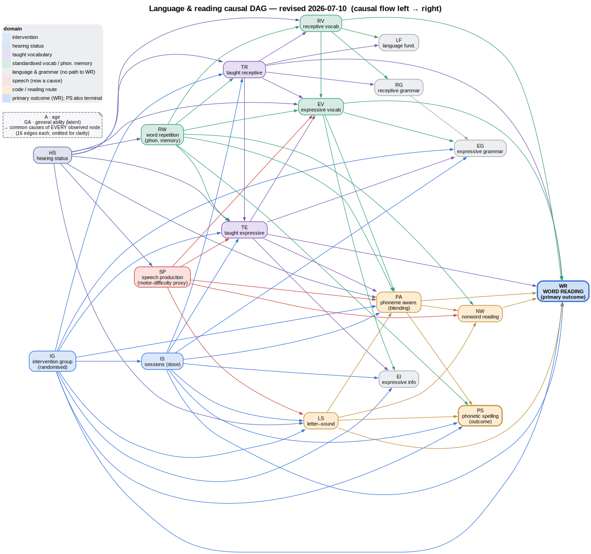

<!-- SPDX-License-Identifier: CC-BY-4.0 -->

> [!NOTE]
> Drafted by a LLM-based AI tool (Claude Code/Opus 4.8) and substantially revised through iterative full-text literature review by a LLM-based AI tool (Claude Code/Fable 5).

> [!IMPORTANT]
> This is a **review draft, circulated for team comment** (snapshot as of 2026-07-10). It is the current prose exposition of the DAG — it supersedes the earlier `dag/dag-language-reading-explained.md`, whose content it incorporates and extends across several rounds of full-text review of the TD/DS/IDD reading literature (adding same-lineage DS studies, correcting citations — including one miscoded effect size caught via a published corrigendum — and positioning the graph against the Snowling & Hulme Reading-Is-Language model). Please review and comment. The graph structure itself (`dag/dag-language-reading.dagitty`) is unchanged; every revision here is to the justification, not the edges.

# The language & reading causal DAG: structure, assumptions, and justification — review draft (2026-07-10)

Date: 2026-07-10. This document explains the causal DAG **as it now stands** after the 2026-07-10 revision — what each part asserts, the evidence for it drawn mainly from the typically-developing (TD) and Down-syndrome (DS) reading literature — with occasional reference to the wider intellectual-and-developmental-disability (IDD) literature, whose aetiological heterogeneity limits how far it transfers — the honest weaknesses and alternatives, and the case for the choices made. It is the reference companion to the machine-readable graph in [`dag-language-reading.dagitty`](../dag/dag-language-reading.dagitty) and its rendered figure; the decision record that produced this structure is [`../notes/202607101100-dag-revision-team-decisions.md`](../notes/202607101100-dag-revision-team-decisions.md), and the two critical reviews that fed it are `../notes/202607091430-dag-critical-review-td-atypical-literature.md` and `../notes/202607091615-vocab-reading-subgraph-critical-review.md` (issue #233). Citations carry DOIs verified against Crossref/PubMed and publisher pages during this revision (the reference list was re-resolved after two DOIs were found to point to the wrong article). This is preliminary research; the graph is a working instrument, not a settled theory.

## 1. What this DAG is for, and how to read it

A causal DAG here is an **identification instrument**, not a complete developmental theory. Its job is narrow and specific: to say which observed associations are confounded, what may legitimately be adjusted for, and which effects the study design actually identifies. It sits at the hinge of the project's two-step method — exploratory gradient-boosting models learn _which_ predictors matter, and the DAG governs which of those associations the step-2 Bayesian models may read causally.

Three consequences shape everything below.

- **Roles are assigned per analysis, not fixed in the graph.** The same structure serves the intention-to-treat analysis (exposure `IG`, outcome `WR`), the mechanism analyses (a skill as exposure, `WR` as outcome), the dose-response analyses (`IS` as exposure) and the mediation analyses (`IG` with a skill mediator). Only `GA [latent]` is annotated, because being unobserved is a structural property rather than an analysis-specific role.
- **A missing edge is a strong claim; an extra edge is comparatively cheap.** An omitted _direct_ edge asserts an _absent direct_ effect — a real theoretical commitment (indirect paths between the two nodes may still remain). An included edge, for the purpose of identifying a back-door-adjusted total effect, usually only enlarges an adjustment set. So the graph is deliberately generous with edges and sparing with omissions, and the omissions are where the contestable theory concentrates. "Cheap" is not "free", though: an added edge can turn a variable into a descendant of the exposure (destroying identification), can create a collider whose accidental conditioning opens bias, and dilutes the graph's refutable content — so edge-generosity is a working heuristic, not a licence. It is safe for the precision-covariate move in §11 only because the added common causes (`HS`, `SP`, `RW`) carry no edge _from_ `IG`.
- **Most internal edges are untestable in these data and are imported from theory.** Because the latent general-ability node `GA` points into almost every observed variable, most internal conditional independences have a separating set that contains `GA` — so they cannot be checked against the data. The internal structure is therefore largely theory-led, and its main audit is contrast with the literature — which is why this document is citation-heavy. One clean class of in-sample check does survive: because `IG` is a parentless randomised root, the graph implies baseline independencies between assignment and the pre-randomisation child characteristics (`IG` ⫫ `{A, HS, RW, SP}`) that route through no latent node and can be examined directly as randomisation-balance checks.

Running through all of it is one population principle: **the causal architecture of early word reading is largely shared between TD and DS children, but the weights differ, and DS carries population-specific inputs — hearing, speech-motor difficulty, verbal short-term memory — that a TD-derived graph never needed to represent.** The 2026-07-10 revision is mostly about putting those DS-specific inputs into the graph and correcting a few TD-inherited weights. The graph is deliberately a DS instrument, not a generic IDD one: intellectual disability is aetiologically heterogeneous, and although broad reading-skill patterns recur across mixed-aetiology samples (e.g. Ratz & Lenhard 2013), the specific weighting here — and inputs such as the DS speech and hearing profile — should not be assumed to transfer to other IDD populations without checking.

## 2. The graph at a glance

Twenty nodes, verified acyclic; four roots (`A`, `GA`, `HS`, `IG`); one primary outcome (`WR`). The figure summarises the edges from the two near-universal parents `A` and `GA` in a note rather than drawing all 32, for legibility; `HS` is drawn explicitly. The authoritative edge list is the `dag { … }` block in the `.dagitty` file.

| Symbol      | Construct (measure)                                                       | Domain / role                                   |
| ----------- | ------------------------------------------------------------------------- | ----------------------------------------------- |
| `A`         | Age                                                                       | observed root; maturation + cumulative exposure |
| `GA`        | General ability                                                           | **latent** root; age-residualised stable trait  |
| `HS`        | Hearing status (`hearing_c`: impaired hearing or repeated ear infections) | observed root; DS-specific common cause         |
| `IG`        | Intervention group (randomised)                                           | root; ITT exposure                              |
| `IS`        | Intervention sessions / attendance                                        | dose (a collider — never conditioned on)        |
| `TR` / `TE` | Taught receptive / expressive vocabulary (bespoke b1/b2 word sets)        | direct teaching targets                         |
| `RV` / `EV` | Standardised receptive / expressive vocabulary (rowpvt / eowpvt)          | transfer (generalisation) measures              |
| `RW`        | Word + nonword repetition (erbto) — phonological short-term memory        | capacity                                        |
| `LF`        | Language fundamentals                                                     | language (no directed path to `WR`)             |
| `RG` / `EG` | Receptive / expressive grammar (trog / aptgram)                           | language (no directed path to `WR`)             |
| `EI`        | Expressive information (aptinfo)                                          | language (no directed path to `WR`)             |
| `SP`        | Speech production (deapp_c) — proxy for pervasive speech-motor difficulty | upstream cause                                  |
| `LS`        | Letter–sound knowledge (yarclet)                                          | code route                                      |
| `PA`        | Phonological awareness / blending                                         | code route                                      |
| `NW`        | Nonword reading (decoding)                                                | code route (mediator)                           |
| `PS`        | Phonetic spelling                                                         | reading/spelling outcome (terminal)             |
| `WR`        | Word reading                                                              | **primary outcome**                             |

## 3. Foundational commitments

These four assumptions pervade every analysis the graph serves.

### 3.1 A single latent general ability `GA` causes (almost) everything

`GA` is a latent common cause pointing into every observed skill. It is the graphical encoding of the project's standing position that **only the randomised contrast is causal**: it makes explicit that every skill-to-skill and mediator-to-outcome association is confounded by a shared, stable trait. Crucially, `GA` does _not_ point into `IG` — which is exactly why randomisation survives (it d-separates `IG` from `GA`).

`GA` is deliberately **drawn but never adjusted**. It is latent, so it can never appear in an implementable adjustment set; the subject-level random intercept in the longitudinal models is only a partial, shrunken stand-in, not "control for ability." This is the honest cost: it means the graph _refuses to claim_ that any internal skill-to-skill slope is unconfounded. TD evidence supports the modesty — nonverbal IQ is a weak _unique_ predictor of early word reading (e.g. the weak IQ paths in Burgoyne et al. 2019). A single `GA` is a defensible first approximation, and a correlated-domain-factor upgrade is a sensible, identification-neutral future refinement rather than an urgent fix. Our own attempt at that upgrade — the mm-001 measurement model — cannot yet adjudicate the question: its only reporting fit **fails the project's convergence gate** (422 divergences and a failed energy/BFMI check), so under the project's own reporting rule its domain-factor correlations must not be interpreted. The single-`GA`-versus-correlated-factors comparison is therefore empirically open here, not settled in either direction — which, if anything, reinforces holding to the single `GA` as the conservative working choice until a clean fit exists.

### 3.2 Age `A` as a near-universal parent and exposure proxy

`A` points into every observed node except the two observed roots `HS` and `IG`. It carries both maturation and cumulative exposure, and it is **not** separated into those channels (only the total age effect is identified). The absence of `A → IG` is load-bearing — an age→assignment edge would open a back-door and cost the ITT effect its empty-adjustment-set identification — and `A → HS` is deliberately deferred to the time-lagged workstream (§12) rather than forced into the contemporaneous graph. `GA` is defined as age-residualised, so `A → GA` is dropped and age carries the developmental trend directly. Age is treated as a precision covariate in the ITT models rather than an object of inference.

### 3.3 Randomisation of `IG`, and the collider status of dose `IS`

`IG` is a parentless randomised root, so **the total intervention effect `IG → WR` is identified by the empty adjustment set** (ID-1). This is the load-bearing causal claim of the whole project, and — importantly — it is _robust to everything in the internal structure_: no revision to the skill-to-skill edges can disturb it. Dose (`IS`, sessions attended) plays two distinct roles that must not be run together. As a **common effect** of assignment and of child/family characteristics it is a **collider**, so it is never conditioned on in the ITT analysis — conditioning would open a spurious `IG`–`GA` path. When `IS` is instead the _exposure_ (the dose-response analyses, LRP-RLI-DOSE-077), its effect is not identified for a _different_ reason: `IS` inherits back-door confounding from its parents — decisively from latent `GA` (`IS ← GA → WR`) — so even an `{A, IG}` adjustment leaves the `GA` back-door open. Either way the dose-response estimate is an adjusted association (§11, ID-2), but the collider argument and the confounding argument are separate claims for separate analyses. The DS behavioural phenotype gives both arguments a concrete common-cause candidate for the child/family parents of `IS`: low task persistence and escape-driven off-task behaviour plausibly shape both how much usable instruction a child receives and how they respond. In one early-reading single-case series a non-responding child's intervention was narrowed (he was ultimately exposed to only the first four steps) because his instructor could not deliver it with fidelity — a breakdown the authors attribute _jointly_ to the child's high levels of challenging behaviour and to the instructor's inexperience (Lemons et al. 2018). Even in that mixed form it illustrates the structure at issue: child behaviour acting as one common cause of both dose received and response, exactly what makes `IS` a collider and the dose-response estimate confounded. It is unmeasured here and belongs, if anywhere, in the time-lagged workstream (§12), not the contemporaneous graph (§9).

### 3.4 One causal coefficient; everything else is an adjusted association

Only τ (the randomised effect) is read causally. Every observational coupling — mechanism slopes, mediator-to-outcome paths, between-child associations — is reported as an **adjusted association**, never "X drives Y" (ID-2; see §11). This convention is what lets the graph carry theory-led internal edges without over-claiming.

## 4. The reading architecture: code route and vocabulary routes

This is the substantive heart of the graph — how the intervention and the child's skills reach word reading.

### 4.1 The code skeleton `LS`/`PA` → decoding → `WR`

Letter–sound knowledge (`LS`) and phoneme awareness (`PA`) feed nonword decoding (`NW`) and word reading (`WR`); `PA` and `LS` also feed each other's downstream products. This is the canonical alphabetic-reading architecture. Its _experimental_ support is among the strongest in the field: training studies with mediation designs place letter–sound knowledge and phoneme awareness causally upstream of word reading in TD samples (Hulme, Bowyer-Crane, Carroll, Duff & Snowling 2012), a lineage running back to Bradley & Bryant (1983). The large meta-analysis of Melby-Lervåg, Lyster & Hulme (2012) adds convergent — but _correlational_ — evidence for phoneme awareness specifically; it does not analyse letter–sound knowledge and is careful not to claim the causal verdict on its own, so it is cited here as corroboration for the phonemic half rather than as RCT-grade evidence. The simple-view framing (Gough & Tunmer 1986) motivates only the broad division into a decoding family and a language family; its language term is a predictor of reading _comprehension_ rather than of word-level decoding, which is why the language nodes are severed from `WR` in §9. (Snowling & Hulme have since _extended_ this separation in their Reading-Is-Language model, where oral language founds decoding as well — but via phonology, which the code route already represents; the severance survives the revision, as §4.3 and §9 set out.)

**The DS-weighting caution (the honest part).** This is where the DS literature diverges most from the TD canon the skeleton imports — though the divergence is itself contested, and the graph deliberately keeps both code-route edges. The most-cited dissociation, Cossu, Rossini & Marshall (1993) — DS children reading at a 7-year level while scoring poorly on phonemic-awareness tasks their reading-age-matched TD controls passed — drew immediate same-issue rejoinders arguing that the phonemic tasks confound task difficulty and general cognitive load with phonemic competence (Byrne 1993; Bertelson 1993), so it is best read as a debated observation, not settled evidence that DS reading bypasses phonology.

On the other side, within-DS work finds genuine phonology–reading links: Cupples & Iacono (2000) related phonological awareness to oral reading and found early segmentation predicting later nonword reading; Hulme et al. (2012, _Developmental Science_) found phoneme awareness correlated with DS reading level at the zero-order but, in their two-group path model, the _unique_ concurrent predictor of DS reading level was vocabulary, not phoneme awareness (the mirror of TD, where phoneme awareness — not vocabulary — predicted the initial level), while phoneme awareness predicted reading _growth_ only in TD; and Lemons & Fuchs (2010b), reviewing twenty studies, found phonology–reading associations in every DS study that examined them and concluded that DS reading does not develop independently of phonological awareness — DS phonological awareness being "delayed rather than deviant" — while phonics instruction benefits some children but not all.

Against this, Næss (2016) found PA in DS lower than in controls and _uneven_ across components — the meta-analytic deficit largest for rhyme (Hedges _g_ ≈ −1.82, 95% CI [−2.48, −1.16]) and, once the outlying Cossu study is removed, smallest for phoneme awareness (_g_ ≈ −0.83) — but her longitudinal study also found DS children's PA improving faster than younger, not-yet-schooled ability-matched TD controls, most clearly for rhyme (the other components' catch-up estimates pointed the same way but were smaller and noisier). Because that catch-up coincided with the DS children entering formal schooling while the controls had not, Næss reads it as instruction-sensitivity — PA, in her words, "can be learned" — and calls for PA-stimulating intervention: i.e. the same source supports the node's _trainability_ as much as its baseline weakness.

Two disclosures follow: (i) in this population the orthographic/whole-word and language routes are expected to carry relatively **more**, and the phonemic route relatively **less (or later)**, than the TD canon implies; and (ii) our `PA` node is operationalised by **blending alone** — the most reading-proximal and relatively preserved PA component — so the node's label claims more construct than the single task delivers. This operationalisation has direct DS component-level warrant: in an early-instructed DS sample, Fletcher & Buckley (2002 — same-institution DSE work) found phoneme blending the only phonological-awareness component robustly and broadly associated with word reading, spelling and the alphabetic (nonword) measures, while rhyme and alliteration correlated more weakly and phoneme segmentation was floored; the review of Lemons & Fuchs (2010b) corroborates this at review level (in the mental-age-matched comparison of Boudreau 2002, DS children did not differ from controls on blending — the one PA component on which they were unimpaired — and blending was the component that correlated with their word reading) — though blending was assessed with a three-alternative picture-pointing task (target plus an initial-phoneme and a rhyme distracter, so roughly a one-in-three chance factor), a receptive format that is itself a reason the label claims more than the task delivers.

We keep the code-route edges (phonology–reading associations do exist in DS, PA is trainable, and our own trial moves blending), but the reader should hold the weights lightly. The pattern in our own data is at least consistent with two coexisting routes: the mediator most strongly associated with the intervention's reading response is letter–sound knowledge (what was explicitly taught), while naturalistic reading variance looks more language-constrained. This route-localisation is echoed within DS by an independent response-to-phonics study: baseline phoneme segmentation predicted growth in nonword decoding but was unrelated to growth in the directly taught sight words and letter sounds (Lemons & Fuchs 2010a, _Reading Research Quarterly_ — a separate empirical paper from the review above), so the phonemic contribution concentrates on the decoding branch rather than acting directly on whole-word reading; this is a baseline predictor of response in a small single-arm sample (n = 24), not a causal effect. Both routes are in the graph by design — but note that any `IG → LS → WR` decomposition is a mediated pathway that ID-2 (§11) declares **not point-identified** — because `LS → WR` is `GA`-confounded, and, separately, because dose `IS` is a treatment-induced mediator–outcome confounder (§11) — so this is read as an adjusted association, not as the effect "running through" letter sounds.

### 4.2 Vocabulary routes to reading — including the new direct edges

Four vocabulary nodes now point directly at reading — receptive (`RV`), expressive (`EV`), taught-receptive (`TR`) and taught-expressive (`TE`) — and the 2026-07-10 revision changed the balance among them.

- **`RV → WR` (receptive vocabulary, direct).** Retained. In TD, vocabulary's direct effect on word-level reading is modest and concentrated on exception words (Ricketts, Nation & Bishop 2007); but in DS it appears _stronger_ — the key DS longitudinal study (Hulme et al. 2012, _Dev Sci_) found reading more language-constrained than in TD, with vocabulary the better predictor of the initial _level_ of reading — receptive vocabulary at the first wave predicted reading two years later markedly more strongly in DS than in TD (r ≈ .80 vs .58) — while DS reading was highly stable over time, so this is a claim about level, not about growth. That DS-strength reading rests mainly on Hulme et al. (2012); a same-lineage study is a counter-point — in Byrne, MacDonald & Buckley (2002) the age-partialled receptive-vocabulary–word-reading correlation was only modest and imprecisely estimated (r ≈ 0.23–0.37 across three waves), with reading age-equivalents running well ahead of vocabulary. So `RV → WR` is better justified in DS than a TD-only reading would suggest, but with wide uncertainty on its magnitude — and, consistent with the honesty caveat below, it is the joint vocabulary contribution, not the receptive route alone, that is safely interpretable.
- **`TE → WR` and `EV → WR` (expressive vocabulary, direct) — new in this revision (decision 5).** Previously expressive vocabulary reached `WR` _only_ through the `PA` gateway, making phoneme awareness a **cut-vertex** for the expressive-vocabulary→reading link. That routing is defensible for a _total_-effect estimate, but any estimand that conditions on `PA` (the mediation and factor families) is then forced to attribute nothing to a non-phonemic expressive route — precisely the route the DS reading model needs. Rather than decide that by graph topology, the direct edges free that route to be _estimated_ rather than fixed at zero by construction, on the document's own edge-generosity principle. That is a narrower gain than it sounds: being `GA`-confounded (ID-2), the coefficient cannot _adjudicate_ whether a causal non-phonemic route exists — it only stops the graph from assuming one away. The substantive warrant is twofold. First, DS early reading via RLI / See-and-Learn is heavily **whole-word and paired-associate**: the child must _produce_ the spoken word for a printed target. A same-lineage DS _experiment_ shows phonology genuinely helps here — Mengoni, Nash & Hulme (2014) taught individuals with DS to read novel nonwords and found that familiarising them with a word's spoken form beforehand substantially improved how accurately they then read it aloud (a large main effect of condition; within-DS _d_ ≈ 0.84) — a within-population causal manipulation, not just a correlation, that a whole-word phonological representation supports DS word reading, and a caution against a _purely_ visual account (though the sample is small — 16 with DS — and whether they rely on it any _more_ than reading-matched TD is unresolved). Note the reach of this evidence: Mengoni et al. manipulated item-specific phonological _familiarity_ for novel nonwords, so it warrants a **phonological-representation** contribution to word reading — a mechanism the code route already carries — not the expressive-vocabulary construct specifically; the receptive-vs-expressive routing stays theory-imposed (honesty note below). Seeing a word in print also aids oral (phonological) word learning in DS about as much as in reading-matched TD (Mengoni, Nash & Hulme 2013 — which tests the _print → oral-word_ direction, so it is cited for the paired-associate coupling of printed and spoken forms, not as evidence for the vocabulary → reading direction, and its equal-benefit reading is an underpowered null in a small _n_ = 17 sample). And DS readers decode markedly less well than they recognise familiar words, tending to lexicalise nonwords (reading _gnombo_ as _gnomo_) — a whole-word/visual reliance documented longitudinally by Roch & Jarrold (2012). All of this points to a lexical contribution a purely receptive account denies. (One nearby result must be read through its published correction: Næss, Melby-Lervåg, Hulme & Lyster's (2012a) meta-analysis originally reported vocabulary — not phonological awareness — as the moderator of the DS–TD gap in nonword _decoding_, but a corrigendum (Næss et al. 2012b, _Res. Dev. Disabil. 33_, 1039–1040) shows that rested on a mis-signed effect size for one of only four studies (Roch & Jarrold 2008), and once corrected no vocabulary→decoding moderator survives; what does survive — and strengthens — is a substantial DS nonword-decoding deficit relative to reading-level-matched controls (_g_ ≈ −0.89), consistent with the whole-word reliance and `NW` floor documented here, though a four-study moderator analysis that flips on one recoding cannot say which skill drives the gap. This study is therefore no longer read as warrant for any vocabulary → `NW` edge; the vocabulary→`WR` coefficients remain `GA`-confounded adjusted associations, ID-2.) Second, in TD and reading-disabled samples _expressive_ vocabulary has been found to relate to visual word recognition/identification over and above receptive vocabulary (Ouellette 2006; Wise, Sevcik, Morris, Lovett & Wolf 2007) — the closest available analogue to the encoded asymmetry, though it is TD/RD rather than DS evidence. Gains in expressive vocabulary are therefore expected to help word reading over and above receptive vocabulary and beyond phonology.
- **Taught vs standardised vocabulary as separate nodes, with transfer edges.** `TR`/`TE` (bespoke taught sets) are kept distinct from `RV`/`EV` (norm-referenced), with transfer edges `TR → RV`, `TR → EV`, `TE → EV`, and both taught nodes also pointing directly at reading (`TR → WR`, `TE → WR`). `TR → WR` predates decision 5 (which added the expressive edges) but encodes the same commitment: a directly taught word can be recognised in print without first raising the standardised score. This converts the trial's "did learning generalise?" question from a design-forced zero into an _estimable transfer association_ — still `GA`-confounded (ID-2), and with randomisation identifying only the total `IG → RV` effect, not the `TR → RV` transfer path itself (matching Burgoyne et al. 2012): the taught measures are the proximal product of teaching; the standardised measures capture near-vs-far transfer. Retaining both also matters for identification — `RV` is a confounder for any `EV`-based mechanism, so deleting the standardised nodes would not simplify the graph but blind it (see §13).

**Honesty about the vocabulary routes.** `WR` now has four collinear, mutually chained vocabulary parents (`TR`, `TE`, `RV`, `EV`), so the coefficients that partition them share variance and only the _joint_ vocabulary contribution to reading is safely interpretable; the receptive-vs-expressive asymmetry and the taught-vs-standardised split are **imposed by theory, not identifiable from these data** — the model cannot discover which route is real, it is told. The collinearity is graded rather than uniform (taught and standardised measures are more distinguishable than the receptive/expressive pair of a given type), but each direct-into-`WR` coefficient is reported as an adjusted association, flagged for non-identifiability against the others; a single latent vocabulary factor (§13) is the alternative if one construct is wanted.

### 4.3 Positioning against the Reading-Is-Language model

Snowling & Hulme's Reading-Is-Language model (Snowling & Hulme 2025) and its clinical companion (Snowling & Hulme 2021) extend the simple view: they argue oral language founds not only reading comprehension but learning to _decode_ — "all aspects of literacy … are parasitic on language" (Snowling & Hulme 2025). Read flat, that seems to tension the §9 severance of the language nodes from word reading; read precisely, it does not. In both papers the route from oral language into word-_level_ reading is carried by **phonology, not grammar or syntax** — "the influence of language skills on learning to decode is mediated via phonological skills" (Snowling & Hulme 2021), the code skills being held to differentiate out of the phonological components of language. This graph already carries that phonological substrate — `PA`, `LS`, and the phonological inputs `SP` (§5) and `RW` (§7) — so for the decoding branch the frameworks' language-founds-decoding claim is satisfied by structure the DAG _has_, not by a missing grammar-to-`WR` edge. Their early oral-language factor is _not_, however, the latent `GA` of §3.1 in another guise. In the Reading-Is-Language model the early factor is an **oral-language** construct (vocabulary, grammar and phonology, measured before reading begins) that acts as a **directional cause** — early language is posited to drive the code-related skills (phoneme awareness, letter-sound knowledge and rapid automatized naming, RAN), which then drive word reading, the code skills "differentiating" out of the phonological components of language. Our `GA` is instead a domain-general, age-residualised **common cause** pointing in parallel into every observed skill, and the DAG omits RAN. The genuine parallel is only that both compress early individual differences into a single latent source; the causal geometry (a differentiating precursor vs a common cause) and the construct (oral language vs domain-general ability) differ — a substantive departure, not a re-labelling, and one that bears on the `GA`-confounded adjusted associations, never on τ.

Three scope differences keep the comparison honest, and none is a contradiction. The frameworks are longitudinal, developmental, comprehension-inclusive causal-_mechanism_ theories; this graph is contemporaneous, single-wave and word-level, identifying only τ and reading every skill-to-`WR` slope as a `GA`-confounded adjusted association (ID-2) — so their timing predictions (language gains first, decoding later, comprehension later still) and their comprehension outcome are out of frame, belonging to the time-lagged workstream (§12). They are also TD-developmental where this graph is DS: its retention of direct vocabulary-to-`WR` edges, which the model would route through the alphabetic foundation, rests on Snowling & Hulme's _own_ DS findings — reading more language-constrained in DS than TD, with vocabulary the unique concurrent predictor of DS reading _level_ (Hulme et al. 2012, _Dev Sci_; §4.2) — and is reported as an adjusted association. The direct edge does _structurally_ permit a route that bypasses the phonological mediators — that is exactly what §4.2 intends it to leave open — but the coefficient is `GA`-confounded (ID-2), so it is not evidence that such a causal bypass operates, only a refusal to rule it out by topology. The DS pattern that sits least easily with the model is its transfer cascade: the project's own trial found taught-skill gains _without_ generalisation (Burgoyne et al. 2012), the profile the model flags for DS but does not structurally represent — and which this graph _does_, through the taught-vs-standardised transfer edges of §4.2.

## 5. Speech production `SP` as an upstream cause

The single largest structural change (decision 2): the 2026-06-23 graph made speech a downstream **sink** of vocabulary (`EV → SP`, `TE → SP`); the revision reverses this to `SP → { TE, EV, LS, PA, NW }`.

**The case.** For these children `SP` (the DEAP picture composite, deapp_c) indexes **speech-sound-production accuracy** and stands as a proxy for **pervasive, persistent speech-production difficulty**, present from the outset, not a downstream reflection of vocabulary size. (The measure establishes persistent difficulty in _producing_ speech sounds; it does not by itself isolate a specifically _motor_ aetiology, so the DAG's "speech-motor" label should be read as shorthand for production difficulty, not a claim about mechanism.) Three strands support the reversal:

- **TD theory/evidence.** In a large (N ≈ 569) unselected TD sample assessed at school entry and again six months later, speech difficulty is longitudinally associated with — and precedes — later word reading, an association fully accounted for by phoneme awareness (Burgoyne, Lervåg, Malone & Hulme 2019). This is an observational path model, not an experiment, and its speech→phoneme-awareness link is measured _concurrently_, so it establishes _compatibility_ with the orientation rather than proving it: read as the authors specify, it is consistent with speech being a cause of the phonological skills rather than a reflection of vocabulary — the opposite orientation to `EV → SP`, and a reason to reopen that edge rather than proof it must reverse.
- **Same-cohort DS evidence.** Burgoyne, Buckley & Baxter (2021) — _our own children_ — found speech production remarkably **trait-stable** (t1↔t2 PCC r = 0.84 over 21 months, with negligible mean change). That stability licenses one specific modelling choice — that `SP` is not moved by the intervention, so it carries no incoming `IG`/`IS` edge and τ_SP ≈ 0 in the reporting fit — but stability on its own does _not_ establish that `SP` sits causally _upstream_ of vocabulary, since a shared stable common cause (`GA`) would produce the same picture. Nor is speech peripheral to vocabulary in that cohort: its accuracy tracked receptive vocabulary and word reading at moderate strength (age-partialled correlations of roughly 0.4–0.5). The upstream orientation is therefore carried by the TD-orientation and task-demand strands, not by the same-cohort correlations.
- **Task demands.** The edges `SP → LS` and `SP → NW` reflect that those two code-route tasks **require producing or sequencing novel speech sounds**: letter–sound knowledge asks the child to _say_ the sound on cue, and nonword reading to articulate unfamiliar phoneme strings — the greatest phonological-assembly demand in the battery. `SP → PA` cannot lean on that rationale, because our `PA`/blending task is **receptive** — the child hears the segmented word and points to one of three pictures, producing no speech — so it is retained only as a weaker construct-level hypothesis (that speech-production difficulty and phonological sensitivity draw on a shared phonological substrate), not on any spoken-response demand. The graph deliberately does _not_ draw `SP → WR` or `SP → RW`, on the view that whole-word reading and word/nonword _repetition_ lean less on _novel_ phonological assembly than on lexical or echoic support — though nonword repetition's echoic cover is only partial (it still demands spoken output of unfamiliar strings), the closest tension to this construct-level judgement, handled as the measurement caveat below rather than as a structural edge.

**Honesty and the measurement channel.** The direction is not testable in-sample, and `SP`, `EV` and `PA` are collinear, so the three-way separation is fragile.

More subtly, there is a **measurement channel no construct-level edge can fully capture**: the expressive-vocabulary and nonword-reading tasks are _spoken-response_ tasks, so poor articulation depresses the _measured_ score independently of the underlying construct (a `SP → measured-Y` path that exists even if `SP → construct-Y` does not). Our own floor-sitter cut is its face — four children with near-complete letter sounds and some word reading scored **zero** on nonword reading, one of them spelling 53 items phonetically; a child who can _spell_ phonetically but scores zero _reading nonwords aloud_ is pointing straight at the production demand of the task. Fletcher & Buckley (2002) report the same dissociation independently in an older DS sample: nonword reading aloud came apart from both phoneme awareness and nonword spelling — children with good phoneme awareness were often unable to read nonwords aloud — and the phoneme task requiring verbal production (segmentation) floored while the pointing blending task was preserved, external face-evidence for a response-mode channel a single construct edge cannot fully encode. Because a single directed edge cannot encode both a construct-level common cause (which licenses covariate adjustment) and a pure response-mode artefact (which does not), the residual method component would be better handled by a measurement model carrying an explicit **spoken-response method factor or correlated residual** than by conditioning on `SP`. The current mm-001 does _not_ do this — it fits only vocabulary/code/grammar domain factors, with no `SP` indicator and no method factor — so this is a **proposed extension**, not a capability the model already has; the adjustment-set advice in §11 flags the same point.

Finally, a scaling caveat: the trial-era DEAP scoring in the working data is more lenient than the blind-transcription PCC reported for this cohort (mean PCC 43.45% at t1; Burgoyne 2021) — on the averaged picture-naming score it runs roughly 20 points higher — and `deapp_c` is a composite _sum_ of the three picture-naming sub-scores, not a percentage, so it must not be read on the PCC scale. `SP`'s _role_ as a speech-production-difficulty proxy is unaffected (see the DEAP-scoring memo). The distributional gap between the two populations is itself an argument for reversal: what is a small clinical tail in TD (PCC ≤ 85% covers ≈ 7% of a TD sample) is essentially the whole DS distribution (~98% below the same cut), so importing the TD _mediating mechanism_ (via phoneme awareness) would be an off-support extrapolation — we adopt the orientation but not the TD mediator.

## 6. Hearing `HS` as a common cause

New in this revision (decision 3): `HS → { TR, RV, TE, EV, SP, RW, PA, LS }`.

**The case.** Hearing is rarely a needed node in a TD reading graph, but conductive hearing loss and recurrent otitis media affect a large fraction of children with DS, and the wider DS literature links hearing to speech and language — most directly Laws & Hall (2014), where DS children with early hearing impairment scored below their satisfactory-hearing peers across the board: the largest difference was in receptive language comprehension (unadjusted d ≈ 1.04), with speech-production accuracy also large (d ≈ 0.87 on percentage consonants correct, in a smaller speech subsample of ≈ 31) and receptive and expressive vocabulary somewhat lower (d ≈ 0.69 each). The two hearing groups barely differed in nonverbal ability (d ≈ 0.07), so these gaps sit over and above general cognitive ability — the pattern one wants for treating `HS` as a root distinct from `GA`. The authors frame the effects modestly and note the field's findings are inconsistent, and the sample is small, so read the magnitudes as imprecise estimates rather than settled values. Our own cohort is _consistent_ with a hearing→speech link but cannot resolve it: the group differences in speech accuracy by hearing status were moderate in magnitude (d ≈ 0.45–0.60) yet estimated too imprecisely in a small sample (n ≈ 40) to be distinguished from zero — an underpowered, uncertain signal, not evidence that hearing does not matter (Burgoyne 2021). The structural warrant for the edge is therefore the high prevalence of hearing difficulty in DS and the wider literature, not the cohort's own inconclusive contrast. If hearing is a common cause of vocabulary, speech, phonological memory and the code skills, then omitting it left every one of those associations open to **hearing confounding**; adding it converts a measured-but-previously-unused variable (`hearing_c` was already in the data) into an **identification asset** — a confounder we can actually adjust for.

**Honesty.** `hearing_c` is a coarse composite (impaired hearing _or_ repeated ear infections), not an audiometric measure, so it under-resolves a fluctuating construct. And `HS` is treated as **exogenous** (no parents) to match the team's specification; age-related change in conductive hearing (glue ear often eases with age) makes `A → HS` defensible, and it is deliberately deferred to the time-lagged workstream rather than forced into the contemporaneous graph. One further scope limit: Laws & Hall tested only language, vocabulary, narrative and speech — not phonological memory or the code skills — so the `HS → { RW, PA, LS }` edges rest on prevalence and theory rather than that study. `HS → RW` in particular rests only on the high prevalence of hearing loss in DS degrading the phonological input that feeds verbal short-term memory, not on a direct empirical estimate: neither DS phonological-memory study cited elsewhere here bears on it — Laws & Gunn (2004) concerns the _downstream_ link (earlier nonword repetition predicting later vocabulary and grammar comprehension) and measures no hearing variable, and Cairns & Jarrold (2005) examined the _cognitive_ correlates of impaired nonword repetition (verbal short-term memory vs vocabulary), not hearing. `HS → RW` is therefore held at lower confidence than `HS → { SP, RV, EV }` on the strength of prevalence-plus-theory, rather than because it is empirically contested.

## 7. Phonological memory `RW`

Widened in this revision (decision 4) from `RW → EV` alone to `RW → { TE, EV, TR, RV, PA, NW, PS }`.

**The case.** Verbal short-term memory is a **signature DS deficit** (Næss, Lyster, Hulme & Melby-Lervåg 2011), which made it an odd node to leave nearly disconnected in a DS-specific graph. The phonological loop is a well-evidenced driver of new-word learning (the Baddeley–Gathercole tradition — the phonological loop as a language-learning device; Baddeley, Gathercole & Papagno 1998), and in DS specifically phonological memory predicted _language-comprehension growth_ over five years (Laws & Gunn 2004) — supporting reach to both taught and standardised vocabulary, to blending, and to the nonword/spelling tasks that lean directly on phonological storage. The old single edge understated all of this. A direct DS experimental correlate points the same way: verbal short-term memory (word recall) predicted new spoken-word learning in the DS group more strongly than in reading-matched TD (r ≈ .72, in a small _n_ = 17 sample the authors flag for replication; Mengoni, Nash & Hulme 2013). (An earlier draft cited Næss et al. (2012a) here for `RW → NW` / `LS → NW`, reading the absence of a phonological-awareness moderator of the DS decoding gap as support; its corrigendum — see §4.2 — removes that footing, so those edges rest instead on the phonological-loop evidence above (Laws & Gunn 2004; the Baddeley–Gathercole tradition) and, for `LS → NW`, on the letter-sound-before-decoding ordering of §4.1. The corrected meta-analysis does leave a substantial DS nonword-decoding deficit, _g_ ≈ −0.89, consistent with the `NW` floor.)

**Honesty.** `RW` (erbto: word + nonword repetition) is itself a spoken-response task, so it shares the production-gating caveat of §5. And `RW` is kept **intervention-free** (no `IG`/`IS` parent) _and_ free of vocabulary parents, as a clean exogenous-capacity proxy — a modelling choice worth stating explicitly, because the evidence is in fact bidirectional. The DS reading-as-intervention literature includes claims that reading instruction improves verbal memory (Laws & Gunn 2002), and the very study cited above for `RW`'s outgoing edges also reports the reverse direction — earlier receptive vocabulary predicting later nonword repetition (Laws & Gunn 2004, in a small, older sample, n = 30) — which a `vocabulary → RW` edge would encode but which would close a cycle in a single-wave graph. The one-way collapse is therefore a deliberate simplification: in a contemporaneous graph the clean-capacity reading is the more conservative one, and the reverse channel belongs in the time-lagged workstream (§12).

## 8. Phonetic spelling `PS` as an outcome

Demoted in this revision (decision 6): `PS → WR` is dropped, and `PS` becomes terminal.

**The case.** The `PS` task involves **writing letters**; it is a reading/spelling outcome in its own right, not a cause of word reading. The TD evidence that invented spelling _promotes_ reading (Ouellette & Sénéchal 2008) is untested in DS (absent, not disconfirmed), `PS` is heavily floored in this cohort (≈ 78% / 64% at t1/t2, so there is almost no variance to transmit and the edge was prior-dominated), and the self-teaching direction (`WR → PS`; Share 1995) is at least as defensible. The load-bearing reasons for the demotion are therefore substantive and temporal — `PS` is a written-output task, a reading/spelling _outcome_, with the self-teaching direction `WR → PS` at least as defensible — with the floor a secondary, estimability consideration rather than an argument about whether a causal arrow exists. The floor-dominance of the decoding end of the code route is corroborated within DS by Lemons & Fuchs (2010a): responding to explicit phonics, almost all children gained on taught sight words and letter sounds, about a third did not respond on decodable words, and nearly two-thirds did not respond on nonword reading — letter-sound knowledge being necessary but not sufficient for decoding novel items. That is corroboration from a phonics-heavier, single-arm programme, not RCT-grade evidence, but it supports both the `LS → NW` ordering and the floor treatment of `NW`/`PS`. Treating `PS` as an outcome alongside `WR` (and `NW` as a mediator) is the floor-robust, theory-consistent choice. Demoting it does _not_ change its collider status — `PS` remains a common effect of `LS` and `PA` (and of `RW`, `IG`, `IS`, `A`, `GA`) whatever its outgoing edge — but as a terminal outcome there is no longer any analytic temptation to condition on it _as a mediator_, which is where the collider bias would have entered.

## 9. What the graph deliberately excludes

The omissions are strong claims, and each is a considered choice. Three of the unmeasured items below — home literacy environment, RAN, and attention/motivation — are _known-but-unmeasured common causes_; they are named as inputs rather than drawn as latent nodes (the graph already shows, with `GA`, that unobserved causes _can_ be represented) because for the only causal claim, τ, identified by randomised `IG`, they are irrelevant, while for the `GA`-confounded ID-2 associations they would only deepen a non-identification already conceded. For those associations, then, the graph is honestly a _partial schematic_, not a sufficient identification DAG.

- **Grammar and broader language are severed from `WR`.** `RG`, `EG`, `EI`, `LF` have no path to word reading. This rests on the simple-view logic: grammar and broad oral language load on reading _comprehension_, not on word-level recognition, and the outcome here is word-level. Severity is not the argument — grammar is disproportionately impaired in DS (Næss et al. 2011), but impairment does not fix causal direction, as the `SP` treatment in §5 shows; if anything the point is a dissociation, grammar weak while single-word reading is a relative DS strength. The disclosure is that the DAG _assumes_ a zero _total causal_ effect of grammar on word reading (the observed grammar–reading association is nonzero and `GA`/age-confounded, not forced to zero by the data) — and the severance carries a concrete empirical cost in the project's own cohort lineage: in Byrne, MacDonald & Buckley (2002), after partialling age, word reading was more strongly associated with grammar (TROG, r ≈ 0.54–0.63) than with vocabulary (BPVS, r ≈ 0.23–0.37). We still do not add an `RG → WR` edge — that association is age/`GA`-confounded and, on the simple-view logic, plausibly runs through comprehension — but the tension is named rather than hidden. This severance is consistent with — and if anything strengthened by — Snowling & Hulme's own revised position: even in the Reading-Is-Language model, where oral language founds decoding, the route into word-level reading is phonological rather than grammatical (§4.3).
- **SES is not a node** but is used as a robustness covariate in a few ITT sensitivity fits. TD SES→language gradients are robust; the split (no structural node, but an optional sensitivity adjustment) is a deliberate, now-recorded choice.
- **Home literacy environment (HLE) is unmeasured.** A standard candidate common cause of both vocabulary and early reading, correlated with but not reducible to SES; like RAN below it is named here as an unadjustable input rather than added to the graph.
- **RAN (rapid automatized naming) is unmeasured.** In the double-deficit tradition RAN is a second constraint on early literacy alongside phonological awareness, though the study cited here indexes reading _fluency_ specifically rather than the word-reading accuracy outcome of this study (Lervåg & Hulme 2009), and its predictive role in DS is thin and inconsistent. Nothing to fix in the graph, but it is a named **unmeasured input** to the code route — a potential common cause of `LS`/`PA` and `WR` we cannot adjust for.
- **Attention, task-persistence and motivation (the DS behavioural phenotype) are unmeasured.** Plausible common causes of both dose received (`IS`) and response to instruction (Lemons et al. 2018; see §3.3) — named here as an unadjustable input and a candidate node for the time-lagged workstream, not added to the contemporaneous graph.
- **Morphological awareness is unmeasured.** A meaning-based skill that predicts word reading beyond phonology — the one such qualification Snowling & Hulme's reviews record to an otherwise phonological route into word reading, though its measured weight varies by orthography and is thinnest in transparent alphabetic scripts (Snowling & Hulme 2021). Named here, like RAN and HLE, as an unadjustable input — but a _meaning-based_ one, a partial exception to the phonological route rather than a warrant for a grammar→`WR` edge.
- **No explicit orthographic-learning route.** The graph describes DS reading as heavily whole-word/orthographic yet contains no distinct orthographic-learning node; in the contemporaneous graph that route is treated as collapsed into the direct taught/expressive vocabulary → `WR` edges (§4.2), with a fuller representation deferred to the wave-unrolled workstream (§12).
- **There are no reverse `WR → language` edges.** Reading instruction as a _route into_ language and verbal memory is the founding hypothesis of the intervention tradition RLI sits in (Laws & Gunn 2002; and print-exposure "Matthew effects" in TD, Stanovich 1986). Within the project's own cohort lineage this hypothesis is in fact more contested than a single citation implies: a two-year longitudinal comparison found no sign that the DS group's marked word-reading advantage translated into faster vocabulary, grammar or memory gains (Byrne, MacDonald & Buckley 2002; no Group×Time interaction favoured DS). With n = 24 and slow, highly stable reading progress this is an imprecise null, not evidence of absence — but it makes not drawing reverse edges the conservative choice. It also cannot be added to the contemporaneous graph without creating a cycle (`EV → PA → WR → EV`), so it is deferred to the time-lagged workstream (§12) rather than denied.

## 10. Domains not yet discussed

For completeness: the **intervention block** (`IG` randomised, `IS` dose) drives the taught targets and the code skills directly — `IG → { IS, TR, TE, PA, LS, WR, PS, EI, EG }` (assignment also determines dose) and `IS → { TR, TE, PA, LS, WR, PS, EI, EG }` — reflecting that the RLI programme explicitly teaches vocabulary, letter sounds, blending and word reading. The **language and grammar** nodes (`LF`, `RG`, `EI`, `EG`) sit as downstream expressive/receptive language outcomes, receiving from vocabulary and grammar but not feeding reading. `RG → EG` encodes that receptive grammar supports expressive grammar.

## 11. Identification: what the DAG buys

- **ID-1 — the ITT effect `IG → WR` is point-identified** with the empty adjustment set, because `IG` is a parentless randomised root. Every structural edit in this revision is internal to the mediation architecture and leaves this untouched: the ITT and joint analyses are unaffected. (The waitlist-crossover DiD is _also_ untouched by the internal edits, but it is not empty-set-identified in the same way — its later within-person contrast is not randomised and leans on a parallel-trends assumption and an imperfect, also-treated time anchor, so it is triangulation of the RCT rather than a second randomised identification; see the DiD model note.) `HS`, `SP` and `RW` carry no edge _from_ `IG` — they are non-descendants of assignment — so, as pre-randomisation child characteristics, they are available as optional **precision** covariates that _can_ tighten τ without biasing it, though in a sample this small the gain is not guaranteed, so it is an option to weigh rather than a mandate. (This safety is a property of those specific omissions, not a general feature of adding covariates: a variable that _was_ a descendant of `IG` would not be a valid precision control.)
- **ID-2 — every skill→`WR` and mediator→outcome slope is confounded by latent `GA`** (and, at a single wave, by shared timing) and is **not point-identified**. These are reported as adjusted associations with direction and uncertainty, never as causal effects. What the revision changes is _which observed confounders are candidates for the adjustment sets_: `SP`, `HS` and a wider `RW` are now common causes to be adjusted **where they lie on a back-door path for the specific exposure–outcome pair** — they are estimand-specific adjusters, not universal ones, and in this small sample adding them is not guaranteed to sharpen an estimate (the follow-up work is tracked in issue #251). One caveat travels with `SP`: adjusting for it is valid only to the extent it acts as a _construct-level_ common cause; the residual spoken-response method variance in the outcome measures (§5) would be better absorbed by a measurement model carrying a **method factor** than by conditioning on `SP`, and the current mm-001 (no `SP` indicator, no method factor) does not yet do this — so that remains a proposed extension, and conditioning on `SP` cannot be assumed to remove the method component.
- **Mediation carries a second, structural non-identification — independent of `GA`.** The g-formula NDE/NIE decompositions (the mediation family) face not only the `GA` confounding of every mediator→`WR` path but a distinct failure that would survive even if `GA` were observed: dose `IS` is a **treatment-induced confounder of the mediator–outcome relationship** — `IG → IS`, and `IS` points into both the candidate mediators (`PA`, `LS`, `TR`, `TE`) and `WR`. Randomising `IG` does not identify natural direct and indirect effects in that structure, and — unlike ordinary confounding — the problem is _not_ repaired by measuring and adjusting `IS`, because `IS` is itself a descendant of the exposure (VanderWeele, Vansteelandt & Robins 2014). The mediation outputs are therefore best read as **model-based g-formula decompositions under stated assumptions**, not identified natural effects; an _interventional_ (rather than natural) mediation estimand would be the route to a defensible target quantity.

The practical reading rule the project already uses: positive τ means the intervention helps; only τ is causal; observational couplings are adjusted associations.

## 12. Weaknesses, challenges, and open questions

Stated plainly, because the graph's value depends on its limits being visible.

- **The deepest issue: a static acyclic graph for a four-wave panel.** The reciprocal directions the literature actually debates (does `WR` at wave _t_ predict `PA`/`EV` _change_ to _t+1_, or the reverse?) are mostly _resolvable in time_, but a single cross-sectional graph cannot represent them — so reciprocity is collapsed one-way, `WR → language` is unrepresentable, and several directions (`SP`, `PS`, `LS`↔`PA`) are assigned by theory rather than by sequence. A **wave-unrolled companion DAG** would make the reciprocal edges representable without cycles and convert currently untestable internal edges into cross-lagged hypotheses. It would not, on its own, _identify_ those effects: unrolling relaxes the acyclicity constraint so the reciprocal paths can be drawn, but reading a valid adjustment set off it still rests on strong assumptions about latent ability, measurement error and time-varying confounding — panel timing makes the paths representable, it does not resolve the confounding. Two DS studies anchor the point directly: Byrne et al. (2002) could not resolve the reading↔language direction cross-sectionally, and Roch & Jarrold (2012) found the longitudinal arrow _within_ reading running `WR → NW` (earlier familiar-word reading predicting later nonword reading, while nonword reading added little to later word reading) and level-gated — word reading aided decoding only above a proficiency threshold, a dependency a static graph cannot encode. Both are small, older or correlational DS samples, so they are pointers for the wave-unrolled companion rather than grounds to re-orient a contemporaneous edge, and a reminder that the forward `NW → WR` mediation imported from TD is only weakly corroborated longitudinally in DS. Hulme et al. (2012, _Dev Sci_) sharpen the reciprocity point for DS specifically: earlier reading predicted later phoneme awareness about as strongly in DS as in TD (the `Read → PA` cross-lag did not differ across groups), a concrete DS `WR → PA` reverse edge the static graph can only collapse one-way — so `WR → PA`, not just `WR → language` broadly, belongs in the wave-unrolled companion. This one-way collapse is a recognised simplification, not an idiosyncrasy: reciprocal word-reading↔language effects are a central claim of the very frameworks this literature rests on — the Reading-Is-Language model posits them across its intermediate phase (Snowling & Hulme 2025), and the review documents a shifting "division of labour", reading comprehension leaning on decoding early and on oral language later, with reading experience feeding back onto phoneme awareness (Snowling & Hulme 2021). This is a high-priority extension and is scoped as its own workstream (issue #250).
- **The `PA → WR` weight is the most DS-contested commitment** (§4.1). The graph keeps the TD code skeleton while flagging that its phonemic weight is probably too high for DS.
- **`GA` is latent and never adjustable**, so no internal slope is claimed unconfounded; the random intercept is only a partial proxy.
- **Untestable internal structure.** Because `GA` points into almost everything, most internal independencies cannot be checked in-sample; the edges are theory-led.
- **Collinearity makes several separations fragile** — the four vocabulary parents of `WR` (`TR`/`TE`/`RV`/`EV`), and `SP`/`EV`/`PA` — so coefficients that partition shared signal (the receptive-vs-expressive and taught-vs-standardised asymmetries, the vocabulary→`PA` link) can be unstable, and only the joint contribution is safely interpretable.
- **Measurement limits.** Spoken-response tasks are production-gated by `SP` in a way construct edges only partly capture; `PA` is blending only; `PS`, and the floored reading outcomes, transmit little variance; `deapp_c` is not on the PCC scale; `hearing_c` is a coarse composite.
- **`HS` exogeneity** is a simplification (`A → HS` is plausible), deferred to the time-lagged graph.

## 13. Alternatives considered and not adopted

| Alternative                                                                | Why not (this revision)                                                                                                                                                                                                                                                                                                                                                                                                          |
| -------------------------------------------------------------------------- | -------------------------------------------------------------------------------------------------------------------------------------------------------------------------------------------------------------------------------------------------------------------------------------------------------------------------------------------------------------------------------------------------------------------------------- |
| Keep `EV → SP` (speech as a downstream sink)                               | The reversal is carried by the TD-orientation and task-demand arguments (§5): speech-production difficulty is developmentally prior to the code-route tasks that require novel phonological assembly, and the TD speech→reading association runs through phonology rather than the reverse. Same-cohort trait-stability (r = 0.84) supports treating `SP` as intervention-invariant, though not by itself its upstream position. |
| Keep `PA` as the sole gateway from expressive vocabulary to reading        | For estimands that condition on `PA` (the mediation and factor families) the sole-gateway routing forces the non-phonemic expressive route to zero by construction; the direct `TE`/`EV → WR` edges free that route to be estimated instead of fixing it at zero (§4.2). The old routing would be defensible only for a pure total-effect estimate.                                                                              |
| Drop the standardised vocabulary nodes (`RV`/`EV`), keep only taught       | Would not simplify but _blind_ the graph: `RV` is a confounder for `EV`-based mechanisms, and the standardised measures are the only near-vs-far **transfer** signal. Taught measures are more proximal, but the fix is role-assignment (taught = proximal mediator/manipulation check; standardised = distal transfer outcome), not deletion — or a latent vocabulary factor if one construct is wanted.                        |
| Import the TD "speech → phoneme awareness → reading" _mechanism_ wholesale | The TD carrier (phoneme awareness) is precisely the DS-weak pathway, and the TD mediation was estimated off-support for DS severity; we adopt the orientation, quarantine the mechanism (§5).                                                                                                                                                                                                                                    |
| Replace single `GA` with a bifactor / correlated-domain-factor model now   | Identification-neutral, and a sensible refinement when the measurement model is next revised — but not urgent, and not yet empirically settled here: the one mm-001 fit that attempted it **fails the convergence gate** (§3.1), so its domain-factor correlations cannot be interpreted.                                                                                                                                        |
| Add reverse `WR → language` edges to the current graph                     | Closes a cycle; belongs in the wave-unrolled graph, not the contemporaneous one (§9, §12).                                                                                                                                                                                                                                                                                                                                       |

## 14. References

DOIs verified against Crossref/PubMed and publisher pages during this revision.

- Baddeley, A., Gathercole, S., & Papagno, C. (1998). The phonological loop as a language learning device. _Psychological Review, 105_(1), 158–173. https://doi.org/10.1037/0033-295X.105.1.158
- Bertelson, P. (1993). Reading acquisition and phonemic awareness testing: how conclusive are data from Down's syndrome? (Remarks on Cossu, Rossini, and Marshall, 1993). _Cognition, 48_(3), 281–283. https://doi.org/10.1016/0010-0277(93)90043-U
- Boudreau, D. (2002). Literacy skills in children and adolescents with Down syndrome. _Reading and Writing, 15_(5–6), 497–525. https://doi.org/10.1023/A:1016389317827
- Bradley, L., & Bryant, P. E. (1983). Categorising sounds and learning to read — a causal connection. _Nature, 301_, 419–421. https://doi.org/10.1038/301419a0
- Burgoyne, K., Duff, F. J., Clarke, P. J., Buckley, S., Snowling, M. J., & Hulme, C. (2012). Efficacy of a reading and language intervention for children with Down syndrome: a randomised controlled trial. _Journal of Child Psychology and Psychiatry, 53_(10), 1044–1053. https://doi.org/10.1111/j.1469-7610.2012.02557.x
- Burgoyne, K., Lervåg, A., Malone, S., & Hulme, C. (2019). Speech difficulties at school entry are a significant risk factor for later reading difficulties. _Early Childhood Research Quarterly, 49_, 40–48. https://doi.org/10.1016/j.ecresq.2019.06.005
- Burgoyne, K., Buckley, S., & Baxter, R. (2021). Speech production accuracy in children with Down syndrome: relationships with hearing, language, and reading ability and change in speech production accuracy over time. _Journal of Intellectual Disability Research, 65_(12), 1021–1032. https://doi.org/10.1111/jir.12890
- Byrne, A., MacDonald, J., & Buckley, S. (2002). Reading, language and memory skills: a comparative longitudinal study of children with Down syndrome and their mainstream peers. _British Journal of Educational Psychology, 72_(4), 513–529. https://doi.org/10.1348/00070990260377497
- Byrne, B. (1993). Learning to read in the absence of phonemic awareness? A comment on Cossu, Rossini, and Marshall (1993). _Cognition, 48_(3), 285–288. https://doi.org/10.1016/0010-0277(93)90044-V
- Cairns, P., & Jarrold, C. (2005). Exploring the correlates of impaired non-word repetition in Down syndrome. _British Journal of Developmental Psychology, 23_(3), 401–416. https://doi.org/10.1348/026151005X26813
- Cossu, G., Rossini, F., & Marshall, J. C. (1993). When reading is acquired but phonemic awareness is not: a study of literacy in Down's syndrome. _Cognition, 46_(2), 129–138. https://doi.org/10.1016/0010-0277(93)90016-O
- Cupples, L., & Iacono, T. (2000). Phonological awareness and oral reading skill in children with Down syndrome. _Journal of Speech, Language, and Hearing Research, 43_(3), 595–608. https://doi.org/10.1044/jslhr.4303.595
- Dodd, B., Hua, Z., Crosbie, S., Holm, A., & Ozanne, A. (2002). _Diagnostic Evaluation of Articulation and Phonology (DEAP)._ London: Psychology Corporation. _(test manual, no DOI.)_
- Fletcher, H., & Buckley, S. (2002). Phonological awareness in children with Down syndrome. _Down Syndrome Research and Practice, 8_(1), 11–18. https://doi.org/10.3104/reports.123
- Gough, P. B., & Tunmer, W. E. (1986). Decoding, reading, and reading disability. _Remedial and Special Education, 7_(1), 6–10. https://doi.org/10.1177/074193258600700104
- Hulme, C., Goetz, K., Brigstocke, S., Nash, H. M., Lervåg, A., & Snowling, M. J. (2012). The growth of reading skills in children with Down Syndrome. _Developmental Science, 15_(3), 320–329. https://doi.org/10.1111/j.1467-7687.2011.01129.x
- Hulme, C., Bowyer-Crane, C., Carroll, J. M., Duff, F. J., & Snowling, M. J. (2012). The causal role of phoneme awareness and letter-sound knowledge in learning to read: combining intervention studies with mediation analyses. _Psychological Science, 23_(6), 572–577. https://doi.org/10.1177/0956797611435921
- Laws, G., & Gunn, D. (2002). Relationships between reading, phonological skills and language development in individuals with Down syndrome: a five year follow-up study. _Reading and Writing, 15_, 527–548. https://doi.org/10.1023/A:1016364126817
- Laws, G., & Gunn, D. (2004). Phonological memory as a predictor of language comprehension in Down syndrome: a five-year follow-up study. _Journal of Child Psychology and Psychiatry, 45_(2), 326–337. https://doi.org/10.1111/j.1469-7610.2004.00224.x
- Laws, G., & Hall, A. (2014). Early hearing loss and language abilities in children with Down syndrome. _International Journal of Language & Communication Disorders, 49_(3), 333–342. https://doi.org/10.1111/1460-6984.12077
- Lemons, C. J., & Fuchs, D. (2010a). Modeling response to reading intervention in children with Down syndrome: an examination of predictors of differential growth. _Reading Research Quarterly, 45_(2), 134–168. https://doi.org/10.1598/RRQ.45.2.1
- Lemons, C. J., & Fuchs, D. (2010b). Phonological awareness of children with Down syndrome: its role in learning to read and the effectiveness of related interventions. _Research in Developmental Disabilities, 31_(2), 316–330. https://doi.org/10.1016/j.ridd.2009.11.002
- Lemons, C. J., King, S. A., Davidson, K. A., Puranik, C. S., Al Otaiba, S., & Fidler, D. J. (2018). Personalized reading intervention for children with Down syndrome. _Journal of School Psychology, 66_, 67–84. https://doi.org/10.1016/j.jsp.2017.07.006
- Lervåg, A., & Hulme, C. (2009). Rapid automatized naming (RAN) taps a mechanism that places constraints on the development of early reading fluency. _Psychological Science, 20_(8), 1040–1048. https://doi.org/10.1111/j.1467-9280.2009.02405.x
- Melby-Lervåg, M., Lyster, S.-A. H., & Hulme, C. (2012). Phonological skills and their role in learning to read: a meta-analytic review. _Psychological Bulletin, 138_(2), 322–352. https://doi.org/10.1037/a0026744
- Mengoni, S. E., Nash, H., & Hulme, C. (2013). The benefit of orthographic support for oral vocabulary learning in children with Down syndrome. _Journal of Child Language, 40_(1), 221–243. https://doi.org/10.1017/S0305000912000396
- Mengoni, S. E., Nash, H. M., & Hulme, C. (2014). Learning to read new words in individuals with Down syndrome: testing the role of phonological knowledge. _Research in Developmental Disabilities, 35_(5), 1098–1109. https://doi.org/10.1016/j.ridd.2014.01.030
- Næss, K.-A. B., Lyster, S.-A. H., Hulme, C., & Melby-Lervåg, M. (2011). Language and verbal short-term memory skills in children with Down syndrome: a meta-analytic review. _Research in Developmental Disabilities, 32_(6), 2225–2234. https://doi.org/10.1016/j.ridd.2011.05.014
- Næss, K.-A. B., Melby-Lervåg, M., Hulme, C., & Lyster, S.-A. H. (2012a). Reading skills in children with Down syndrome: a meta-analytic review. _Research in Developmental Disabilities, 33_(2), 737–747. https://doi.org/10.1016/j.ridd.2011.09.019
- Næss, K.-A. B., Melby-Lervåg, M., Hulme, C., & Lyster, S.-A. H. (2012b). Corrigendum to "Reading skills in children with Down syndrome: a meta-analytic review" [Res. Dev. Disabil. 33 (2) (2012) 737–747]. _Research in Developmental Disabilities, 33_(4), 1039–1040. https://doi.org/10.1016/j.ridd.2012.01.012
- Næss, K.-A. B. (2016). Development of phonological awareness in Down syndrome: a meta-analysis and empirical study. _Developmental Psychology, 52_(2), 177–190. https://doi.org/10.1037/a0039840
- Ouellette, G. P. (2006). What's meaning got to do with it: the role of vocabulary in word reading and reading comprehension. _Journal of Educational Psychology, 98_(3), 554–566. https://doi.org/10.1037/0022-0663.98.3.554
- Ouellette, G., & Sénéchal, M. (2008). Pathways to literacy: a study of invented spelling and its role in learning to read. _Child Development, 79_(4), 899–913. https://doi.org/10.1111/j.1467-8624.2008.01166.x
- Ratz, C., & Lenhard, W. (2013). Reading skills among students with intellectual disabilities. _Research in Developmental Disabilities, 34_(5), 1740–1748. https://doi.org/10.1016/j.ridd.2013.01.021
- Ricketts, J., Nation, K., & Bishop, D. V. M. (2007). Vocabulary is important for some, but not all reading skills. _Scientific Studies of Reading, 11_(3), 235–257. https://doi.org/10.1080/10888430701344306
- Roch, M., & Jarrold, C. (2012). A follow-up study on word and non-word reading skills in Down syndrome. _Journal of Communication Disorders, 45_(2), 121–128. https://doi.org/10.1016/j.jcomdis.2011.11.001
- Share, D. L. (1995). Phonological recoding and self-teaching: sine qua non of reading acquisition. _Cognition, 55_(2), 151–218. https://doi.org/10.1016/0010-0277(94)00645-2
- Snowling, M. J., & Hulme, C. (2021). Annual Research Review: reading disorders revisited — the critical importance of oral language. _Journal of Child Psychology and Psychiatry, 62_(5), 635–653. https://doi.org/10.1111/jcpp.13324
- Snowling, M. J., & Hulme, C. (2025). The Reading Is Language model: a theoretical framework for language and reading development and intervention. _Annual Review of Developmental Psychology, 7_, 195–218. https://doi.org/10.1146/annurev-devpsych-111323-084821
- Stanovich, K. E. (1986). Matthew effects in reading: some consequences of individual differences in the acquisition of literacy. _Reading Research Quarterly, 21_(4), 360–407. https://doi.org/10.1598/rrq.21.4.1
- VanderWeele, T. J., Vansteelandt, S., & Robins, J. M. (2014). Effect decomposition in the presence of an exposure-induced mediator–outcome confounder. _Epidemiology, 25_(2), 300–306. https://doi.org/10.1097/EDE.0000000000000034
- Wise, J. C., Sevcik, R. A., Morris, R. D., Lovett, M. W., & Wolf, M. (2007). The relationship among receptive and expressive vocabulary, listening comprehension, pre-reading skills, word identification skills, and reading comprehension by children with reading disabilities. _Journal of Speech, Language, and Hearing Research, 50_(4), 1093–1109. https://doi.org/10.1044/1092-4388(2007/076)

## 15. Related documents and issues

- [`dag-language-reading.dagitty`](../dag/dag-language-reading.dagitty) — the authoritative machine-readable graph (paste into dagitty.net); [`dag-language-reading.dot`](../dag/dag-language-reading.dot) / [`.svg`](../dag/dag-language-reading.svg) — the rendered figure and its source; [`README.md`](../dag/README.md) — directory overview.
- [`../notes/202607101100-dag-revision-team-decisions.md`](../notes/202607101100-dag-revision-team-decisions.md) — the decision record for this structure; [`../notes/202606231600-dag-revision-consolidated.md`](../notes/202606231600-dag-revision-consolidated.md) — the superseded 2026-06-23 structure and its deliberation.
- `../notes/202607091430-dag-critical-review-td-atypical-literature.md` and `../notes/202607091615-vocab-reading-subgraph-critical-review.md` — the two critical reviews (issue #233) this exposition draws on.
- Issues #244–#251 — the model-adjustment follow-ups (adjustment sets, PS-as-outcome, figures) and the time-lagged DAG workstream (#250).
