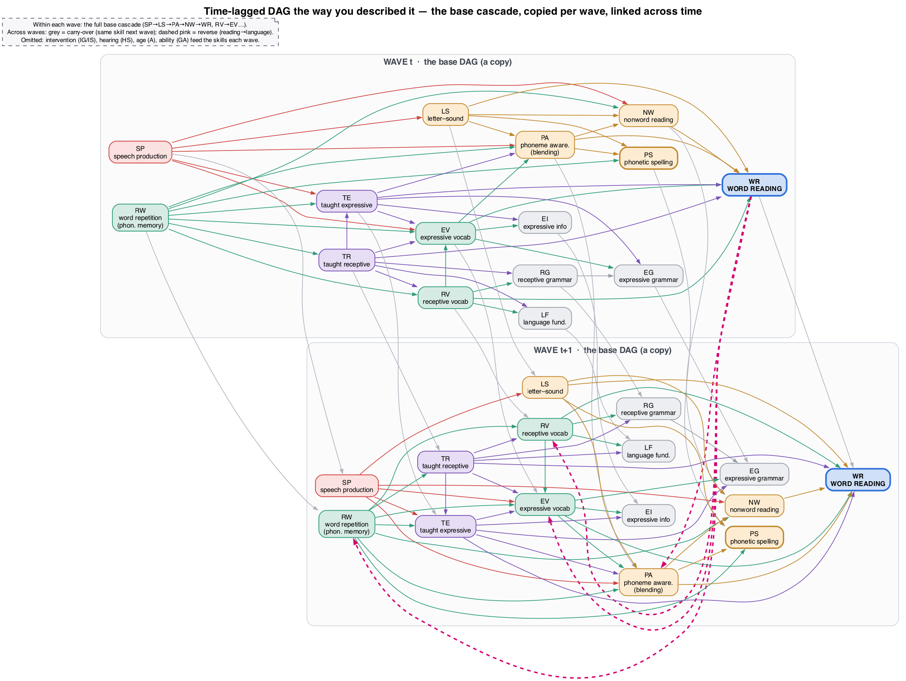
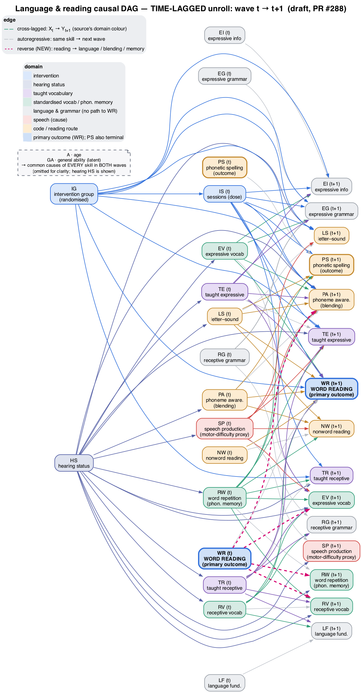

<!-- SPDX-License-Identifier: CC-BY-4.0 -->

# Time-lagged DAG: two options for the team

> [!NOTE]
> Drafted by an LLM-based AI tool (Claude Code/Opus 4.8). For team review; the choice below is the team's to make.

## Why unroll the DAG over time

The base DAG is a single snapshot. In it, language causes reading. We also think reading feeds back into language. We cannot draw both in one snapshot: an arrow from reading back to language would make a loop, and a DAG cannot have loops. If we draw the skills at each measurement occasion and join the occasions up, every arrow points forward in time and the loop problem goes away.

There are two sensible ways to do this. They agree on almost everything. They differ on one question: can a skill affect another skill within the same wave, or only by the next wave?

## Option A — the base DAG, copied at each wave (recommended)

Each wave holds the full cascade we already use (`SP → LS`, `LS → PA → NW → WR`, `RV → EV`, and the feeders). Between waves we add each skill to itself at the next wave (carry-over, grey), and the reverse edges from word reading to vocabulary, blending and memory at the next wave (dashed pink). This is the standard "unrolled" dynamic DAG.

## Option B — pure-lagged (what the draft `.dagitty` encodes now)

No skill affects another within the same wave. Every skill-to-skill effect is moved across a wave instead, so letter-sound at wave `t` affects blending at wave `t+1` rather than the same wave. Carry-over and the reverse edges are the same as in A. It gives a clean order in time, but it makes a strong claim: that nothing in the skill chain acts within a measurement interval. For waves about a year apart that is hard to defend, and it is why the picture is two bare columns rather than our usual diagram.

## Trade-offs

|                                     | A: base DAG per wave                                                                     | B: pure-lagged (current draft)                                                           |
| ----------------------------------- | ---------------------------------------------------------------------------------------- | ---------------------------------------------------------------------------------------- |
| Skill-to-skill arrows within a wave | Yes, the full cascade                                                                    | None                                                                                     |
| Reads like                          | Our base DAG, twice                                                                      | Two bare columns                                                                         |
| Main assumption                     | Skills can affect each other within a measurement interval                               | The whole cascade takes a full wave to act                                               |
| Cost                                | Same-wave effects are harder to identify, because cause and effect are measured together | Strong claim: a skill has no effect on a closely related skill until the next assessment |

## Recommendation: Option A

The only reason to unroll at all is the reading-to-language feedback. That is the one part that has to cross a time gap to stay a DAG. The rest of the cascade we already believe acts within a child's current state, so forcing all of it across a wave adds an assumption we cannot support. Keep the forward cascade within each wave, keep carry-over, and keep the reverse edges lagged (they have to be, to avoid a loop).

## Still open (from the critical review)

1. **A vs B** — the choice above. The draft `.dagitty` currently encodes B; adopting A means rewriting it to put the cascade inside each wave.
2. **Waitlist crossover.** The two-slice template assumes the same structure at every transition. The intervention's active window is arm-specific (immediate arm t1→t2, waitlist arm t2→t3), so a single generic template hides that. Worth a crossover-aware slice before any cross-lagged / LCSM model is built on it.
3. **Reverse edges** need a one-line justification each. `WR → EV` (print exposure) is well grounded; `WR → RW` (reading → phonological memory) is the most tentative and easy to drop.

A printable Word version of this note with the figures is available on request (the repo does not track `.docx`).
