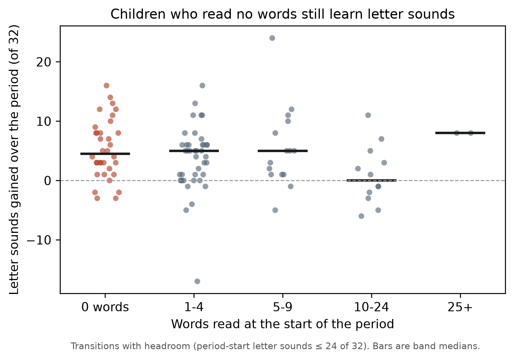
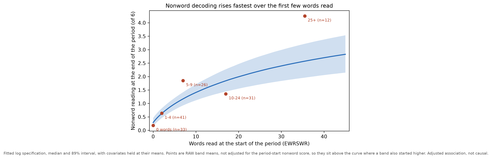
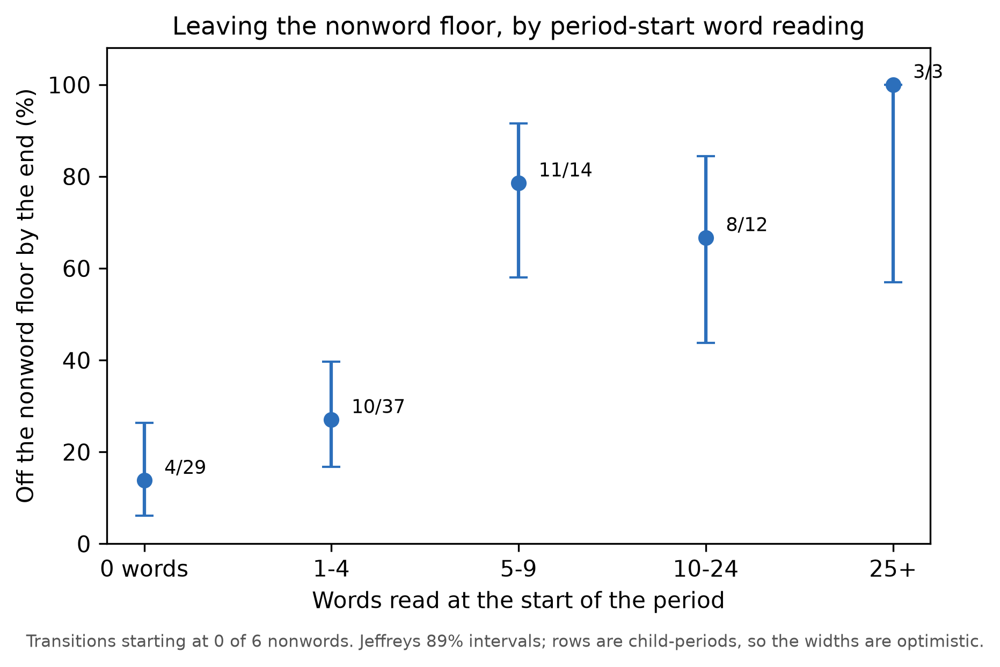
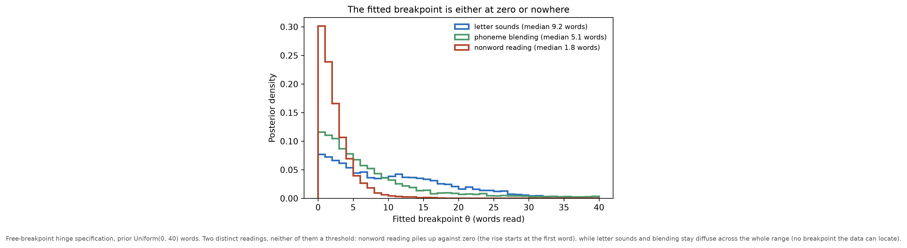

<!-- SPDX-License-Identifier: CC-BY-4.0 -->

# Findings — is there a minimum word-reading level before letter sounds, blending or nonword reading can progress?

> [!NOTE]
> Drafted by a LLM-based AI tool (Claude Code/Opus 4.8); 2026-08-08 and 2026-08-10 issue-decision updates by Codex/GPT-5. Asks one question of the existing data in three forms: descriptively (do children who read no words progress at all?), by band contrast, and by fitting a **free-breakpoint threshold model** against smooth alternatives and comparing them by PSIS-LOO. All fits are exploratory scratch fits from `notes/assets/202607241900-wr-threshold-probe.py`, not registered models — they bypass the production convergence gate, though every one is clean (0 divergences, max R-hat 1.01, min bulk ESS 581). **Nothing here is causal.** Latent general ability is unobserved and unblockable; the only randomisation-licensed effect in the study is the ITT arm. Preliminary — n ≈ 52 children, 143–162 child-period transitions, exploratory study.

## Why this note exists

The practical question behind it is a teaching one: **must a child be reading some words before it is worth working on the code skills?** If a minimum existed, it would change the order in which a programme introduces things. Three targets, in the order asked:

1. **Letter-sound knowledge** (`L`, YARC-LSK, 32 items)
2. **Phoneme blending** (`B`, 10 items)
3. **Nonword reading** (`N`, 6 items)

The companion note ([word-reading bands](202607241600-findings-word-reading-bands.md)) asked what word-reading standing _goes with_ and found, descriptively, that children in the top word-reading half were far more likely to leave the nonword floor. This note asks the sharper version of that: is the relationship a **prerequisite** — nothing happens below some level of reading, then progress becomes possible — or an ordinary **gradient**?

Reproducible asset: [`202607241900-wr-threshold-probe.py`](assets/202607241900-wr-threshold-probe.py). CSVs land in `output/notes/202607241900-wr-threshold/`.

## Promotion-status correction (2026-08-10)

The graded nonword finding below does **not** unblock a production model. Its `18 ± 4.4` expected-log-predictive-density comparison concerns a graded Beta-Binomial outcome among transitions with `N_pre <= 4`; it is not evidence that the proposed Bernoulli true-floor-exit model distinguishes `log1p(W_pre)` from a genuine no-exposure null. The raw floor-exit counts are descriptive only. The pre-fit method decision in [`202608101700-nonword-floor-exit-method-decision.md`](202608101700-nonword-floor-exit-method-decision.md) therefore requires a fresh two-population by two-prior Bernoulli promotion grid before registration. Until that gate is run and passed, the correct status is **worth probing, not unblocked**.

## The answer in one paragraph

**No minimum, for any of the three.** Children reading zero words gain letter sounds at the same rate as everyone else and gain blending at half the transitions. Nonword reading is different in degree — period-start word reading predicts it strongly — but the _shape_ is the opposite of a prerequisite: the returns are **steepest at the very bottom** of the reading range and flatten thereafter, so the fastest change happens between reading no words and reading a handful. A threshold model with a free breakpoint was fitted for all three and never won; for nonword reading it was decisively beaten by a smooth concave curve.

## How this was set up, and why the setup does most of the work

Every row is one **child-period transition** (t → t+1, three per child). Two design choices carry the argument.

**Headroom.** Rows are kept only where the target had somewhere to go: period-start letter sounds ≤ 24 of 32, blending ≤ 7 of 10, nonword ≤ 4 of 6. Without this restriction "did not progress" and "was already at ceiling" are the same number, and they would be systematically confused, because the strong readers are exactly the children at the letter-sound ceiling — a median of 28 of 32 by t3. The headroom cut is a judgement call, so a looser cut and the unrestricted set are reported alongside in `p1_band_progress.csv`.

**Threshold tested directly, not inferred from a band table.** Per target, four Beta-Binomial ANCOVA specifications of the period-end count given the period-start count, differing **only** in how period-start word reading enters:

| Spec     | Word-reading term                               | The claim it encodes                         |
| -------- | ----------------------------------------------- | -------------------------------------------- |
| `null`   | none                                            | reading level is irrelevant to progress      |
| `linear` | straight line in words                          | a constant gradient                          |
| `log`    | straight line in log1p(words)                   | diminishing returns — steepest at the bottom |
| `hinge`  | flat below a **free** breakpoint θ, then a line | **a prerequisite**                           |

All four carry the same covariates — own period-start level on the logit scale, age, arm, on-intervention status, hearing, speech — plus a child random intercept, so the PSIS-LOO comparison is a clean functional-form contrast. Slopes take the family's regularising `Normal(0, 0.3)` prior; θ takes `Uniform(0, 40)` words. Evidence language follows the house ladder ([evidence strength](202606261304-evidence-strength-and-rope-reporting.md)); intervals are the house **89 %** equal-tailed ([credible-interval standard](202607172359-credible-interval-standard.md)).

## (a) Letter sounds — no minimum, and barely a gradient

Among the **34 transitions where a child began the period reading zero words** (23 children), **29 gained letter sounds**, 26 gained at least two, the median gain was **+4.5 of 32** and the largest was +16.

Across bands the gain, residualised on the child's own period-start letter-sound score, is flat and non-monotone (Cliff's delta against the zero-word band, bootstrap clustered by child):

| Period-start words | n rows | median gain | any gain | Cliff's δ vs 0 words | 89 % CI        |
| ------------------ | ------ | ----------- | -------- | -------------------- | -------------- |
| 0                  | 34     | +4.5        | 85 %     | —                    | —              |
| 1–4                | 41     | +5.0        | 73 %     | +0.01                | −0.21 to +0.22 |
| 5–9                | 15     | +5.0        | 87 %     | +0.25                | −0.01 to +0.50 |
| 10–24              | 12     | 0.0         | 50 %     | −0.17                | −0.48 to +0.21 |
| 25+                | 2      | +8.0        | 100 %    | +0.76                | +0.58 to +0.94 |

The 25+ row is two transitions and is reported only for completeness. Model-side, `linear` takes 94 % of the stacking weight, but the margins are small: `hinge` −1.0 ± 1.2 elpd, `log` −3.0 ± 3.0, `null` −5.0 ± 4.2. The fitted breakpoint cannot be located (θ = 9.2 words, 89 % CI 0.7 to 26.1). **Restricted to children reading ≤ 25 words, all four specifications tie and the no-word-reading-term model takes 34 % of the weight** — so even the gradient is carried largely by the strongest readers.

## (b) Blending — no minimum, a weak gradient

19 of the same 34 zero-word transitions showed blending progress (median +1 of 10). The band contrasts rise smoothly with no step (+0.06, +0.18, +0.35, +0.53 against the zero-word band). `linear` takes the full stacking weight; `hinge` is −1.0 ± 0.98 behind it and `null` −5.0 ± 3.3. Within ≤ 25 words everything ties again and `null` takes 27 %.

Adding period-start **letter sounds** to the model barely moves the word-reading slope (+0.32 → +0.31 on the linear spec), so the little that is there is not simply letter-sound knowledge in disguise.

## (c) Nonword reading — a real dependence, in the wrong shape for a prerequisite

This is the one where word reading matters. Dropping the word-reading term costs **18 ± 4.4 elpd** — by a distance the largest effect of any specification choice in this note. But the winner is `log`, not `hinge`:

| Spec     | elpd difference from best | dse | stacking weight |
| -------- | ------------------------- | --- | --------------- |
| `log`    | 0.0                       | —   | **1.00**        |
| `linear` | −4.0                      | 2.6 | 0.00            |
| `hinge`  | −6.0                      | 2.9 | 0.00            |
| `null`   | −18.0                     | 4.4 | 0.00            |

Restricted to children reading ≤ 25 words — dropping the tail above the EWRSWR instrument switch — the ordering sharpens: `log` keeps the full weight, `linear` falls to −7.0 ± 1.7 and `hinge` to −10.0 ± 2.5. So the concave shape is not an artefact of the long right tail.

Expected end-of-period nonword score by period-start words read, covariates at their means:

| Prior words         | 0    | 1    | 2    | 3    | 5    | 10   | 25   | 40   |
| ------------------- | ---- | ---- | ---- | ---- | ---- | ---- | ---- | ---- |
| Expected `N` (of 6) | 0.29 | 0.48 | 0.63 | 0.76 | 0.98 | 1.41 | 2.21 | 2.70 |

**Roughly half the total climb across the whole 0–40 word range happens over the first five words.** The same thing appears descriptively as floor exit — among transitions starting at zero of six nonwords, the proportion reading at least one by the period end:

| Period-start words          | 0           | 1–4          | 5–9          | 10–24       | 25+         |
| --------------------------- | ----------- | ------------ | ------------ | ----------- | ----------- |
| Off the floor by period end | 4/29 (14 %) | 10/37 (27 %) | 11/14 (79 %) | 8/12 (67 %) | 3/3 (100 %) |

Only **4 of 33** zero-word-reader transitions showed any nonword gain at all — which is the observation that makes this look like a prerequisite at first glance. The model says otherwise, and the distinction is exactly the one the question turns on: a prerequisite is **flat, then rising**; what these data show is **steepest at the bottom, then flattening**. The children reading one to four words are already a long way up the curve.

**It is not the letter sounds.** Adding period-start letter-sound knowledge attenuates the word-reading slope by about a fifth but leaves it decisive: +0.71 [+0.50, +0.94] → **+0.57 [+0.33, +0.81]** on the linear spec, P(> 0) ≈ 1.000 either way.

## The breakpoint that is not there

The free breakpoint fails in two distinguishable ways, and neither is a threshold:

- **Nonword reading**: θ collapses against the lower bound (median 1.8 words, 89 % CI 0.2 to 6.9, with 30 % of the posterior below one word). The hinge is trying to become a plain rising curve — which is what `log` already is, and does better.
- **Letter sounds and blending**: θ stays diffuse across the whole prior range (9.2 words, 0.7 to 26.1; and 5.1 words, 0.5 to 24.3). There is no breakpoint the data can locate, and in the ≤ 25-word subsets the hinge slope interval covers zero.

## Adversarial checks

Applying the project's descriptive-claims discipline:

- **Regression to the mean.** Band contrasts use the gain residualised on the target's own period-start level, and every model is an ANCOVA on the period-start count. Raw gain contrasts across word-reading bands would be RTM plus a ceiling constraint, because the bands differ sharply on the target's own baseline.
- **Clustering.** Each child contributes up to three transitions. The band bootstrap resamples **children**, not rows; the models carry a child random intercept. The Jeffreys intervals in the floor-exit figure do **not** account for it and are labelled optimistic.
- **Ceilings and floors.** The headroom restriction handles the letter-sound ceiling. It cannot repair the measures themselves: blending is a 10-item three-alternative task with a chance floor near 3.3 and 19 % of children at ceiling by t4; nonword reading is 6 items, floored for 72 / 64 / 52 / 40 % of children at t1–t4. A concave curve on a logit link with a floored bounded outcome is partly manufacturable by the instrument, and the nonword result should be read with that live.
- **The EWRSWR switch.** Children reading more than 25 words receive additional Test of Single-Word Reading items, so the upper tail is partly a different instrument. Every model was refitted with that tail dropped; the conclusions strengthen rather than weaken.
- **Pareto-k.** Two to four observations exceed k̂ = 0.7 in the letter-sound and blending comparisons, so those elpd differences are unreliable — though they are ties either way. The nonword comparison, the one carrying a conclusion, is clean apart from a single flagged point on the hinge.
- **Power.** For letter sounds and blending, "no threshold" partly means "not enough signal to distinguish anything" — the null is competitive there. Only for nonword reading is the threshold specification decisively _beaten_ rather than merely unsupported.

## What we can and cannot say

**Can say.** In this cohort there is no minimum word-reading level below which children fail to progress in letter sounds — children who read no words gain letter sounds at the cohort's ordinary rate, and 29 of 34 such transitions show a gain. Blending progresses for about half of zero-word readers and tracks reading only as a weak gradient. Nonword reading depends on period-start word reading strongly, but with diminishing returns: the modelled expected score roughly triples between zero and five words read and then takes another twenty words to double again. A free-breakpoint threshold specification was fitted for all three targets and won nowhere.

**Cannot say.** That any of this is causal, or even, for two of the three targets, that it is an adjusted association in the DAG's terms. Under the lagged graph the `WR → LS` coupling is identifiable with a small set, and that set is used here; `WR → PA` needs 8–11 adjusters; and the `WR → NW` edge adopted on 2026-08-08 still needs 8 and 12 measured adjusters across the two transitions. Those sets are unfittable here, and latent general ability remains unblocked, so the strongest nonword result remains descriptive. Direction is not established either: a child beginning to decode will also read more words, and this design cannot separate the two.

## What would be worth building

**One descriptive model is worth probing, but is not unblocked.** The nonword result is the only one here strong enough to justify the Bernoulli promotion probe, and its candidate shape (concave, off-floor) is not what the current `mechanism` family fits by default. #428 adopts the `WR_t → NW_{t+1}` edge, but the wide backdoor set means any model eventually specified in #433 must still ship with `causal_status="none"` and `estimand_type="descriptive"`. Registration depends on the separate Bernoulli full-versus-null evidence and sensitivities locked on 2026-08-10; the favourable graded result cannot substitute for them.

**Nothing further for letter sounds or blending.** The existing `lcsm-082` already estimates the reading → blending coupling. The optional reverse-coupling LCSM for letter sounds in #429 is not planned: `med-176` already addresses direction, while a second fit would inherit the same latent-general-ability problem and is not currently tied to an independent per-transition estimand.

**A measurement point for the design record.** Two of the three targets here cannot answer a shape question at all — a 6-item nonword test and a 10-item three-alternative blending task, both floored, are being asked to resolve a curve. That belongs with the existing [design-lessons](202607172345-design-lessons-for-future-studies.md) entry rather than with any model.

## Cross-references

- [Word-reading bands](202607241600-findings-word-reading-bands.md) — the companion, where the descriptive floor-exit contrast first appeared.
- [Letter sounds and word reading](202607241000-findings-letter-sounds-word-reading-association.md) — the forward-direction associational review.
- [Time-lagged DAG](202607131200-time-lagged-dag.md) and `dag/dag-language-reading-lagged.dagitty` — the graph the identification statements are read off.
- [Skill thresholds](202607171215-findings-skill-thresholds.md) — the earlier knee sweep, which found only letter sounds have a resolved knee and is the closest prior work to this note.
- [Evidence strength](202606261304-evidence-strength-and-rope-reporting.md), [credible-interval standard](202607172359-credible-interval-standard.md) — reporting conventions.
- Issues: #428 (the adopted `WR → NW` DAG decision), #433 (registering the nonword model as descriptive), #429 (the reverse-coupling LCSM decision not to build now).
