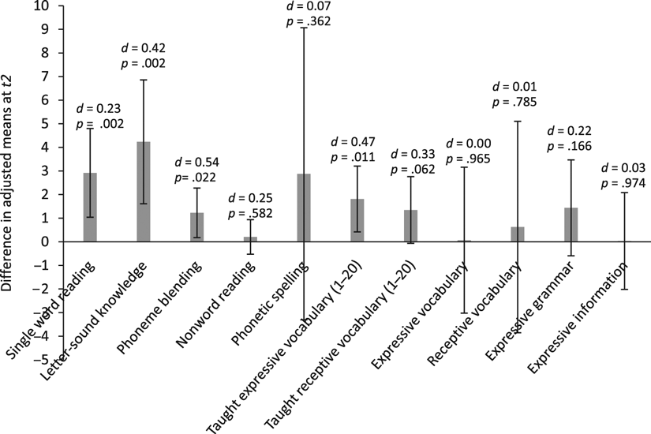

# Efficacy of a reading and language intervention for children with Down syndrome: a randomized controlled trial

Kelly Burgoyne, Fiona J. Duff, Paula J. Clarke, Sue Buckley, Margaret J. Snowling, Charles Hulme

First published: 26 April 2012

DOI: https://doi.org/10.1111/j.1469-7610.2012.02557.x

Accepted 2012 Mar 15; Issue date 2012 Oct.

# Introduction

Down syndrome (DS) is the most common genetic cause of learning
disability and is associated with particular difficulties with language
and communication. Despite this, most individuals with DS can learn to
read, though attainment levels vary widely ([@b8]; [@b22]). There
remains, however, limited evidence about how best to intervene to
improve these children's reading and language skills. Although a great
deal of evidence supports the use of phonics for the teaching of reading
([@b12]; [@b27]; [@b30]), there is debate about the appropriateness of
this approach for children with DS. Typically, children with DS show
good visual skills ([@b16]), deficits in phonological awareness ([@b11];
[@b23]) and a profile of stronger word recognition than decoding skills.
This profile has led some to advocate the use of 'whole-word' strategies
for teaching these children to read. Within the 'Triangle Model' of
reading ([@b31]), such an approach might be seen as fostering the use of
the 'semantic' pathway linking orthography with word meanings. Although
this can undoubtedly increase the number of words children recognise, it
does little to foster the development of a 'phonological' pathway
mapping orthography to phonology, which is fundamental to independent
reading.

A small number of studies have demonstrated that children with DS
benefit from reading instruction which targets phonological awareness
and reading skills (e.g. [@b10]; [@b17]; [@b24]). However, the available
evidence is limited by small samples (_N_ = 7--24), short training
periods (10 hr to 16 weeks of daily 40-min intervention), a lack of
appropriate comparison groups, and inclusion criteria which do not
include the full range of abilities seen in individuals with DS.
Furthermore, little is known about individual differences in response to
intervention.

Among typically developing children, one of the main factors which
affects response to intervention is oral language skill ([@b33];
[@b35]). Other child-variables which affect response include (in order
of effect size): rapid naming, behaviour, phonological awareness,
alphabetic knowledge, memory, IQ and demographics ([@b28]) and extrinsic
factors such as the length and quality of instruction are also important
([@b2]; [@b27]).

With these findings as a backdrop, we set out to evaluate a programme of
intervention for children with DS which combined phonics-based reading
instruction with vocabulary teaching. The rationale for the intervention
was that language impairments are common in children with DS (e.g.
[@b1]) and if attenton is not paid to these they may compromise the
development of phoneme awareness ([@b9]; [@b25]). Moreover, a previous
study had shown that such an approach was effective for supporting the
reading development of typically developing children who show poor
response to intervention ([@b15]). Thus, we report a randomized
controlled trial (RCT) of an intervention for children with DS that
targets both reading and language skills. The size and scope of our
study enables us to investigate whether the intervention accelerates
progress in reading and language when compared with 'teaching as usual'
and the factors that predict response to intervention.

# Method

Trained TAs delivered a reading and language intervention to children on
an individual basis in daily 40-min sessions in the children's schools.
The performance of children who received the intervention for 40 weeks
(intervention group) was compared to a waiting control group who
continued with their regular education during the first 20 weeks (which
included one-to-one support from a TA) before receiving the intervention
in just the second 20-week period. Ethical approval was granted by the
Ethics Committee, Department of Psychology, University of York; informed
parental consent was obtained for all children. The trial was conducted
within schools and hence was not registered. Details of participant
recruitment, allocation and flow through the study are summarised in the
CONSORT diagram ([Figure 1](#fig01)).

<figure id="fig01">

<figcaption>Flow diagram showing participant recruitment and progress
through the trial [in line with CONSORT recommendations (Schulz, Altman, &amp; Moher,
2010)]</figcaption>
</figure>

## Participants

The project was advertised in Spring 2009 to parents and educators of
children with DS attending primary schools in two UK locations: North
(Yorkshire) and South (Hampshire). Fifty-eight children in 50 schools
were identified; all children were in integrated classrooms with support
from a TA for a large part of the school day. Fifty-seven children (one
child was unavailable for testing) were visited in school for an initial
assessment. The only eligibility criterion was that children should be
in primary school Years 1--5 at the start of the study so that they
would remain in primary education for the duration of the project. The
57 children (28 boys) recruited were randomly allocated to either the
intervention or waiting control group.

Children were aged between 5:02 and 10:00 at the start of the project.
Children came from a range of SES backgrounds but were predominantly
from white, English-speaking families; two children spoke an additional
language (Cantonese, Russian). Parent-completed questionnaires (84%
returned) indicated high rates of involvement in early services
\[portage (_N_ = 40), occupational therapy (_N_ = 21) and speech and
language services (_N_ = 42)\] though the timing, frequency and duration
of service involvement varied widely. Visual impairments were reported
for 37 children; 23 children were reported as having a hearing
impairment ranging from mild to severe loss in one or both ears. Most
parents (96%) reported that they had read to their child regularly from
an early age and had tried to teach their child to read.

Teacher ratings on the Strengths and Difficulties Questionnaire (SDQ;
[@b18]) (82% returned) indicated significant behavioural problems (i.e.
Total difficulties score 16--40) for five children in the intervention
group and seven children in the waiting control group. Descriptive
statistics for the two groups of children are shown in [Table
1](#tbl1).

::::
::: caption
Mean raw scores (_SD_) for the intervention and waiting control groups
on screening and descriptive measures, prior to the intervention
:::

+--------------+------------+------------------------------------------------------+
| | | Intervention group |
+--------------+------------+------------------------------------------------------+
| | | |
+--------------+------------+--------------------------+---------------------------+
| | | Intervention | Waiting control |
+--------------+------------+--------------------------+---------------------------+
| | | | |
+--------------+------------+------+---------+---------+-------+---------+---------+
| Measure | Test point | _N_ | _M_ | Range | _N_ | _M_ | Range |
| (maximum | | | (_SD_) | | | (_SD_) | |
| score) | | | | | | | |
+==============+============+======+=========+=========+=======+=========+=========+
| Age (months) | Screening | 29 | 80.48 | 60--115 | 28 | 77.82 | 57--115 |
| | | | (14.74) | | | (15.88) | |
+--------------+------------+------+---------+---------+-------+---------+---------+
| SDQ (40) | Screening | 27 | 11.37 | 3--23 | 20 | 13.05 | 5--24 |
| | | | (4.66) | | | (5.87) | |
+--------------+------------+------+---------+---------+-------+---------+---------+
| Single-word | Screening | 29 | 4.79 | 0--29 | 28 | 4.50 | 0--30 |
| reading (30) | | | (8.30) | | | (7.88) | |
+--------------+------------+------+---------+---------+-------+---------+---------+
| Letter-sound | Screening | 29 | 17.24 | 0--31 | 28 | 14.43 | 0--28 |
| knowledge | | | (9.84) | | | (9.41) | |
| (32) | | | | | | | |
+--------------+------------+------+---------+---------+-------+---------+---------+
| Expressive | Screening | 29 | 29.97 | 6--63 | 28 | 28.79 | 6--73 |
| vocabulary | | | (11.85) | | | (13.41) | |
| (170) | | | | | | | |
+--------------+------------+------+---------+---------+-------+---------+---------+
| Receptive | Screening | 29 | 36.93 | 6--70 | 28 | 32.43 | 5--62 |
| vocabulary | | | (12.42) | | | (13.84) | |
| (170) | | | | | | | |
+--------------+------------+------+---------+---------+-------+---------+---------+
| Non-verbal | *t*1 | 28 | 13.39 | 0--22 | 26 | 11.73 | 0--24 |
| IQ: Block | | | (5.83) | | | (6.70) | |
| Design (40) | | | | | | | |
+--------------+------------+------+---------+---------+-------+---------+---------+
| Non-verbal | *t*1 | 28 | 10.25 | 0--24 | 26 | 8.65 | 0--25 |
| IQ: object | | | (6.62) | | | (6.97) | |
| assembly | | | | | | | |
| (37) | | | | | | | |
+--------------+------------+------+---------+---------+-------+---------+---------+
| Receptive | *t*1 | 28 | 12.36 | 3--22 | 26 | 12.50 | 5--23 |
| grammar (32) | | | (4.53) | | | (3.82) | |
+--------------+------------+------+---------+---------+-------+---------+---------+
| Basic | *t*1 | 28 | 8.93 | 0--17 | 26 | 9.38 | 1--18 |
| concepts | | | (4.74) | | | (3.99) | |
| (18) | | | | | | | |
+--------------+------------+------+---------+---------+-------+---------+---------+

SDQ, Strengths and Difficulties Questionnaire.

*t*1 is the testing time point immediately prior to the first 20-week
block (of intervention or waiting).
::::

## Assessments

Children were assessed four times: at screening, immediately before
intervention (*t*1), after the first 20-week intervention period (*t*2),
and after the second 20-week intervention period (*t*3). Children were
assessed individually over two or more sessions on separate days. TAs
were present during testing to assist with behavioural and communicative
challenges where necessary. In addition, tasks were kept short,
fast-paced and varied to maintain motivation and interest. Here, we only
report data for outcomes and predictors relevant to this report.

*Nonverbal IQ (t*1*):* Assessed using Block Design and Object Assembly
subtests (WPPSI-III; [@b34]; alphas 0.84 and 0.85, respectively).

## Reading-related measures

_Single-word reading (screening; t1_--_t3)._ All children completed the
Early Word Recognition (EWR) test (α = 0.98) from the York Assessment of
Reading (YARC) Early Reading battery ([@b21]). Children reading over 25
words were given an additional set of words from the Test of Single-Word
Reading, from the YARC.

*Letter-sound knowledge (screening; t*1--*t*3*)*: This extended test of
alphabetic knowledge from the YARC ([@b21]) asks the child to provide
the sound for 32 individual letters and digraphs (α = 0.98).

*Phoneme blending (t*1--*t*3*)*: The child was asked to select which of
three pictures represented a word spoken by the experimenter in 'robot'
talk. On each trial a target picture (e.g. _bed_) was presented along
with pictures representing an initial phoneme distracter (e.g. _bud_)
and a rhyming distracter (e.g. _head_). All targets and distracters had
a consonant-vowel-consonant structure. Two practice items were followed
by 10 test items (α = 0.67).

*Nonword reading (t*1--*t*3*)*: Children were asked to read the names of
six cartoon monsters: 'et', 'om', 'ip', 'neg', 'sab' and 'hic'. This
test was devised because all available nonword reading tests were too
difficult. Two practice items were given before test items (internal
reliability = 0.88).

*Spelling (t*1--*t*3*)*: Ten words were presented as pictures to be
named and spelled (see also [@b6]). If no letters were correctly
represented in the first two items the test was discontinued (internal
reliability = 0.97).

## Language measures

*Vocabulary (t*1--*t*3*)*. Children were given Expressive and Receptive
One-Word Picture Vocabulary Tests (EOWPVT; ROWPVT; [@b7]). Median
internal consistencies across the relevant age ranges were 0.96.

*Taught vocabulary knowledge (t*1--*t*3*):* Tests were created to
measure expressive and receptive knowledge of words explicitly taught in
each phase of the intervention programme (i.e. weeks 1--20, tested
t1--*t*3; weeks 21--40, tested *t*2--*t*3). Six words of each type
(nouns, adverbs, adjectives, prepositions) were tested. In the
expressive test, children were shown pictures that they were asked to:
name (nouns); say what the person was doing (verbs; e.g. 'what is the
man doing?''_Stretching_'); name after a prompt related to a comparison
picture (adjectives; e.g. 'this boy is clean, this boy
is\...?''_Dirty'_); or answer a specific question designed to elicit a
preposition (e.g. 'where is the book?''_On_ the table'). In the
receptive test, children were asked to select the picture (from a choice
of 4) which represented the target word. Correlations between
standardised and bespoke vocabulary tests ranged from 0.64 to 0.81 (*p*s
\< .001).

*Expressive grammar and information (t*1--*t*3*)*: Assessed using the
Action Picture Test (APT; [@b29]).

*Basic concept knowledge (t*1*)*: From the Clinical Evaluation of
Language Fundamentals (CELF) Preschool 2nd Edition ([@b36]) assessed
knowledge of 18 basic linguistic concepts (internal consistency = 0.85).

*Receptive grammar (t*1*)*: Measured by the Test for Reception of
Grammar 2 (TROG-2; [@b5]). Eight grammatical constructs were tested in
blocks of four items; each correct item was awarded a score of 1
(internal consistency = 0.87).

_Behaviour_: Assessed at *t*1--*t*3 by ratings of video-recordings of
assessment sessions. Using a time-sampling technique, behaviour was
rated over 10 s periods on a 5-point scale (1 = very good; 5 = very
challenging) every 5 min through 60 min of film; scores were averaged to
create a single score for each child at each time point (inter-rater
reliability = 0.87).

## Outcome measures

Primary outcomes were those proximal to the content of the intervention
(letter-sound knowledge, phoneme blending, single word reading, taught
vocabulary); secondary outcome measures were those more distal to the
content of the intervention (nonword reading, phonetic spelling,
standardised tests of receptive and expressive vocabulary and expressive
grammar and information).

## Intervention programme

The intervention programme consisted of two components: a Reading Strand
and a Language Strand. Four sessions each week were dedicated to new
teaching; the fifth session provided an opportunity to revise and
consolidate learning. The intervention followed a prescribed programme
in daily 40 min sessions with opportunities to tailor sessions according
to the needs and abilities of the child (see [Table
2](#tbl2) for an overview of the structure of sessions
and [Appendix S1](#SD1) for a
detailed description). TAs received a comprehensive teaching manual, a
set of finely graded reading books, a pack of phonics resources, and a
copy of Letters and Sounds ([@b13]) when they attended training.

::::
::: caption
Content and structure of the reading and language strand intervention
sessions
:::

+----------------------------------+----------------------------------+
| Reading | Language |
+----------------------------------+----------------------------------+
| | |
+---------------------+------------+---------------------+------------+
| Activity | Time (min) | Activity | Time (min) |
+=====================+============+=====================+============+
| Read 'easy' book | 2--3 | New word introduced | 5 |
| (\>94% reading | | with written, | |
| accuracy) | | spoken and | |
| | | pictorial examples. | |
| | | One per session or | |
| | | in pairs (e.g. | |
| | | on/in) | |
+---------------------+------------+---------------------+------------+
| Read | 5 | Game using new word | 5 |
| 'instructional' | | to reinforce | |
| level book (90--94% | | learning in | |
| accuracy) while TA | | multiple contexts | |
| takes 'running | | | |
| record' | | | |
+---------------------+------------+---------------------+------------+
| Sight word learning | 2--3 | Use new word in | 5 |
| and revision | | oral activities | |
+---------------------+------------+---------------------+------------+
| Letter-knowledge | 5 | Use new word in | 5 |
| (including | | guided writing | |
| digraphs), oral | | | |
| phonological | | | |
| awareness games and | | | |
| linking of letters | | | |
| and sounds | | | |
+---------------------+------------+---------------------+------------+
| Introduce new | 5 | | |
| book/shared reading | | | |
| of instructional | | | |
| book | | | |
+---------------------+------------+---------------------+------------+
::::

The Reading Strand was based on Reading Intervention which is a combined
approach that teaches reading and phonics together ([@b19]). The
Language Strand aimed to teach new vocabulary and promote appropriate
and accurate use of new words in expressive language (oral and written).
Teaching was based on the multiple context approach ([@b4]) making use
of visual supports throughout the activities and using simple games to
reinforce learning (e.g. matching, sorting). Target words, taught in
themes, were selected from a set of parent-completed vocabulary
checklists ([@b14]) identifying words which many children were not yet
using or did not yet understand and which would be useful additions to
children's vocabulary. (Further details of the intervention programme
are given in the online supplementary material).

Two TAs from each school were invited to attend 2 days of training on
the educational needs of children with DS. Specific intervention
training was given 2 days shortly before the intervention began with a
further day after 10 weeks of delivery. New TAs who joined the project
part way through the intervention phases were trained in school. TAs
were supported by regular telephone/email contact and observed at least
once a term to assess fidelity of implementation and provide
individualised feedback. Observations were also used to rate TAs
according to their effectiveness in delivering the intervention using a
scale of 1 (excellent) to 3 (poor). The average TA rating was 1.41
(0.64).

A questionnaire was used to assess children's participation in classroom
literacy activities both prior to and in addition to the intervention.
Questionnaires were returned for 36 children (intervention group _N_ =
24; waiting group _N_ = 12). Prior to starting the intervention,
children were involved in book reading (64%; including independent,
guided and class reading), phonics instruction (28%), sight word
learning (25%) and making and reading personal books (31%). Literacy
instruction provided in addition to the intervention included book
reading (81%), phonics (28%) and sight word learning (14%). Eleven per
cent of respondents indicated that intervention was the only literacy
input children received.

# Results

[Table 3](#tbl3) shows the means and standard
deviations for all measures for each group at *t*1, *t*2 and *t*3
(pre-intervention, after the first 20-week intervention period and after
the second 20-week intervention period). Four children withdrew from the
intervention part way through the study (see [Figure
1](#fig01)) but we obtained follow-up measures and
included their scores in our analyses. As expected given random
allocation, the intervention and waiting control groups did not differ
reliably on any measure at *t*1 (Cohen's _d_'s ranged from 0.03 to
0.35).

::::
::: caption
Means (_SD_) on all outcome measures at pre-intervention (*t*1),
mid-intervention (*t*2), and post-intervention (*t*3) for intervention
and waiting control groups
:::

+----------------------------------------+------------+-----------------------------------------------+
| | | Intervention group |
+----------------------------------------+------------+-----------------------------------------------+
| | | |
+----------------------------------------+------------+-----------------------+-----------------------+
| | | Intervention | Waiting control |
+----------------------------------------+------------+-----------------------+-----------------------+
| | | | |
+----------------------------------------+------------+---------+-------------+---------+-------------+
| Test (maximum score) | | _M_ | Range | _M_ | Range |
| | | (_SD_) | | (_SD_) | |
+========================================+============+=========+=============+=========+=============+
| Single-word reading (79) | *t*1 | 5.86 | 0--46 | 6.88 | 0--52 |
| | | (10.41) | | (12.43) | |
| +------------+---------+-------------+---------+-------------+
| | *t*2 | 10.50 | 0--52 | 8.92 | 0--56 |
| | | (12.01) | | (13.59) | |
| +------------+---------+-------------+---------+-------------+
| | *t*3 | 14.86 | 0--55 | 13.36 | 0--64 |
| | | (14.02) | | (16.48) | |
+----------------------------------------+------------+---------+-------------+---------+-------------+
| Letter-sound knowledge (32) | *t*1 | 15.36 | 0--28 | 13.12 | 0--30 |
| | | (8.13) | | (9.27) | |
| +------------+---------+-------------+---------+-------------+
| | *t*2 | 22.29 | 6--31 | 16.35 | 2--31 |
| | | (7.28) | | (9.42) | |
| +------------+---------+-------------+---------+-------------+
| | *t*3 | 23.46 | 2--32 | 20.50 | 1--31 |
| | | (8.02) | | (7.46) | |
+----------------------------------------+------------+---------+-------------+---------+-------------+
| Phoneme blending | *t*1 | 5.00 | 0--10 | 4.85 | 0--10 |
| (10)[^a^](#tf3-1) | | (1.94) | | (2.52) | |
| +------------+---------+-------------+---------+-------------+
| | *t*2 | 6.25 | 2--10 | 4.88 | 0--10 |
| | | (2.35) | | (2.55) | |
| +------------+---------+-------------+---------+-------------+
| | *t*3 | 6.43 | 2--10 | 5.73 | 0--10 |
| | | (2.35) | | (2.59) | |
+----------------------------------------+------------+---------+-------------+---------+-------------+
| Nonword reading (6) | *t*1 | 0.52 | 0--5 | 0.96 | 0--6 |
| | | (1.25) | | (1.61) | |
| +------------+---------+-------------+---------+-------------+
| | *t*2 | 0.96 | 0--6 | 1.04 | 0--6 |
| | | (1.48) | | (1.90) | |
| +------------+---------+-------------+---------+-------------+
| | *t*3 | 1.48 | 0--5 | 1.12 | 0--6 |
| | | (1.87) | | (1.79) | |
+----------------------------------------+------------+---------+-------------+---------+-------------+
| Phonetic spelling (92) | *t*1 | 4.89 | 0--92 | 12.35 | 0--92 |
| | | (17.87) | | (23.85) | |
| +------------+---------+-------------+---------+-------------+
| | *t*2 | 11.00 | 0--92 | 17.00 | 0--92 |
| | | (21.84) | | (26.98) | |
| +------------+---------+-------------+---------+-------------+
| | *t*3 | 20.00 | 0--89 | 25.72 | 0--89 |
| | | (28.39) | | (32.93) | |
+----------------------------------------+------------+---------+-------------+---------+-------------+
| Taught expressive vocabulary; weeks | *t*1 | 5.07 | 0--13 | 5.00 | 0--13 |
| 1--20 (24) | | (3.51) | | (3.59) | |
| +------------+---------+-------------+---------+-------------+
| | *t*2 | 8.50 | 2--17 | 6.77 | 1--15 |
| | | (4.07) | | (3.84) | |
| +------------+---------+-------------+---------+-------------+
| | *t*3 | 9.21 | 2--19 | 9.54 | 0--18 |
| | | (4.29) | | (5.05) | |
+----------------------------------------+------------+---------+-------------+---------+-------------+
| Taught receptive vocabulary; weeks | *t*1 | 12.04 | 3--22 | 11.92 | 5--18 |
| 1--20 (24) | | (4.83) | | (3.20) | |
| +------------+---------+-------------+---------+-------------+
| | *t*2 | 15.50 | 7--21 | 14.04 | 7--22 |
| | | (3.55) | | (3.67) | |
| +------------+---------+-------------+---------+-------------+
| | *t*3 | 16.07 | 7--23 | 15.58 | 6--21 |
| | | (3.89) | | (4.00) | |
+----------------------------------------+------------+---------+-------------+---------+-------------+
| Taught expressive vocabulary; weeks | *t*2 | 6.32 | 0--11 | 6.27 | 1--15 |
| 21--40 (24) | | (3.13) | | (3.42) | |
| +------------+---------+-------------+---------+-------------+
| | *t*3 | 9.89 | 0--17 | 8.46 | 0--15 |
| | | (4.06) | | (4.13) | |
+----------------------------------------+------------+---------+-------------+---------+-------------+
| Taught receptive vocabulary; weeks | *t*2 | 16.11 | 8--23 | 14.19 | 5--22 |
| 21--40 (24) | | (4.39) | | (4.06) | |
| +------------+---------+-------------+---------+-------------+
| | *t*3 | 16.68 | 7--23 | 16.62 | 9--23 |
| | | (4.01) | | (3.32) | |
+----------------------------------------+------------+---------+-------------+---------+-------------+
| Expressive vocabulary (170) | *t*1 | 29.64 | 8--59 | 27.69 | 8--71 |
| | | (11.85) | | (13.88) | |
| +------------+---------+-------------+---------+-------------+
| | *t*2 | 34.00 | 13--67 | 32.00 | 12--74 |
| | | (11.72) | | (13.43) | |
| +------------+---------+-------------+---------+-------------+
| | *t*3 | 37.39 | 10--68 | 36.38 | 14--69 |
| | | (14.41) | | (11.96) | |
+----------------------------------------+------------+---------+-------------+---------+-------------+
| Receptive vocabulary (170) | *t*1 | 35.61 | 11--61 | 35.23 | 12--67 |
| | | (12.00) | | (15.25) | |
| +------------+---------+-------------+---------+-------------+
| | *t*2 | 38.79 | 20--68 | 38.27 | 15--64 |
| | | (11.85) | | (12.54) | |
| +------------+---------+-------------+---------+-------------+
| | *t*3 | 44.25 | 15--74 | 42.42 | 16--72 |
| | | (12.95) | | (15.07) | |
+----------------------------------------+------------+---------+-------------+---------+-------------+
| Expressive grammar (37) | *t*1 | 5.86 | 0--23 | 4.80 | 0--28 |
| | | (5.38) | | (5.63) | |
| +------------+---------+-------------+---------+-------------+
| | *t*2 | 8.29 | 0--26 | 6.04 | 0--23 |
| | | (6.29) | | (5.54) | |
| +------------+---------+-------------+---------+-------------+
| | *t*3 | 7.93 | 0--21 | 8.12 | 0--27 |
| | | (5.42) | | (6.59) | |
+----------------------------------------+------------+---------+-------------+---------+-------------+
| Expressive information (40) | *t*1 | 13.84 | 0--32 | 11.79 | 0--27.50 |
| | | (7.26) | | (6.39) | |
| +------------+---------+-------------+---------+-------------+
| | *t*2 | 16.63 | 3.00--37.50 | 14.77 | 3.50--32.50 |
| | | (7.38) | | (7.25) | |
| +------------+---------+-------------+---------+-------------+
| | *t*3 | 18.01 | 2.00--31.50 | 18.75 | 4.00--34.50 |
| | | (6.73) | | (8.48) | |
+----------------------------------------+------------+---------+-------------+---------+-------------+
| No. of sessions attended (200) | *t*1--*t*3 | 137.46 | 72--183 | 75.28 | 17--92 |
| | | (28.89) | | (17.67) | |
+----------------------------------------+------------+---------+-------------+---------+-------------+

A test of _Sound Isolation_ (Hulme et al., 2009) was also administered
at *t*1 but discontinued due to marked floor effects (_M_ = 0.81, _SD_ =
1.63, max = 12; skewness = 1.95, _SE_ = 0.33; kurtosis = 2.65, _SE_ =
0.64).
::::

## Intervention effects

The effects of intervention on language and literacy outcomes were
assessed using regression (ANCOVA) models implemented in Mplus (v 6.0;
[@b100]). In these analyses the small amount of missing data was dealt
with using Full Information Maximum Likelihood (FIML) estimators (the
default in Mplus). To assess the impact of the intervention after the
first 20 weeks, group differences at *t*2 were tested, controlling for
baseline performance at *t*1, age and gender. The results are summarised
in [Figure 2](#fig02), which plots the difference
between the groups' adjusted means (*t*2 scores controlling for
covariates), with 95% confidence intervals. Any score greater than 0
represents greater progress in the intervention group compared to the
waiting control group; where the 95% confidence intervals do not cross
the _x_-axis, this represents a statistically significant effect (_p_ \<
.05). The figure shows that children receiving intervention made
significantly greater progress than those not receiving intervention on
four primary outcome measures: single word reading, letter-sound
knowledge, phoneme blending and taught expressive vocabulary (with small
to medium effect sizes). The intervention effect did not transfer to
other measures of literacy (spelling and nonword reading) or
standardised tests of language (vocabulary, grammar and information).

<figure id="fig02">

<figcaption>Comparison of the intervention and waiting control groups at
<em>t</em>2 (controlling for <em>t</em>1), after receiving 20 and 0
weeks of intervention, respectively, on intervention outcome measures
[with 95% confidence intervals, effect sizes (<em>d</em>, difference in
raw score gains divided by pooled <em>SD</em> at <em>t</em>1)] and
<em>p</em>-values</figcaption>
</figure>

The data in [Table 3](#tbl3) also indicate that once
the waiting list control group began to receive intervention, their
skills increased at about the same rate as those of the intervention
group during their first 20-week period. To assess whether the
intervention group remained ahead after the waiting control group had
received 20 weeks of intervention, differences at t3 were tested, again
controlling for baseline performance at *t*1 (except for taught
vocabulary items introduced in the second block of intervention, where
*t*2 scores are controlled), age and gender. The results are summarised
in [Figure 3](#fig03). Although the children who had
received 40 weeks of intervention were numerically ahead of those who
received 20 weeks, none of the group differences were statistically
reliable at this time point.

<figure id="fig03">

<figcaption>Comparison of the intervention and waiting control groups at
<em>t</em>3 (controlling for <em>t</em>1 or <em>t</em>2*), after
receiving 40 or 20 weeks of intervention, respectively, on intervention
outcome measures [with 95% confidence intervals, effect sizes
(<em>d</em>, difference in raw score gains divided by pooled <em>SD</em>
at <em>t</em>1 or <em>t</em>2*)] and <em>p</em>-values</figcaption>
</figure>

## Predictors of growth in reading

From the factors known to relate to response to reading intervention
(after [@b28]) we assessed behaviour, phonological awareness, letter
knowledge, IQ, age and gender. We also assessed receptive language
(after [@b33] and [@b35]) -- here the sum of _z_-scores for receptive
grammar and vocabulary, which were highly correlated (_r_ = 0.620); and
extrinsic factors relating to length and quality of intervention. We
derived a measure of reading growth across the 40-week period by
computing the residualized *t*3 reading scores (controlling for *t*1
reading). [Table 4](#tbl4) reports the correlations
between these residualized reading gain scores, number of intervention
sessions attended in the 40-week period, TA effectiveness rating, and
key measures at *t*1. Growth in reading correlated with age (favouring
younger children), TA effectiveness and attendance, whereas correlations
with children's rated behaviour problems and gender were not
significant. Of the cognitive measures, letter knowledge was the only
measure that correlated significantly with growth in reading. However,
letter knowledge and receptive vocabulary correlated strongly with each
other and receptive vocabulary also showed a sizable, but
non-significant, correlation with growth in reading.

::::
::: caption
Bivariate correlations between variables measured at *t*1 and progress
in reading over 40 weeks (*t*3 controlling for *t*1), collapsed across
groups
:::

                                                            1                                          2                                            3       4                                           5                                            6                                            7                                            8       9

---

1\. Reading growth --  
 2\. Age −.34[^\*^](#tf4-1) --  
 3\. Gender .26 .09 --  
 4\. Behaviour −.19 −.04 −.16 --  
 5\. Block design .14 .36[^\*\*^](#tf4-2) --  
 6\. Phoneme blending .19 .29[^\*^](#tf4-2) --  
 7\. Letter-knowledge .36[^\*\*^](#tf4-3) --  
 8\. Receptive language .23 .51[^\*\*\*^](#tf4-4) --  
 9\. Sessions attended .29[^\*^](#tf4-2) .10 .16 .14  
 10\. TA effectiveness[^a^](#tf4-1) 0.04 −0.12 −0.15 −0.22 −0.19

Rating for second 20-week block of intervention for control group, and
average across both 20-week blocks for intervention group -- note that
lower scores reflect higher effectiveness.

_p_ \< .05;

_p_ \< .01;

_p_ \< .001.
::::

The relative strengths of all of these predictors were assessed in a
multiple regression model predicting growth in reading ([Table
5](#tbl5), Model 1). The model accounted for 51% of
the variance in reading growth \[_F_(9,42) = 4.81, _p_ \< .001\]. Only
age, receptive language and attendance were significant predictors in
this model. These three predictors were entered into a second model
([Table 5](#tbl5), Model 2), which accounted for 41%
of variance in reading growth \[_F_(3,48) = 11.22 _p_ \< .001\]. All
three variables accounted for independent variance, with age accounting
for 28%, receptive language 19%, and attendance 9% of variance in
reading growth. However, as noted above, letter knowledge and receptive
language were highly correlated, and the absence of an effect of letter
knowledge as a predictor in the models presented in [Table
5](#tbl5) reflects this shared variance. If we
substitute letter knowledge for receptive language as a predictor of
reading progress in Model 2, letter knowledge is a highly significant
predictor (B = 0.31; _t_ = 3.15; _p_ \< .001) with the overall model
(age, attendance, and letter knowledge) accounting for 35% of the
variance in reading growth.

::::
::: caption
Simultaneous multiple regression models predicting reading growth across
40 weeks from *t*1 measures
:::

+---------------------+-------+-------+--------+
| Predictor | _B_ | _t_ | _p_ |
+=====================+=======+=======+========+
| Model 1 |
+---------------------+-------+-------+--------+
|  Age | −0.56 | −4.28 | \<.001 |
+---------------------+-------+-------+--------+
|  Gender | 0.19 | 1.71 | .095 |
+---------------------+-------+-------+--------+
|  Behaviour | 0.10 | 0.81 | .421 |
+---------------------+-------+-------+--------+
|  Block design | −0.05 | −0.34 | .734 |
+---------------------+-------+-------+--------+
|  Phoneme blending | 0.07 | 0.49 | .624 |
+---------------------+-------+-------+--------+
|  Letter-knowledge | 0.20 | 1.54 | .131 |
+---------------------+-------+-------+--------+
|  Receptive language | 0.37 | 2.06 | .045 |
+---------------------+-------+-------+--------+
|  Sessions attended | 0.31 | 2.59 | .013 |
+---------------------+-------+-------+--------+
|  TA effectiveness | −0.12 | −0.96 | .345 |
+---------------------+-------+-------+--------+
| Model 2 |
+---------------------+-------+-------+--------+
|  Age | −0.62 | −4.82 | \<.001 |
+---------------------+-------+-------+--------+
|  Receptive language | 0.51 | 3.97 | \<.001 |
+---------------------+-------+-------+--------+
|  Sessions attended | 0.30 | 2.69 | .001 |
+---------------------+-------+-------+--------+

TA, teaching assistant.
::::

It should be noted that attendance was not manipulated in the trial
(beyond the manipulation involved in assigning children to groups) and
hence the effects of attendance on outcome need to be interpreted with
some caution (it could be for example that the children least able to
learn tended to show the poorest attendance).

# Discussion

This study is the first RCT of a reading and language intervention for
children with DS. Children who received the intervention during the
first 20 weeks of the trial made significantly more progress on several
key measures (single word reading, letter-sound knowledge and phoneme
blending; with small to moderate effect sizes) than children receiving
their typical instruction. All of these skills were directly targeted by
the intervention; little generalization was observed to reading-related
abilities which rely heavily upon phonological skills, namely nonword
reading and spelling. The children's expressive knowledge of taught
vocabulary had also improved. There were no gains in receptive
vocabulary or on standardised tests of language (expressive and
receptive vocabulary; expressive information and grammar).

The gains in single word reading were modest with an average gain of 4.5
words on the reading test per 20 weeks of intervention, compared to an
average of two words when receiving typical literacy instruction. When
interpreting these findings it is important to remember that these
children have general learning difficulties. A similar intervention for
DS by our group reported similar gains (two words per 8 weeks of
phonics-based reading intervention), though with larger effect sizes
([@b17]). That study pre-selected children with 'emergent reading
skills', whereas no child in mainstream school was excluded from the
present sample (indeed, some children had very poor oral language
skills). Moreover, it needs to be noted that there was wide variation in
the gains children made in reading, with some children making little or
no progress and others making large and educationally significant gains.
Importantly, 48/53 children were able to score on the reading test at
*t*3 (compared with 32 at *t*1) and 10 children attained a standard
score of 90 or above on the EWR reading measure at this time.

Another positive outcome of the present study was that improvements in
reading continued for the group who received 40 weeks of instruction,
and there was a dose-related relationship such that children who
attended more sessions benefited more. Perhaps inevitably given a finite
set of items to be taught, there was more limited growth in letter-sound
knowledge during the second phase of intervention and gains in phoneme
blending were also less good. However, it is not unusual for growth in
word reading to be ahead of growth in phoneme awareness([@b3]; [@b17])
and even the modest improvement (_d_ = 0.24) could be important in
ensuring the future reading devleopment of these children ([@b32]).

The intervention had less impact on language outcomes though it was
encouraging to find evidence of gains on the measure of directly taught
expressive vocabulary (though not on the equivalent receptive vocabulary
measure). Moreover, children maintained the gains they made in taught
vocabulary beyond the initial teaching of those words when instruction
moved to a different set of words. We hypothesize that this unexpected
pattern of better gains in expressive than receptive knowledge for
taught words is likely due to the emphasis placed upon using these words
in different contexts during the sessions, as well as the differing task
demands of the two tests. Nonetheless, the relatively poor progress of
the group in oral language skills speaks to the fact that these children
have pervasive language learning difficulties.

Once age and attendance were controlled, receptive language accounted
for a significant proportion of variance in growth in reading, though,
in contrast to findings from typical development ([@b26]), phoneme
awareness did not. In the present study, our measure of receptive
language was a composite of vocabulary and grammar; statistically
vocabulary had the stronger effect. Consistent with this, a longitudinal
study of reading in DS ([@b20]) also found that receptive vocabulary was
a stronger predictor of reading skills than phoneme awareness. Taken
together, these findings are consistent with the view that vocabulary
knowledge places constraints on the development of segmental
phonological representations in the absence of which, phoneme awareness
is compromised ([@b25]). Within the framework of the Triangle Model
([@b31]), the problems observed in the development of an efficient
decoding system which can support nonword reading and phonetic spelling
would be a natural consequence. Speculatively, our finding that younger
children responded better to intervention may be explained by the fact
that they were more likely to be exposed to phonics-based classroom
literacy work which was reinforced by the current intervention but the
optimal age for intervention in this population is an issue which
deserves further research.

The intervention evaluated here was novel in its integrated approach to
reading and language instruction for children with DS and is
educationally realistic. Although the effect sizes obtained are modest
and there was little evidence of transfer to broader measures of
literacy or language the study does provide evidence to support the
efficacy of the intervention. It is also worthy of note that the
intervention was cost-effective since the TAs were already assigned to
the children; furthermore, the control group could be considered
conservative since all children worked with a dedicated TA delivering
one-to-one instruction during the 'waiting' period. Response to the
intervention was variable with children who were younger, received more
intervention, and had better receptive language skills making better
progress. A potential avenue for future research is to consider how best
to tailor intervention to meet the needs of individual children.

# Acknowledgments

This trial was funded by the Big Lottery Fund. K.B. and F.D made an
equal contribution to the work as joint first authors. None of the
authors declares any conflict of interest. However, K.B. and S.B. are
employees of DS Education International which, as a registered charity,
intend to market the programme evaluated in this intervention, with any
profits from the sales going back to the charity to support its work.
Claudine Crane and Glynnis Smith assisted in the development of the
programme and in training the teaching assistants (TAs). Research
assistance was provided by Rebecca Baxter, Rose Birkinshaw, Shane Ford,
Emma Truelove and Pam Baylis; and the help of Elizabeth Fieldsend in
supporting TAs was invaluable. We thank Jolly Learning Ltd., Jelly and
Bean Ltd., Gardner Education and Pops Resources for contributing books
and other resources used in the teaching programme. Finally, our
grateful thanks go to the schools, TAs, children and families who were
involved in the research.

## Key points

- Many children with Down syndrome have reading and language
  impairments.

- This RCT shows it is possible to improve word reading and related
  skills in children with DS and to teach vocabulary though
  generalisation to untaught skills is poor.

- There was wide variation in rates of progress but gains continued
  beyond the initial phase of intervention.

- Younger children and children with better receptive language responded
  better to intervention and its effects were 'dose-related'.

- Teaching assistants currently working with the child in school were
  trained to deliver intervention and did so effectively.

# Supporting information

Additional supporting information is provided along with the online
version of this article.

**Appendix S1** Summary of intervention programme (PDF document)

Please note that Wiley-Blackwell are not responsible for the content or
functionality of any supporting materials supplied by the authors
(although this material was peer reviewed by JCPP referees and Editors
along with the main article). Any queries (other than missing material)
should be directed to the corresponding author for the article.

# References

:::
:::

# Associated Data

## Supplementary Materials
